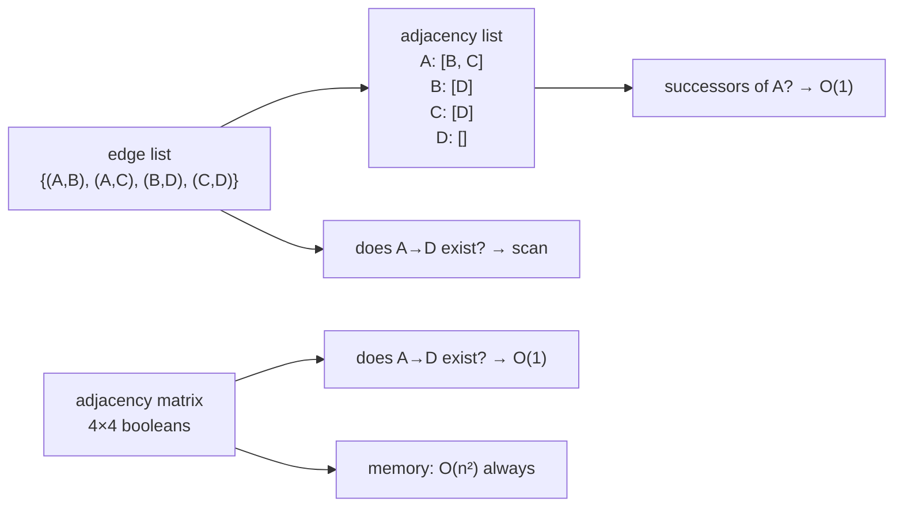

# Adjacency representations

How a graph is actually stored in memory. The choice decides which questions are
cheap, and this project uses three different ones in the same module.

## What it is

Three standard ways to store which nodes connect to which.

**Edge list** — a flat collection of `(from, to)` pairs. Compact, natural to
serialise, and answering "what follows this node?" requires scanning all of them.

**Adjacency list** — a mapping from each node to its successors. Compact for
sparse graphs, O(1) to look up a node's successors, O(degree) to test whether one
specific edge exists.

**Adjacency matrix** — an n×n table of booleans. O(1) edge existence test, O(n²)
memory regardless of how few edges there are, O(n) to enumerate a node's
successors.

For a sparse graph — and a chronology is very sparse, since most pairs of
deposits have no recorded relationship — the adjacency list wins on memory and
on the operation performed most.

## The picture



## Where this project uses it

`poggio_webapp/pipeline/harris_matrix.py` moves between all three, each for one
job.

### Edge set, for membership and set algebra

```python
nodes, relation_ids_by_edge = _collapsed_graph(matrix, components)
edges = set(relation_ids_by_edge)
```

A Python `set` of `(younger, older)` tuples. This form is chosen because
[transitive reduction](transitive-reduction.md) needs **set difference**:

```python
reduced_edges = _transitive_reduction_edges(edges)
display_edges = sorted(reduced_edges)

for edge in sorted(edges - reduced_edges):
    warnings.append(_issue("redundant-relation", ...))
```

`edges - reduced_edges` is the redundant edges, in one operation. An adjacency
list would make that a nested loop.

### Adjacency list, for traversal

```python
def _adjacency(nodes, edges):
    adjacent = {node: [] for node in nodes}
    for younger, older in sorted(edges):
        adjacent[younger].append(older)
    return adjacent
```

Built on demand from the edge set, and consumed by every traversal —
[cycle detection](cycle-detection.md),
[topological sorting](topological-sorting.md), and reachability.

Two details carry weight:

**`sorted(edges)`** — iteration over a Python set has no defined order, so
building the adjacency list from an unsorted set would give neighbours in
arbitrary order, and the reported cycle would vary between runs on identical
data. Sorting makes every traversal [deterministic](determinism-and-stable-sorting.md).

**`{node: [] for node in nodes}`** — every node gets an entry, including
isolated ones. Traversals can then index without a `KeyError` or a `.get()`
default.

### A parallel in-degree map, for Kahn's algorithm

```python
def _topological_sort(nodes, edges):
    adjacent = _adjacency(nodes, edges)
    indegree = {node: 0 for node in nodes}
    for _, older in edges:
        indegree[older] += 1
```

[Kahn's algorithm](topological-sorting.md) needs "how many predecessors remain
unprocessed," which the adjacency list does not answer directly. A counter per
node does, in O(1).

`poggio_webapp/pipeline/merge_walls.py` builds the same pair incrementally as it
reads the faces, rather than from a completed edge set:

```python
if name not in order_index:
    order_index[name] = len(order_index)
    faces_by_surface[name] = []
    successors[name] = set()
    indegree[name] = 0
...
if later not in successors[earlier]:
    successors[earlier].add(later)
    indegree[later] += 1
```

`successors` maps to a **set** rather than a list here, because the same
constraint can arrive from several walls and `indegree` must count each edge
once. The `if later not in successors[earlier]` guard is what enforces that.

### Edge-to-relation index, for error messages

```python
relation_ids_by_edge = defaultdict(list)
...
relation_ids_by_edge[(younger, older)].append(relation.id)
```

Several stored relations can collapse onto one display edge, once
[correlations](union-find.md) merge units. Keeping the mapping means an error
can name the **specific relation records** a user must go and fix:

```python
def _cycle_relation_ids(cycle, relation_ids_by_edge):
    relation_ids = set()
    for younger, older in zip(cycle, cycle[1:]):
        relation_ids.update(relation_ids_by_edge[(younger, older)])
    return sorted(relation_ids)
```

A fourth representation, existing purely so the error message is actionable.

## Why this and not something else

| Alternative | Best at | Why it lost — or won |
|---|---|---|
| **Adjacency matrix** | O(1) edge lookup | O(n²) memory for a graph that is overwhelmingly empty. It would make [transitive closure](transitive-reduction.md) natural via matrix multiplication, and the reduction here is computed by reachability instead, which is cheaper on sparse input. |
| **Edge list only** | Serialisation, set algebra | Used — for the reduction's set difference. Traversal from it would be O(E) per node lookup. |
| **Adjacency list only** | Traversal | Used — for every DFS and for Kahn's. Set difference from it would be a nested loop. |
| **A graph library (networkx)** | Everything | Would replace perhaps 80 lines with imports, and adds a dependency to a module whose only imports are `heapq`, `re`, `collections`, `typing`, and `pydantic`. The algorithms here are short enough to read, and reading them is how a maintainer verifies the chronology logic. |
| **Several representations, converted on demand** *(chosen)* | Each operation | Conversion is O(V + E), so building an adjacency list per traversal is free relative to the traversal itself. |

The point worth extracting: **converting between representations is cheap, so
match the representation to the operation rather than committing to one.**
`_adjacency` is called fresh by `_find_cycle`, `_topological_sort`, and
`_path_exists`, and none of them shares state — which also means none can corrupt
another's view.

## What it costs

| | Memory | Edge exists? | Successors of v | Enumerate all edges |
|---|---|---|---|---|
| Edge list / set | O(E) | O(1) for a set | O(E) | O(E) |
| Adjacency list | O(V + E) | O(degree) | O(1) | O(V + E) |
| Adjacency matrix | O(V²) | O(1) | O(V) | O(V²) |

Rebuilding the adjacency list on each traversal is O(V + E) each time — three or
four times per validation. At Harris Matrix scale (tens to low hundreds of
units) that is microseconds, and it buys independence between the traversals.

The `sorted(edges)` inside `_adjacency` adds O(E log E) per build. That is the
price of determinism, and it is explicitly worth paying here: without it, the
cycle reported for a given matrix could differ between runs, and the rendered
diagram could differ between saves.

## Where else you meet it

- **Every graph library** — networkx, JGraphT, Boost Graph — exposes these
  representations and lets you choose.
- **Compilers**, where control-flow graphs use adjacency lists and dataflow
  analyses sometimes use bit-matrices.
- **Sparse matrix formats** (CSR, CSC) are adjacency lists with numeric weights;
  a graph *is* a sparse matrix.
- **Databases**, where a join table is an edge list and an index over it is an
  adjacency list.
- **Web crawling and PageRank**, which operate on adjacency lists because the
  matrix would be astronomically large.

## Related pages

- [Graphs and terminology](graphs-and-terminology.md) — the vocabulary.
- [Depth-first search](depth-first-search.md) — the main consumer.
- [Topological sorting](topological-sorting.md) — which needs the in-degree map.
- [Transitive reduction](transitive-reduction.md) — which needs the edge set.
- [Determinism and stable sorting](determinism-and-stable-sorting.md) — why `sorted(edges)` matters.
