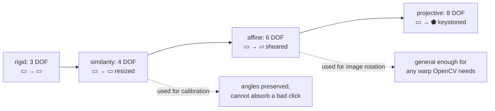

# Affine transforms

Any combination of translation, rotation, scale, and shear. Used here for one
job, rotating an image during deskew, and deliberately *not* used for
calibration.

## What it is

An affine transform is a linear map followed by a translation:

```
[x']   [a  b] [x]   [tx]
[y'] = [c  d] [y] + [ty]
```

Six parameters. It can express translation, rotation, uniform and non-uniform
scaling, shear, and reflection.

What it preserves:

- Straight lines stay straight.
- Parallel lines stay parallel.
- Ratios along a line are preserved: a midpoint stays a midpoint.

What it does **not** preserve: angles, lengths, and shape. A square can become
any parallelogram.

Three corresponding point pairs determine it exactly, which is why
`cv2.getAffineTransform` takes three pairs.

## The picture



## Where this project uses it

### Rotating an image during deskew

`poggio_webapp/pipeline/preprocess.py`:

```python
angle = float(np.median(angles))
h, w = gray.shape
M = cv2.getRotationMatrix2D((w / 2, h / 2), angle, 1.0)
rot = cv2.warpAffine(
    gray, M, (w, h), flags=cv2.INTER_CUBIC, borderMode=cv2.BORDER_REPLICATE
)
return rot, angle
```

`getRotationMatrix2D` returns a 2×3 affine matrix. The transform applied is
actually a *rigid* one (rotation about a centre, with the `1.0` scale factor),
but `warpAffine` is the general machinery, so the matrix is affine-shaped.

Two flags carry the real decisions:

**`INTER_CUBIC`**: the rotation is by a small angle, so most pixels move by a
fraction of a pixel. That is exactly the regime where resampling quality shows.
See [bilinear and bicubic interpolation](bilinear-and-bicubic-interpolation.md).

**`BORDER_REPLICATE`**: a rotated image has corners with no source data. Black
fill would create a hard artificial edge that [Canny](canny-edge-detection.md)
and [contour tracing](contour-tracing.md) would detect as real structure.

The critical property of this use: **it is lossy.** Every warp resamples, and
resampling discards information. That is why deskew is opt-in
(`deskew_flag=False`) and why `01_scan/` keeps the untouched original. See
[files and artifacts](../architecture/files-and-artifacts.md).

### Where affine was deliberately not used

Calibration is a [similarity transform](similarity-transforms.md), not an affine
one, even though three clicks would be enough to determine an affine map.

`poggio_webapp/pipeline/manual_extraction.py`:

```python
ux, uy = dx / pixel_span, dy / pixel_span
vx, vy = -uy, ux
```

The second axis is *derived by rotating the first*, not fitted from the third
click. The third click only chooses a sign:

```python
toward_lowest = (lx - ox) * vx + (ly - oy) * vy
if toward_lowest < 0:
    vx, vy = -vx, -vy
```

That is a deliberate restriction. An affine fit through three clicks would let
the depth axis be non-perpendicular to the wall axis, and the extra freedom
would be spent absorbing whatever error was in the third click, producing a
self-consistent, slightly sheared, wrong coordinate system.

Perpendicularity is a **fact about the drawing**, not a parameter to estimate.

## Why this and not something else

For image rotation:

| Alternative | Why it lost, or won |
|---|---|
| **Affine warp** *(chosen)* | The general machinery in OpenCV; a rotation is a special case, and there is no cheaper dedicated path worth having. |
| **Rotation-only kernel** | A hand-written rotation would be marginally faster and would reimplement `warpAffine` badly. |
| **Do not rotate; correct in coordinate space** | **The stronger option, and what the primary path does.** [Projection onto the calibrated basis](vector-projection.md) corrects tilt exactly, with no resampling. Deskew exists only to make the image easier for a *human* to trace on. |

For calibration:

| Alternative | Degrees of freedom | Why it lost |
|---|---|---|
| **[Similarity](similarity-transforms.md)** *(chosen)* | 4 | Preserves angles, so a mis-clicked point produces a visibly wrong overlay instead of a plausible shear. |
| **Affine** | 6 | Could model a genuinely skewed sheet, and equally happily models a bad click. |
| **Projective** | 8 | Would correct perspective from an angled photograph, at the cost of a fourth click and high sensitivity to it. The real limitation; see the [roadmap](../project/roadmap.md). |

The general principle, applied twice in opposite directions: **use the most
general transform where the machinery is generic and lossless in intent
(rendering), and the most restrictive one where the parameters are estimated
from user input (measurement).** Extra degrees of freedom are places for error
to hide.

## What it costs

The matrix itself is six floats. Applying it to a point is four multiplies and
four adds.

Applying it to an *image* is O(pixels), plus a resampling cost per output pixel
(16 samples for bicubic). And it is **lossy and cumulative**: warp twice and you
lose twice. That is the argument for keeping the archival original and for
correcting in coordinate space wherever possible.

Affine transforms compose by matrix multiplication, which is why graphics
pipelines represent them in [homogeneous coordinates](homogeneous-coordinates.md):
a 3×3 matrix makes translation multiplicative and the whole chain a single
product.

## Where else you meet it

- CSS and SVG `transform`, which accept a six-parameter `matrix()`.
- Every 2D graphics API: Canvas, Cairo, Skia.
- Data augmentation in machine learning, where random affine warps expand a
  training set.
- Medical image registration, aligning scans taken at different times.
- Font rendering, where a glyph outline is transformed into device space.
- Robotics, where 3D affine transforms compose along a kinematic chain.

## Related pages

- [Similarity transforms](similarity-transforms.md): the restricted family used
  for calibration, and why.
- [Translation, rotation, and scaling](translation-rotation-scaling.md): the
  components.
- [Homogeneous coordinates](homogeneous-coordinates.md): how they compose.
- [Bilinear and bicubic interpolation](bilinear-and-bicubic-interpolation.md):
  the resampling a warp requires.
- [Hough line transform](hough-line-transform.md): how the deskew angle is
  estimated.
