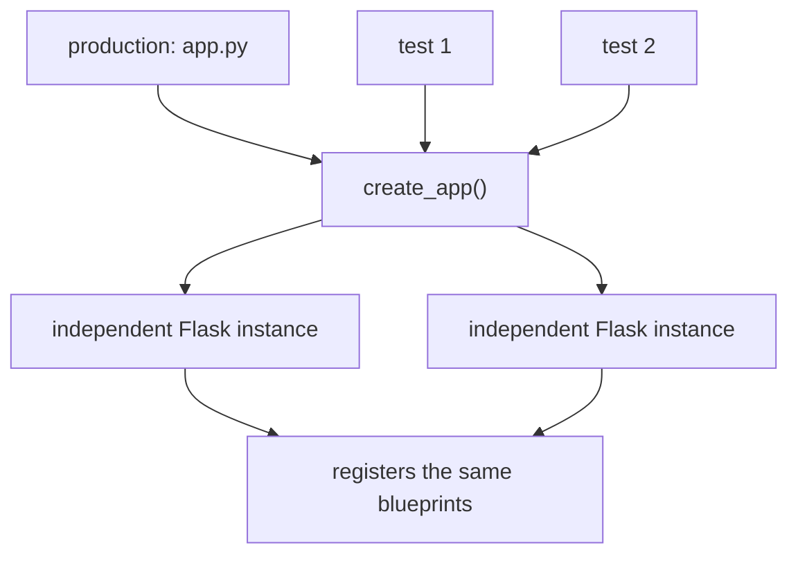

# Application factory

Building the application inside a function instead of at import time. The
difference between a test suite that can configure the app and one that inherits
whatever the module happened to build.

## What it is

The naive Flask application is a module-level object:

```python
app = Flask(__name__)  # built on import


@app.route("/")
def index(): ...
```

Everything is bound the moment the module is imported. There is one application,
configured however the import path decided, and no opportunity to build a
different one.

An **application factory** wraps construction in a function:

```python
def create_app() -> Flask:
    app = Flask(__name__, ...)
    register_blueprints(app)
    return app
```

Now the application is built **on demand**. A test can build one, configure it,
use it, and discard it. Nothing global is shared between tests.

## The picture



## Where this project uses it

`poggio_webapp/backend/__init__.py`:

```python
"""Flask application factory for the trench digitization web app."""

from flask import Flask, jsonify
from werkzeug.exceptions import HTTPException

import storage

from .routes import register_blueprints


def create_app() -> Flask:
    app = Flask(
        __name__,
        static_folder=str(storage.STATIC_DIR),
        template_folder=str(storage.TEMPLATES_DIR),
        static_url_path="/static",
    )
    register_blueprints(app)

    @app.errorhandler(HTTPException)
    def handle_http_error(error: HTTPException):
        return jsonify(
            {
                "error": error.description or error.name,
                "status": error.code,
            }
        ), error.code

    @app.errorhandler(Exception)
    def handle_unexpected_error(error: Exception):
        app.logger.exception("Unhandled application error")
        return jsonify({"error": str(error) or "unexpected server error"}), 500

    return app
```

Three things happen here and nowhere else: the app is constructed, the
blueprints are registered, and the two error handlers are attached.

The **error handlers are the payoff of centralisation.** Every route in every
blueprint can call `abort(400, description="...")` and know it becomes JSON,
because one handler covers them all. The catch-all logs the traceback and returns
a generic 500, so an unexpected exception never leaks a stack trace to the
browser while still being recorded. See
[error taxonomies](error-taxonomies.md).

`poggio_webapp/app.py` is then twenty lines, and its docstring is a rule:

```python
"""Trench Digitization Pipeline backend entry point.

Every route lives in a blueprint under backend/routes/ and is registered by
backend.create_app(). Nothing should be added directly to the app object here.
If you are about to, it belongs in a blueprint.
"""

import os

from backend import create_app

app = create_app()


if __name__ == "__main__":
    debug = os.environ.get("FLASK_DEBUG", "0") == "1"
    app.run(
        debug=debug,
        port=int(os.environ.get("PORT", 5000)),
    )
```

"Nothing should be added directly to the app object here" is the invariant that
keeps the entry point trivial. `debug` defaults to **off** and must be enabled
explicitly. Flask's debugger executes arbitrary code from the browser, so
defaulting it on would be a remote-execution hole.

### What it buys the tests

`tests/conftest.py`:

```python
@pytest.fixture
def app(storage_dirs):
    """The full application under test.

    Phase 1 moved the last twelve routes out of app.py and into blueprints, so
    ``create_app()`` now builds the application that actually ships. app.py is
    just an entry point.
    """
    flask_app = create_app()
    flask_app.config.update(TESTING=True)
    return flask_app
```

Two properties matter.

**The tests exercise the shipping application.** The docstring makes the point:
before the refactor, twelve routes lived in `app.py` and were therefore *not*
part of what `create_app()` built. A test using the factory would have tested a
different application from the one that ran.

**Order of fixtures.** `app` depends on `storage_dirs`, which redirects the
storage roots to a temporary directory *before* the app is constructed. With a
module-level app, the paths would already be bound, which is exactly the
problem [late binding](late-binding-vs-import-time-binding.md) solves for
`storage`, and the factory solves for the app.

### Blueprints as a data-driven registry

`poggio_webapp/backend/routes/__init__.py`:

```python
BLUEPRINTS = (
    pages_bp,
    jobs_bp,
    editor_bp,
    finds_bp,
    scans_bp,
    preprocess_bp,
    extraction_bp,
    features_bp,
    markers_bp,
    manual_bp,
    task_status_bp,
    text_metadata_bp,
    processing_bp,
    gempy_bp,
    harris_bp,
    trenches_bp,
    demo_bp,
)


def register_blueprints(app: Flask) -> None:
    for blueprint in BLUEPRINTS:
        app.register_blueprint(blueprint)
```

See [blueprint and plugin registries](blueprint-and-plugin-registries.md).

## Why this and not something else

| Alternative | How it would build the app | Why it lost |
|---|---|---|
| **Module-level `app`** | `app = Flask(__name__)` at import | Simplest for a script. One global instance, configured at import, with no way for a test to build a differently-configured one, and it invites routes being attached in the entry point, which is how twelve of them escaped the factory before. |
| **A class** | `class Application:` with methods | Equivalent, and heavier for something constructed once. |
| **A DI container** | Register components, resolve on demand | Powerful for many interchangeable implementations. There is one application and one storage backend. |
| **`create_app(config)`** | Parameterise the factory | The common extension, and this project has no configuration to vary: the storage roots are already redirectable via [late binding](late-binding-vs-import-time-binding.md), which is what the tests actually need. |
| **A no-argument factory** *(chosen)* | `create_app()` | Minimal, testable, and the invariant "everything is registered here" is easy to state and to check. |

The deciding property is **testability without a running server**. 1135 tests
build applications freely because construction is a function call.

## What it costs

One extra function and one indirection.

The costs:

- Two-step import: `from backend import create_app`, then call it. Trivial,
  and it surprises people expecting a module-level `app`.
- Deployment needs the call. A WSGI server must be pointed at `app:app`,
  which `app.py` provides, or at a factory-aware entry point.
- The invariant is not enforced. Nothing stops a future contributor writing
  `@app.route` in `app.py`. The docstring is the guard, and the fact that it was
  needed once is why it is stated so directly.
- No configuration parameter yet. Adding one later is easy; not adding one
  speculatively is the right default.

## Where else you meet it

- Flask's own documentation, which recommends this pattern for anything
  beyond a single-file example.
- Django's `get_wsgi_application()` and app registry.
- FastAPI, where the app object is commonly built in a factory for the same
  test reasons.
- The factory pattern generally, in the Gang of Four sense.
- Dependency injection frameworks (Spring, .NET's host builder), which are
  this idea with a container attached.

## Related pages

- [Blueprint and plugin registries](blueprint-and-plugin-registries.md): how
  routes are collected.
- [Late binding versus import-time binding](late-binding-vs-import-time-binding.md):
  the related fix for storage paths.
- [Pure functions and testability](pure-functions-and-testability.md): the
  wider goal.
- [Layered architecture](layered-architecture.md): what the web layer contains.
- [Backend architecture](../architecture/backend.md): this project's layout.
