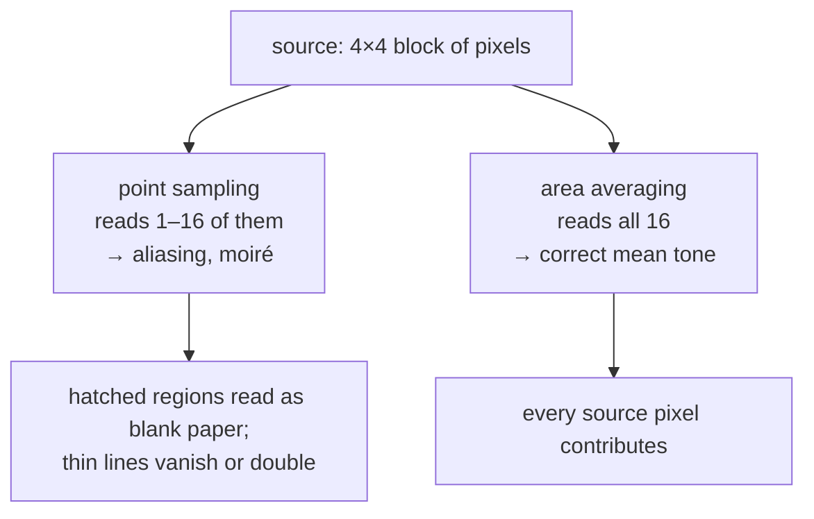

# Area-averaging downsampling

Shrinking an image correctly, by averaging every source pixel that falls inside
each destination pixel — and why the filter that is best for enlarging is
actively wrong for shrinking.

## What it is

Shrinking is not the reverse of enlarging. When you enlarge, you have too few
samples and must invent plausible values between them. When you shrink, you have
**too many** samples and must decide how to combine them.

Get that wrong and you get **aliasing**: high-frequency detail that the smaller
grid cannot represent does not disappear, it folds back and masquerades as
low-frequency structure. On a drawing this shows as moiré patterns across
hatched areas and graph paper, and as boundary lines that flicker in and out of
existence.

The Nyquist–Shannon sampling theorem says the fix is to remove detail finer than
the new grid can hold **before** resampling. Area averaging does exactly that:
each destination pixel is the mean of all source pixels its footprint covers.
The averaging *is* the low-pass filter.

Point-sampling methods — nearest, bilinear, bicubic, Lanczos — only look at a
fixed small neighbourhood. Shrink by 4× with bicubic and it inspects 16 source
pixels while ignoring the other 240 in the footprint. Most of the image simply
never gets consulted.

## The picture

Shrinking a row of finely hatched drawing by 4×:

```
source (fine hatching, alternating):
  240  60  240  60  240  60  240  60   ← real texture

nearest      → 240, 240        "the hatching is solid white"
bicubic      → 233, 231        "the hatching is nearly white"
area average → 150, 150        "the hatching is mid-grey"   ← correct
```

Nearest and bicubic both sampled the peaks and reported white paper where there
is dense hatching. Area averaging reports the honest average tone.



## Where this project uses it

`poggio_webapp/pipeline/detect_features.py`, which caps the analysis image so
contour detection runs at a predictable scale:

```python
MAX_ANALYSIS_DIM = 2200


def _analysis_copy(img: np.ndarray) -> tuple[np.ndarray, float]:
    """Return a resized analysis image and its scale relative to the original."""
    height, width = img.shape[:2]
    longest_side = max(width, height)

    if longest_side <= MAX_ANALYSIS_DIM:
        return img.copy(), 1.0

    scale = MAX_ANALYSIS_DIM / longest_side
    resized = cv2.resize(
        img,
        (max(1, round(width * scale)), max(1, round(height * scale))),
        interpolation=cv2.INTER_AREA,
    )
    return resized, scale
```

The returned `scale` is the other half of the design: every detection is
performed on the small copy and then mapped back to full-resolution
coordinates, so the *output* is at native precision even though the *work* was
not. See [multi-scale analysis](multi-scale-analysis.md).

```python
inverse_scale = 1.0 / scale
points = [
    [round(float(p[0][0]) * inverse_scale, 1), round(float(p[0][1]) * inverse_scale, 1)]
    for p in approximated_contour[:80]
]
```

The extraction modules cap dimensions for a different reason — request size
rather than detection stability — with the rationale recorded in
`extract_illustrator.py`:

> Sending that whole thing as base64 makes the request slow to the point of
> looking hung, with no accuracy benefit. Cap the longest side right before
> sending, independent of whatever upscale preprocessing used.

## Why this and not something else

| Alternative | How it would work here | Why it lost |
|---|---|---|
| **Nearest neighbour** | Take one source pixel per destination pixel | Worst possible choice for shrinking. It point-samples, so a one-pixel boundary line is either kept whole or deleted entirely depending on where the grid lands. Hatched regions alias into arbitrary patterns. |
| **[Bilinear](bilinear-and-bicubic-interpolation.md)** | 4-sample blend | Better, and still point-sampling: at 4× reduction it consults 4 of 16 pixels. Aliases on fine texture, which drawings are full of. |
| **[Bicubic](bilinear-and-bicubic-interpolation.md)** | 16-sample cubic | Better again, same structural flaw at large reduction ratios, plus overshoot that can create false edges. |
| **[Lanczos](lanczos-resampling.md)** | 64-sample windowed sinc | The best choice for *enlarging* in this same repository — and for shrinking its ringing manufactures alternating light and dark bands beside every stroke, which [contour tracing](contour-tracing.md) then finds as structure. Sharpness is the wrong goal when discarding information. |
| **Blur first, then point-sample** | Gaussian with σ matched to the ratio, then bilinear | Textbook-correct and effectively what area averaging does in one step, with a σ you would have to derive per ratio. `INTER_AREA` gets it right automatically. |
| **Mipmapping** | Precompute a pyramid of halved images, sample the right level | The GPU answer, and the right one when you resample repeatedly at many scales. Here each image is shrunk once. |
| **Do not shrink at all** | Run detection at full resolution | Tempting, and it makes runtime depend on camera megapixels rather than on the drawing, and it makes every size threshold in the detector resolution-dependent. Capping at 2200 px means `min_area`, `width < 10`, and the aspect limits mean the same thing for every input. |

That last row is the real motivation. The cap is not primarily about speed — it
is about making the detector's **thresholds meaningful**. A filter tuned on a
12 MP phone photo would reject everything on a 40 MP one.

## What it costs

O(source pixels) — every one is read exactly once — which is *cheaper* than
Lanczos at the same reduction, since Lanczos reads 64 samples per **destination**
pixel and area averaging reads one per **source** pixel.

The output is smaller, so everything downstream is proportionally faster. At
2200 px from a 4284 px photo, that is roughly a 3.8× saving on every subsequent
operation.

The cost is precision: detections are located on the small grid, so mapping back
carries up to half a small-pixel of error — under a pixel at full resolution.
For [feature](../archaeology/index.md) candidates a human reviews and adjusts,
that is immaterial. It would not be acceptable for
[marker detection](../workflows/03-markers-and-features.md), which is why
`detect_markers.py` works at full resolution and refuses outright when the photo
is too coarse:

```python
if mm_px < 2:
    raise RuntimeError(
        "photo resolution too low for marker detection "
        f"({mm_px:.1f} px per paper mm) — retake closer or "
        "at higher resolution"
    )
```

Two detectors, two different precision requirements, two different decisions
about downsampling.

## Where else you meet it

- **Thumbnail generation.** Every gallery you have used; a badly downscaled
  thumbnail of a striped shirt is aliasing.
- **Mipmapping in 3D graphics**, which exists entirely to prevent texture
  aliasing at distance.
- **Anti-aliasing in rendering** — supersampling renders large and area-averages
  down.
- **Audio decimation**, where a low-pass filter before downsampling is
  mandatory for the same Nyquist reason.
- **Digital cameras**, whose optical low-pass filter blurs slightly *before* the
  sensor samples, to prevent moiré on fabric.

## Related pages

- [Lanczos resampling](lanczos-resampling.md) — the opposite direction, and why
  the best upscaler is the wrong downscaler.
- [Bilinear and bicubic interpolation](bilinear-and-bicubic-interpolation.md) —
  the general-purpose middle ground.
- [Multi-scale analysis](multi-scale-analysis.md) — detecting small and mapping
  back large.
- [Gaussian blur](gaussian-blur.md) — the low-pass filter this performs
  implicitly.
