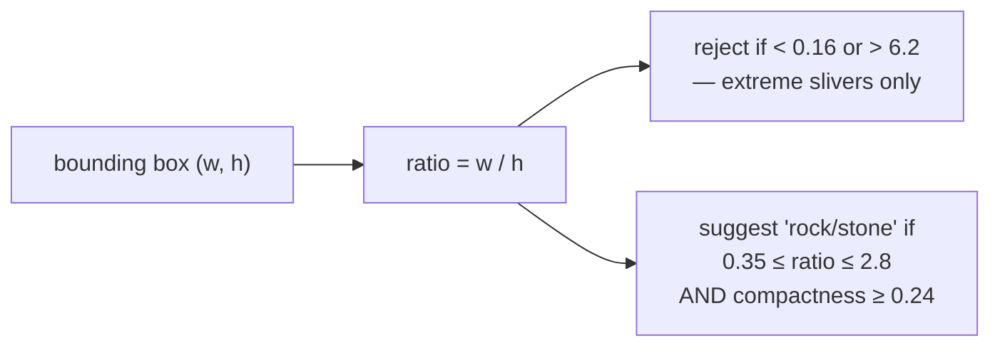

# Aspect ratio

Width divided by height. The cheapest possible shape test, used here to reject
extreme slivers early and to help suggest whether a candidate looks like a
stone.

## What it is

```
aspect ratio = bounding-box width / bounding-box height
```

- **1.0** — as wide as it is tall.
- **> 1** — wider than tall.
- **< 1** — taller than wide.

One division on numbers already computed for the
[bounding box](bounding-boxes.md). It costs nothing.

Its weakness is inherent to the box: **it measures the box, not the shape.** A
long thin object at 45° has a nearly square bounding box and therefore an aspect
ratio near 1.0. It is an orientation-dependent measure of an
orientation-independent property.

That makes it useful only as a **loose** filter. A tight aspect-ratio band would
reject diagonal shapes inconsistently depending on their angle.

## The picture

```
horizontal bar  ████████████        w=12 h=2   ratio 6.0
vertical bar    █                   w=2  h=12  ratio 0.17
                █
                █
diagonal bar    ██                  w=9  h=9   ratio 1.0  ← indistinguishable
                  ██                             from a blob
                    ██
blob            ████                w=8  h=7   ratio 1.14
                ████
```



## Where this project uses it

`poggio_webapp/pipeline/detect_features.py`, twice.

### As an early loose reject

```python
x, y, width, height = cv2.boundingRect(contour)

if width < 10 or height < 10:
    continue
...
aspect_ratio = width / height

if aspect_ratio < 0.16 or aspect_ratio > 6.2:
    continue
```

The band `0.16 – 6.2` is roughly 1:6 in either direction, and it is deliberately
wide. It removes only the extremes — a fragment of a ruled line, a slice of a
layer boundary — while leaving every plausibly blob-like candidate for the
tighter measures ([circularity](circularity.md), [solidity](solidity.md),
[extent](extent-and-fill-ratio.md)) that follow.

The width and height floors that precede it matter as much. Below 10 px, one
pixel of quantisation moves the ratio substantially, so the guard keeps the
measure out of the regime where it is unreliable.

### As a term in the suggested label

```python
suggested_type = (
    "rock/stone"
    if compactness >= 0.24 and 0.35 <= aspect_ratio <= 2.8
    else "other feature"
)
```

A much tighter band, `0.35 – 2.8` — and note it produces a **suggestion**, not a
classification. The module is explicit about that:

> This detector intentionally does not claim that every closed contour is a
> stone. It proposes compact, closed shapes that may represent stones, cuts,
> lenses, voids, or other discrete features. A person approves, rejects, and
> labels each proposal before extraction.

Both fields are carried into the output so the reviewer sees the machine's guess
and can change it, while the original suggestion stays on the record:

```python
"suggested_type": suggested_type,
"feature_type": suggested_type,
"status": "pending",
"source": "cv",
```

`suggested_type` is what the detector said; `feature_type` is what the human
settles on. Keeping both is [provenance](provenance-and-data-lineage.md).

`detect_markers.py` does **not** use aspect ratio at all — its targets are round
by definition, so the [minimum enclosing circle](minimum-enclosing-circle.md)
gives a better size measure and [circularity](circularity.md) a better shape
test.

## Why this and not something else

| Alternative | What it measures | Why it lost — or won |
|---|---|---|
| **Rotated-rectangle aspect ratio** | `minAreaRect` major/minor | Orientation-invariant, so a diagonal sliver is correctly reported as elongated. It costs a rotating-calipers computation on every contour, to improve a filter whose whole purpose is to be nearly free. The tighter measures that follow already catch what it would. |
| **Ellipse axis ratio** | `fitEllipse` major/minor | Also orientation-invariant and better behaved on smooth shapes. Needs ≥5 points and is unstable on small noisy contours. |
| **[Circularity](circularity.md)** | `4πA/P²` | Also used, and it is the *right* elongation measure — orientation-invariant and sensitive to raggedness too. It needs area and perimeter, which is more work than a division. Aspect ratio runs first as a cheap pre-filter. |
| **[Extent](extent-and-fill-ratio.md)** | `A / box area` | Also used, and shares the same orientation-dependence — a diagonal sliver has *low* extent, so extent catches exactly the case aspect ratio misses. The two box-based measures are complementary for that reason. |
| **Aspect ratio** *(chosen, loosely)* | Box proportions | Free, and adequate for removing extremes. Used with a deliberately wide band because of its known blind spot. |

The judgement here is about **filter ordering**. Aspect ratio is not the best
elongation measure and does not need to be: it is a cheap first pass that
removes obvious rubbish before the O(n log n) [convex hull](convex-hull.md) runs.
Ordering filters cheapest-first is what keeps the detector fast over thousands
of contours, and it only works if each cheap filter is set loose enough to never
reject something a later, better filter would have kept.

## What it costs

One division. The bounding box is already computed.

The cost is the blind spot — a 45° sliver passes — which is handled by pairing
it with [extent](extent-and-fill-ratio.md), whose bias runs the opposite way:
that same sliver has an extent near 0.02 and is rejected there. Two cheap
box-based measures with opposite blind spots cover between them what one
expensive orientation-invariant measure would.

## Where else you meet it

- **Screen and video resolutions** — 16:9 and 4:3 are aspect ratios.
- **OCR and document layout**, separating text lines from rules and images.
- **Object detection**, where anchor boxes are defined by preset aspect ratios.
- **Sedimentology**, where grain elongation is a standard descriptor — the
  archaeological cousin of this use.
- **Biology**, where cell elongation distinguishes motile from stationary
  states.

## Related pages

- [Bounding boxes](bounding-boxes.md) — where the two numbers come from.
- [Extent and fill ratio](extent-and-fill-ratio.md) — the complementary
  box-based measure.
- [Circularity](circularity.md) — the orientation-invariant elongation measure.
- [Multi-scale analysis](multi-scale-analysis.md) — why the pixel thresholds
  around it are meaningful across inputs.
