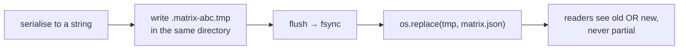

# Atomic file writes

Replacing a file's contents in a way that cannot leave it half-written. Four
steps that turn "the power went out mid-save" from data loss into a no-op.

## What it is

The obvious way to save is to open the file and write:

```python
path.write_text(serialized)  # ← truncates first
```

That truncates the file, then writes. Between those two moments the file is
empty or partial. A crash, a full disk, or a concurrent reader lands in that
window and finds a **torn file** — and the previous good copy is already gone.

The atomic pattern uses the filesystem's own guarantee that **rename is atomic**
within a filesystem:

1. Write the new content to a **temporary file in the same directory**.
2. `flush()` — push Python's buffer to the OS.
3. `fsync()` — force the OS to put it on physical storage.
4. `os.replace()` — atomically swap the temp file into place.

A reader at any instant sees either the whole old file or the whole new one.
Never a mixture, never nothing.

Each step matters:

| Step | Without it |
|---|---|
| Temp in the **same directory** | `os.replace` across filesystems is not atomic |
| `flush` | data sits in Python's buffer, unwritten |
| `fsync` | data sits in the OS cache; a power cut loses it |
| `os.replace` | a delete-then-rename leaves a window with no file at all |

## The picture



## Where this project uses it

`poggio_webapp/backend/harris_store.py`:

```python
def _atomic_write(matrix: HarrisMatrix, destination: Path) -> None:
    serialized = matrix.model_dump_json(indent=2) + "\n"
    temporary_path = None

    try:
        with tempfile.NamedTemporaryFile(
            mode="w",
            encoding="utf-8",
            dir=destination.parent,
            prefix=".matrix-",
            suffix=".tmp",
            delete=False,
        ) as temporary:
            temporary_path = Path(temporary.name)
            temporary.write(serialized)
            temporary.flush()
            os.fsync(temporary.fileno())
        os.replace(temporary_path, destination)
    finally:
        if temporary_path is not None and temporary_path.exists():
            temporary_path.unlink()
```

Every argument is load-bearing.

**`dir=destination.parent`** — the temp file must be on the same filesystem, or
`os.replace` degrades to a copy-and-delete, which is not atomic. Using the
system temp directory would silently break the guarantee on a machine where
`/tmp` is a separate mount.

**`delete=False`** — `NamedTemporaryFile` normally deletes on close, which would
remove the file before it could be renamed.

**`prefix=".matrix-"`** — a dotfile, so a stray temp is not mistaken for real
content by a directory listing. `list_matrices` also filters by a
[regex](regular-expressions.md), so a leftover could not be loaded as a matrix
anyway.

**`encoding="utf-8"`** — pinned rather than inherited from the locale, so the
same bytes are written on any machine.

**`os.fsync(temporary.fileno())`** — the step most often omitted. Without it the
data is in the OS page cache; `os.replace` then atomically installs a file whose
contents may not yet be on disk. A power cut can leave a *correctly renamed but
empty* file.

**The `finally` block** cleans up a temp file left by an exception between
creation and rename. After a successful `os.replace` the temp path no longer
exists, so `exists()` is false and `unlink` is skipped — the same block serves
both paths.

**Serialisation happens first**, before the temp file is opened. If
`model_dump_json` raises, nothing has been created.

### Composed with the other guarantees

```python
matrix = _validate_candidate(candidate_data)
_atomic_write(matrix, _matrix_path(matrix_id))
```

Validation before writing, so an invalid matrix never reaches disk; the write
atomic, so a crash cannot corrupt the previous revision; and
[optimistic concurrency](optimistic-concurrency-control.md) before both, so a
conflicting save is refused. Three independent failure modes, three defences.

Note that the rest of the codebase does **not** do this. `jobs.write_meta`, the
editor's `save_editor_state`, and the pipeline's JSON outputs all use plain
`write_text`. That asymmetry is defensible: a job's stage outputs are
regenerable by re-running the stage, whereas a Harris Matrix is **hand-authored
scholarship with no source to regenerate from**. The expensive guarantee is
applied where loss is unrecoverable.

## Why this and not something else

| Alternative | How it would save | Why it lost |
|---|---|---|
| **`path.write_text(...)`** | Truncate and write | Used elsewhere here, appropriately. For irreplaceable data it means a crash destroys the old copy without producing a new one. |
| **Write, then verify by re-reading** | Check afterwards | Detects corruption without preventing it — and the old copy is already gone. |
| **Keep numbered backups** | `matrix.json.1`, `.2`, … | Complementary rather than competing, and it needs a retention policy. Version history is genuinely a good future addition; the `revision` counter already exists. |
| **SQLite** | A transactional database | Real ACID guarantees, and it turns a readable JSON file into an opaque binary one. This project keeps job and matrix directories inspectable on purpose. |
| **`fcntl` locking** | Exclusive access during write | Solves concurrent *access*, not crash *atomicity*. Different problem. |
| **Temp file + fsync + rename** *(chosen)* | Four steps, no dependency | The standard POSIX idiom, guaranteed by the filesystem, and it leaves the file human-readable. |

The principle: **build on the strongest primitive the platform offers.** `rename`
is atomic because the filesystem says so; reimplementing exclusion in
application code would be weaker and more complex.

## What it costs

`fsync` is the expensive part — it waits for physical storage, typically
milliseconds on SSD and much longer on spinning disk. That is why it is not
applied to every JSON write in the pipeline, where stage outputs are cheap to
regenerate.

Other costs:

- **Transient temp files.** A hard kill between creation and rename leaves a
  `.matrix-*.tmp`. Harmless: hidden, regex-filtered out of listings, and
  overwritten by the next successful save.
- **Same-filesystem requirement.** Easy to break by "tidying" the temp file into
  the system temp directory.
- **Atomicity is per-file.** A change spanning two files is not atomic as a
  whole. Nothing here needs that.
- **`fsync` on the *directory*** is also needed for full durability of the rename
  itself on some filesystems. Not done here — an acceptable gap for a local
  single-user application, and worth knowing.

## Where else you meet it

- **Databases**, where write-ahead logging plus fsync is the durability
  mechanism.
- **`git`**, which writes objects to temp files and renames them into place.
- **Package managers and installers**, staging then swapping so a failed install
  does not brick the previous version.
- **Configuration management** — `sed -i` and most "edit in place" tools are
  really write-and-rename.
- **Editors**, whose atomic-save option exists for exactly this reason.

## Related pages

- [Optimistic concurrency control](optimistic-concurrency-control.md) — the
  check that runs before this.
- [Race conditions](race-conditions.md) — the wider family.
- [Fail-closed design](fail-closed-design.md) — refusing rather than half-doing.
- [Files and artifacts](../architecture/files-and-artifacts.md) — what lands on
  disk.
