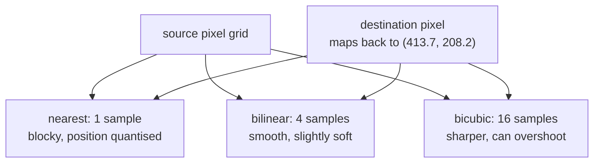

# Bilinear and bicubic interpolation

When a transformed pixel lands between four real pixels, something has to
decide what colour it is. These are the two standard answers, and this project
uses one of them for rotation.

## What it is

Rotate, scale, or warp an image and the output grid no longer lines up with the
input grid. A destination pixel maps back to a source position like
`(413.7, 208.2)`, a place where no pixel exists. *Resampling* invents a value
for it from the pixels that do exist.

**Nearest neighbour** takes the closest pixel. Fast, and it produces visible
staircase edges because it quantises position.

**Bilinear** takes the four surrounding pixels and blends them by distance:
linear interpolation horizontally, then again vertically. Smooth, cheap, and
slightly soft, because it is a small averaging filter.

**Bicubic** takes the sixteen surrounding pixels (a 4×4 patch) and fits a cubic
curve through them. Sharper than bilinear because a cubic can follow a slope
rather than just splitting the difference, at four times the samples.

## The picture

Sampling at 30% between two pixel columns:

```
source columns:   240 ................ 100
                       ↑
                  sample at 0.3

nearest    →  240              (snaps to the nearer column)
bilinear   →  0.7·240 + 0.3·100 = 198
bicubic    →  ≈ 201            (a curve fitted through 4 columns,
                                so it can overshoot slightly)
```



Bicubic's ability to overshoot is a real property, not a bug: fitting a curve
through four samples can produce a value outside their range, which shows as a
faint bright rim beside a dark stroke. On a document scan that is usually
acceptable and occasionally not.

## Where this project uses it

Bicubic, once, for rotation during deskew.
`poggio_webapp/pipeline/preprocess.py`:

```python
def deskew(gray):
    """Estimate small skew from near-horizontal strokes and rotate to correct."""
    ...
    angle = float(np.median(angles))
    h, w = gray.shape
    M = cv2.getRotationMatrix2D((w / 2, h / 2), angle, 1.0)
    rot = cv2.warpAffine(
        gray, M, (w, h), flags=cv2.INTER_CUBIC, borderMode=cv2.BORDER_REPLICATE
    )
    return rot, angle
```

Two flags carry the decisions:

**`INTER_CUBIC`**: the rotation angles here are small (the filter keeps only
lines within ±15° of horizontal), so most pixels move by a fraction of a pixel.
That is precisely the regime where interpolation quality shows: bilinear's
softening would visibly thin the boundary strokes the next stage has to find.

**`BORDER_REPLICATE`**: a rotated image has corners with no source data.
Filling them with black would create a hard artificial edge that
[Canny](canny-edge-detection.md) and [contour tracing](contour-tracing.md)
would happily detect as real structure. Replicating the edge pixel produces a
smooth, uninteresting border instead. See
[contour tracing](contour-tracing.md), whose candidate filter separately
discards anything touching the frame.

For *scaling up*, the project chooses [Lanczos](lanczos-resampling.md) instead;
for scaling *down*, [area averaging](area-averaging-downsampling.md). Three
different resamplers for three different jobs.

## Why this and not something else

For a small-angle rotation of a line drawing:

| Alternative | How it would work here | Why it lost |
|---|---|---|
| **Nearest neighbour** | Snap to the closest source pixel | Free, and it quantises position. A one-pixel-wide boundary stroke rotated by 0.8° would break into a dotted line, catastrophic for a stage whose job is to keep thin lines intact. |
| **Bilinear** | 4-sample blend | Perfectly reasonable and slightly soft. Since the whole `clean()` chain ends with [unsharp masking](unsharp-masking.md) to recover sharpness, giving away sharpness here to save four samples is the wrong trade. |
| **Bicubic** *(chosen)* | 16-sample cubic fit | Sharper than bilinear at a cost that is irrelevant for a once-per-scan operation. Mild overshoot is acceptable on a grayscale document. |
| **[Lanczos](lanczos-resampling.md)** | Windowed-sinc, 8×8 samples | Sharper still, and stronger ringing: a bright halo beside every dark stroke. Justifiable when *upscaling*, where you are trying to synthesise detail; overkill for a sub-pixel rotation. |
| **Do not rotate at all** | Leave the skew; handle it in the calibration | Genuinely the strongest alternative, and it is what the manual tracing path does. Three calibration clicks define the along-wall axis from the *drawn* edge, so a tilted photograph is corrected by the coordinate transform with no resampling whatsoever. Deskew stays available because a visibly straight image is easier for a human to trace on, and it is **opt-in** (`deskew_flag=False` by default) precisely because it is not needed for correctness. |

That last row is the interesting one. The best resampler is often no resampler:
this project's primary path avoids the problem by moving the correction into
[coordinate space](similarity-transforms.md), where it is exact and lossless.

## What it costs

| Method | Samples per output pixel |
|---|---|
| Nearest | 1 |
| Bilinear | 4 |
| Bicubic | 16 |
| Lanczos4 | 64 |

All are O(n) in the output size. On a 9-megapixel scan, bicubic is around 150
million samples, well under a second in native code, and it happens once.

The unavoidable cost is **generation loss**. Every resample is lossy and the
losses accumulate, which is why `01_scan/` keeps the untouched original and
every derived image lives in its own stage folder. See
[files and artifacts](../architecture/files-and-artifacts.md).

## Where else you meet it

- Zooming any image on a screen, in any application.
- Video scaling: the difference between a good and bad upscaler on a TV.
- Map tiles, reprojected between coordinate systems.
- Texture sampling in 3D graphics; GPUs implement bilinear in hardware
  because it is used billions of times a second.
- Audio resampling between sample rates is the same mathematics in one
  dimension.

## Related pages

- [Lanczos resampling](lanczos-resampling.md): used for upscaling here.
- [Area-averaging downsampling](area-averaging-downsampling.md): used for
  shrinking here.
- [Affine transforms](affine-transforms.md): the rotation that needs
  resampling.
- [Similarity transforms](similarity-transforms.md): the alternative that
  avoids resampling entirely.
- [Geometric normalization](../concepts/geometric-normalization.md): the
  concept page on deskewing.
