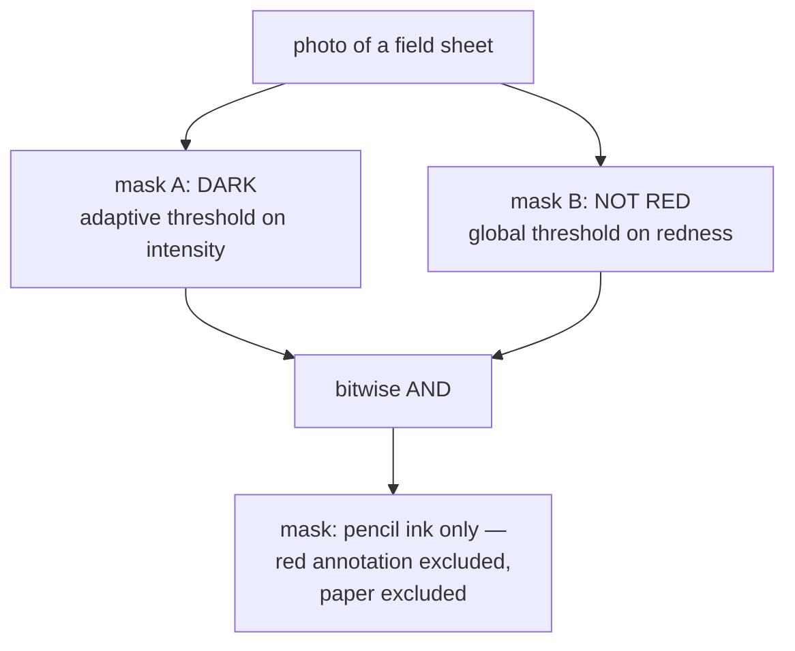

# Binary masks and bitwise operations

Once an image is reduced to yes-or-no per pixel, combining several tests
becomes ordinary boolean logic — and logic composes in a way that a single
cleverer test does not.

## What it is

A **binary mask** is an image whose pixels are only 0 or 255 (conventionally
"false" and "true"). It is the answer to one yes/no question, stored per pixel.

Because it is boolean, masks combine with boolean operators applied
pixel-by-pixel:

| Operation | Meaning |
|---|---|
| `AND` | in both masks — narrows the selection |
| `OR` | in either mask — widens it |
| `NOT` | everything the mask excludes |
| `XOR` | in exactly one — the difference between two masks |

The value of this is **separability of concerns**. Instead of designing one
detector for "dark pencil that is not red annotation," you build one detector
for *dark*, one for *not red*, and combine them. Each can be tuned, tested, and
reasoned about alone.

The convention of using 255 rather than 1 is not arbitrary: it makes a mask a
displayable image, so you can look at it, and it makes `bitwise_and` with a
grayscale image act as a stencil that passes the original values through.

## The picture



Concretely, for three kinds of pixel:

| pixel | dark? | not red? | AND |
|---|---|---|---|
| white paper | ✗ | ✓ | ✗ |
| pencil stroke | ✓ | ✓ | **✓** |
| red pen annotation | ✓ | ✗ | ✗ |

Neither test alone suffices. Darkness admits the red pen; not-red admits the
paper. The conjunction is what isolates pencil.

## Where this project uses it

`poggio_webapp/pipeline/detect_markers.py`, in the function whose entire job is
this combination:

```python
def _ink_mask(img, block_px, C=10):
    """Dark-and-not-red ink, adaptively thresholded so light pencil and
    uneven phone-photo lighting don't fragment the strokes."""
    gray = cv2.cvtColor(img, cv2.COLOR_BGR2GRAY)
    b, g, r = cv2.split(img.astype(np.int32))
    redness = r - (g + b) / 2.0
    ad = cv2.adaptiveThreshold(gray, 255, cv2.ADAPTIVE_THRESH_MEAN_C,
                               cv2.THRESH_BINARY_INV, block_px, C)
    return cv2.bitwise_and(ad, (redness < 25).astype(np.uint8) * 255)
```

The docstring is the boolean expression in English: **dark** *and* **not red**.

The two operands are built by different methods, and that is the point:

- **dark** needs [adaptive thresholding](adaptive-thresholding.md), because raw
  intensity is corrupted by the lighting gradient;
- **not red** needs only a [global threshold](global-thresholding.md), because
  [the redness expression already cancelled the illumination](colour-channel-arithmetic.md).

Two independent problems, two appropriate solutions, one `AND`. A single fused
test would have forced one method to serve both.

Note the `* 255` on the second operand. `(redness < 25)` is a NumPy boolean
array of `True`/`False`; `cv2.bitwise_and` operates on the byte values, and
`True` is 1, so `1 & 255 = 1` — a mask of ones is technically non-zero but does
not compose cleanly with a 0/255 mask under later operations. Scaling to the
same 0/255 convention keeps the two operands in the same representation. It is
a small thing that produces confusing bugs when omitted.

Downstream, the mask is consumed by
[morphological opening](morphological-opening.md) and then
[contour tracing](contour-tracing.md), both of which are defined on binary
input — which is why the pipeline binarises at all rather than carrying grey
levels forward.

## Why this and not something else

| Alternative | How it would work here | Why it lost |
|---|---|---|
| **One fused test** | A single expression combining intensity and colour, e.g. threshold `gray + λ·redness` | Couples the two decisions. Retuning the darkness sensitivity would silently change the red rejection, and neither could be inspected on its own. The `AND` keeps them orthogonal. |
| **Sequential masking** | Apply the darkness test, then filter the surviving pixels by redness | Identical result, expressed as control flow instead of algebra. Slower in NumPy (loses vectorisation over the whole array) and no clearer. |
| **Multi-label segmentation** | Classify every pixel as paper / pencil / red-pen in one pass | The general solution. It needs a classifier, training data, and produces a result nobody can audit line by line — against the grain of a module whose justification is that CV cannot fabricate. |
| **Alpha compositing / weighted masks** | Soft masks in 0.0–1.0 instead of hard 0/255 | Genuinely better where confidence is graded, and it makes every downstream operation ([morphology](erosion.md), [contours](contour-tracing.md)) either undefined or approximate, since those are defined on sets. |
| **Boolean masks combined with `AND`** *(chosen)* | Independent tests, algebraic combination | Each test is separately debuggable and separately visualisable; the combination is one vectorised operation. |

The deeper argument is that **boolean masks are sets**, and set algebra is
associative, commutative, and distributive. Adding a third criterion later —
"and not inside the legend box," say — is one more `AND`, with no risk of
disturbing the existing two. A fused scoring function has no such guarantee.

## What it costs

O(n) per operation, a single vectorised pass, and one byte per pixel per mask.
Holding three masks of a 9-megapixel image is 27 MB — trivial next to the
decoded colour image they came from.

The real cost is representational: a hard mask **throws away confidence**. A
pixel that scored just barely dark enough and one that is unmistakably ink are
indistinguishable afterwards. This project accepts that, and compensates
downstream by keeping the *rejected* contour candidates and offering them back
to the reviewer:

```python
# The route and review UI consume the rejected candidates too (red,
# toggleable dots), so a person can rescue a real vertex the filters
# wrongly dropped.
```

The confidence discarded at the pixel level is reintroduced at the object
level, where a human can act on it.

## Where else you meet it

- **Photoshop layer masks and selections** — union, intersection, and subtract
  in the selection tools are these operators.
- **Database query planning.** An index intersection for `WHERE a AND b` is the
  same operation over bitmaps.
- **Bloom filters and bitmap indexes**, which are bitwise algebra as a data
  structure.
- **Permissions and feature flags** — `flags & READ_PERMISSION` is one pixel of
  this idea.
- **GIS overlay analysis**, where intersecting raster layers answers "flat AND
  well-drained AND not protected."

## Related pages

- [Adaptive thresholding](adaptive-thresholding.md) — produces the first
  operand.
- [Colour-channel arithmetic](colour-channel-arithmetic.md) — produces the
  second.
- [Global thresholding](global-thresholding.md) — why the second needs no
  window.
- [Morphological opening](morphological-opening.md) — the next operation on the
  combined mask.
- [Connected-component labelling](connected-component-labelling.md) — turning a
  mask into countable objects.
