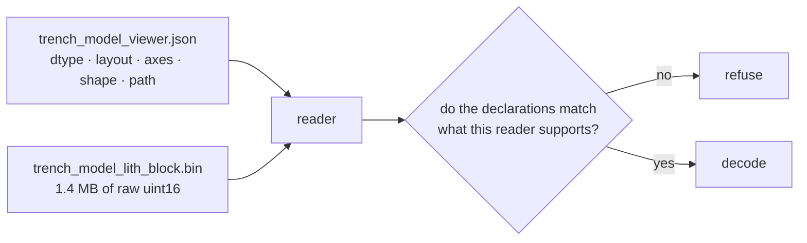

# Binary serialisation

Writing numbers to a file as raw bytes rather than as text. Fast and compact,
and it carries no self-description — so everything the reader needs must be
stated somewhere else.

## What it is

A text format encodes `4660` as the four characters `4660`. A binary format
writes the two bytes `34 12`. Binary is smaller and parses faster, and it is
**opaque**: nothing in the bytes says how wide each number is, what order its
bytes are in, or how a multidimensional array was flattened.

Four things a reader must know, none of which the payload states:

| Property | This project's answer |
|---|---|
| Element type and width | `uint16` |
| [Byte order](endianness.md) | little-endian |
| Memory layout | C order (row-major) |
| Shape | `[nx, ny, nz]` from the manifest |

Get any one wrong and the file decodes into plausible-looking noise.

The answer is a **sidecar manifest**: a small JSON document declaring the format
alongside the binary payload.

## The picture



## Where this project uses it

### Writing, with validation before a byte is emitted

`poggio_webapp/pipeline/build_gempy.py`:

```python
def write_lithology_binary(lith_block, resolution, output_path, lithology_names=None):
    resolution_array = np.asarray(resolution)
    if (
        resolution_array.shape != (3,)
        or resolution_array.dtype.kind not in "iu"
        or np.any(resolution_array <= 0)
    ):
        raise ValueError("resolution must contain three positive integers")
    shape = tuple(int(value) for value in resolution_array)
    expected_count = int(np.prod(resolution_array, dtype=np.int64))

    values = np.asarray(lith_block)
    if values.size != expected_count:
        raise ValueError(
            "lithology block element count "
            f"{values.size} does not match resolution product {expected_count}"
        )
    if values.dtype.kind not in "iuf":
        raise ValueError("lithology block values must be numeric")
    if not np.isfinite(values).all():
        raise ValueError("lithology block values must be finite")
    if np.any(values < 0):
        raise ValueError("lithology block values must be non-negative")
    if np.any(values != np.floor(values)):
        raise ValueError("lithology block values must be integers")
    if np.any(values > 65535):
        raise ValueError("lithology block values must not exceed 65535")
```

**Seven checks before the file is opened.** Because the format is opaque, a bad
value cannot be detected later — a negative number silently becomes a huge
unsigned one, a float truncates, an out-of-range value wraps. Every one of those
would render as a wrong lithology rather than as an error.

Then the write, with the byte order pinned:

```python
# `<u2` is pinned rather than left as the platform's native uint16: the
# browser decodes this file with DataView.getUint16(i, true), so the file
# has to be little-endian on every machine that writes one.
encoded = np.asarray(values.reshape(shape, order="C"), dtype="<u2").ravel(order="C")
with open(output_path, "wb") as binary_file:
    binary_file.write(encoded.tobytes(order="C"))
```

`order="C"` appears three times. C order means the last axis varies fastest, and
the reader's index arithmetic depends on it:

```javascript
export function volumeIndex(x, y, z, shape) {
  const [nx, ny, nz] = validatedShape(shape);
  ...
  return ((validX * ny) + validY) * nz + validZ;
}
```

Fortran order would need `x + nx*(y + ny*z)` instead. Same bytes, different
volume.

### The manifest that makes it readable

```python
manifest["volume"] = {
    "schema_version": 1,
    "format": "raw",
    "dtype": "uint16-le",
    "layout": "C",
    "axes": ["x", "y", "z"],
    "shape": [int(value) for value in resolution],
    "path": relative_path(volume_path),
    "lithologies": [
        {"id": int(lithology["id"]), "name": str(lithology["name"])}
        for lithology in (volume_lithologies or [])
    ],
}
```

Every assumption made explicit, including the mapping from numeric ID to
lithology name — without which the volume is just integers.

### Reading, refusing anything unexpected

`poggio_webapp/static/visualizer/volume3d-core.mjs` checks each declaration
against the only values it supports:

```javascript
if (raw.schema_version !== SUPPORTED_SCHEMA_VERSION) {
    throw new TypeError("volume.schema_version must be 1");
}
if (raw.format !== SUPPORTED_FORMAT) {
    throw new TypeError('volume.format must be "raw"');
}
if (raw.dtype !== SUPPORTED_DTYPE) {
    throw new TypeError('volume.dtype must be "uint16-le"');
}
if (raw.layout !== SUPPORTED_LAYOUT) {
    throw new TypeError('volume.layout must be "C"');
}
```

and cross-checks the payload against the declared shape:

```javascript
const actualCount = arrayBuffer.byteLength / 2;
if (actualCount !== expectedCount) {
    throw new RangeError(
      `volume payload contains ${actualCount} elements; expected ${expectedCount}`,
    );
}
```

The server validates the manifest independently, in
`poggio_webapp/backend/services/viewer_files.py`:

```python
and shape == resolution
```

Three parties assert the same contract: the writer, the server that offers the
file, and the browser that decodes it. None trusts another's word.

## Why this and not something else

| Alternative | How it would transfer 700 000 values | Why it lost |
|---|---|---|
| **JSON array** | `[1, 1, 2, …]` | Self-describing and readable, and several megabytes of text against 1.4 MB binary, with a much slower parse. |
| **CSV** | One value per line | Same objection, plus no natural way to express three dimensions. |
| **`.npy` (NumPy's own)** | Header declares dtype, order, shape | Genuinely self-describing and exactly right — for a Python reader. The consumer is a browser, which would need an `.npy` parser. |
| **HDF5 or Zarr** | Chunked, compressed, self-describing | The right answer at scientific scale, and both need a browser-side library. |
| **Protocol Buffers / MessagePack** | Schema-driven binary | Well-suited to structured records, unnecessary overhead for a flat numeric array. |
| **Raw binary + JSON manifest** *(chosen)* | Bytes plus a declaration | Compact, decodable in six lines with no dependency, and the contract is written down rather than implied. |

The deciding constraint is the browser. This project **ships no build step** and
vendors nothing beyond Three.js, so any format needing a decoder library is out.
Raw plus a manifest is the only option that is both compact and dependency-free.

The manifest is what makes it defensible. Raw binary *without* a declaration
would be an undocumented format — the thing that becomes unreadable in five
years. With `dtype`, `layout`, `axes`, and `shape` written down, the file is
self-contained evidence.

## What it costs

The file is 2 bytes per voxel: 1.4 MB at 100 × 100 × 70. JSON would be roughly
4× that and far slower to parse.

The costs:

- **Opacity.** You cannot look at the file. Debugging needs a decoder.
- **A four-part contract** that must stay in step across three
  implementations — hence the assertions on all three sides.
- **No compression.** A lithology block is highly repetitive and would compress
  enormously. Adding compression means a decoder in the browser, which is the
  constraint that shaped the whole choice.
- **`.npz` is written too**, alongside, for Python consumers:
  `np.savez(lith_path, lith_block=..., resolution=..., extent=...)`. Two formats
  for two audiences rather than one compromise.

## Where else you meet it

- **Image and audio formats** — the pixel data in a BMP or the samples in a WAV
  are raw arrays behind a header that declares exactly these properties.
- **Machine-learning weights** — safetensors is raw tensors plus a JSON header,
  the identical pattern.
- **Scientific data** — FITS in astronomy, NIfTI in medical imaging, both
  header-plus-payload.
- **Memory-mapped files and databases**, where fixed-width binary records allow
  direct offset arithmetic.
- **Network protocols**, where a fixed binary layout is what makes parsing fast.

## Related pages

- [Endianness](endianness.md) — one of the four declarations.
- [Bit depth and dynamic range](bit-depth-and-dynamic-range.md) — why `uint16`.
- [Schema versioning](schema-versioning.md) — how the reader refuses a future
  format.
- [Validation at trust boundaries](validation-at-trust-boundaries.md) — the
  checks on both sides.
- [Output files](../reference/output-files.md) — what each stage writes.
