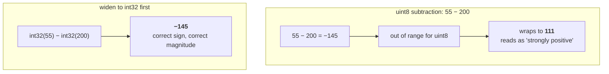

# Bit depth and dynamic range

How many distinct values one number can hold, and what happens at the two ends
when you ask for one it cannot.

## What it is

*Bit depth* is how many bits store one value. *Dynamic range* is the span of
values that implies.

| Type | Range | Used here for |
|---|---|---|
| `uint8` | 0 – 255 | image pixels |
| `int32` | ±2.1 billion | intermediate arithmetic on pixels |
| `float32` | ~7 significant digits | normalised intermediates |
| `uint16` | 0 – 65 535 | lithology identifiers in the model volume |

Two failure modes matter, and this repository has guarded against both:

**Overflow and wraparound.** In an unsigned type, `55 − 200` does not give
−145; it wraps to 111. No error, no warning, a plausible-looking number.

**Saturation.** In OpenCV's saturating arithmetic, `240 + 40` clamps to 255
rather than wrapping. Safer, but it silently destroys the distinction between
"bright" and "brighter."

## The picture



For the redness test in `detect_markers.py`, the wrapped value inverts the
answer completely: every red pixel would score as strongly *not* red, and the
red-annotation filter would admit exactly what it exists to exclude.

## Where this project uses it

### Widening before signed arithmetic

`poggio_webapp/pipeline/detect_markers.py`:

```python
b, g, r = cv2.split(img.astype(np.int32))
redness = r - (g + b) / 2.0
```

`.astype(np.int32)` is the entire safety mechanism. Without it the subtraction
is `uint8` and silently wrong. See
[colour-channel arithmetic](colour-channel-arithmetic.md).

### Normalising through float, then coming back

`poggio_webapp/pipeline/preprocess.py` divides one image by another, which
cannot be done in integers at all:

```python
norm = gray.astype(np.float32) / bg.astype(np.float32)
norm = np.clip(norm * 200.0, 0, 255).astype(np.uint8)
```

Note the explicit `np.clip` before the cast back. Casting an out-of-range float
to `uint8` in NumPy wraps rather than clamps, so the clip is doing real work,
not decoration.

### Choosing a width to fit the data

`poggio_webapp/pipeline/build_gempy.py` writes lithology identifiers, and picks
`uint16` deliberately (one byte would cap at 255 surfaces, four would double
the file for no benefit):

```python
if np.any(values > 65535):
    raise ValueError("lithology block values must not exceed 65535")
```

The whole validation sequence checks integrality, non-negativity, finiteness,
and range **before** a byte is written, so an out-of-range value produces an
error rather than a silently truncated model. See
[validation at trust boundaries](validation-at-trust-boundaries.md).

The browser side enforces the same ceiling independently, in
`poggio_webapp/static/visualizer/volume3d-core.mjs`:

```javascript
const MAX_UINT16 = 65535;
if (!Number.isInteger(id) || id < 0 || id > MAX_UINT16) {
    throw new TypeError(
      `${path}.id must be an integer from 0 through ${MAX_UINT16}`);
}
```

Both ends assert the contract rather than one trusting the other.

## Why this and not something else

For pixel arithmetic:

| Alternative | Why it lost |
|---|---|
| **Work in `float32` throughout** | Removes every overflow concern and quadruples memory. Reasonable for a small analysis image; wasteful for a 20 MP photo, and OpenCV's fastest paths are `uint8`. |
| **Rely on OpenCV's saturating operators** (`cv2.subtract`) | Genuinely safe: it clamps at 0 instead of wrapping. But it clamps, so `55 − 200` becomes 0, not −145, and the *magnitude* of the redness is gone. The test needs the signed value. |
| **Widen only where needed** *(what this does)* | One `astype` at the point of danger, everything else stays `uint8`. |

For the volume format:

| Alternative | Why it lost |
|---|---|
| **`uint8`** | Halves the file, caps at 255 lithologies. Plausible today, a silent ceiling later. |
| **`int32` or `float32`** | Doubles the file for a value that is a small integer identifier. At 100×100×70 = 700 000 cells, `uint16` is 1.4 MB and `float32` is 2.8 MB across the network to a browser. |
| **A compressed format (PNG-style, or zlib)** | Smaller on the wire, and requires a decoder in the browser plus a schema for how the 3D data was flattened. `uint16` raw plus an explicit `shape` is decodable in six lines. |

## What it costs

Memory scales linearly with width: the same image is 1×, 2×, or 4× depending
on `uint8`, `uint16`, or `float32`. Nothing else about bit depth costs
anything: the arithmetic is the same speed. The cost of getting it *wrong* is
a wrong answer with no error message, which is why the guards are explicit.

## Where else you meet it

- Audio. 16-bit versus 24-bit recording is exactly this trade-off, and
  clipping a loud passage is saturation.
- HDR photography exists because 8 bits per channel cannot span a scene
  containing both sky and shadow.
- The Ariane 5 flight 501 failure was a 64-bit float converted to a 16-bit
  signed integer that did not fit.
- Medical imaging. CT scans are 12- or 16-bit precisely because 256 levels
  cannot distinguish the tissue densities that matter.
- Timestamp overflows: the 2038 problem is a 32-bit signed integer running
  out of seconds.

## Related pages

- [Colour-channel arithmetic](colour-channel-arithmetic.md): the subtraction
  that needs the widening.
- [Floating-point representation](floating-point-representation.md): the other
  numeric trap in this codebase.
- [Endianness](endianness.md): the *order* those bytes are written in.
- [Binary serialisation](binary-serialisation.md): writing the volume to disk.
