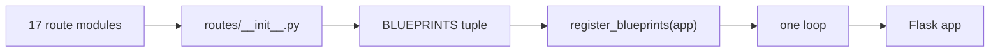

# Blueprint and plugin registries

Collecting components in a list and registering them in a loop, instead of
wiring each one by hand. The registration becomes data, and adding a component
becomes a one-line edit in a place a reviewer will notice.

## What it is

A **registry** is a collection of components a system iterates over. Adding a
component means adding it to the collection; nothing else changes.

Flask's **blueprints** are the web version: a blueprint groups related routes,
and registering it attaches them all to the application.

Two ways to build the registry:

**Explicit** — a literal list, maintained by hand. Adding a component requires
an edit that shows up in a diff.

**Discovered** — scan a directory or a decorator registry at import. Adding a
component requires only creating a file.

Discovery is more convenient and less predictable: import order becomes
significant, a stray file becomes a component, and nothing shows in a diff.

## The picture



## Where this project uses it

### Route blueprints

`poggio_webapp/backend/routes/__init__.py`, the whole file:

```python
"""Register all backend blueprints."""

from flask import Flask

from .demo import bp as demo_bp
from .editor import bp as editor_bp
from .extraction import bp as extraction_bp
from .features import bp as features_bp
from .finds import bp as finds_bp
from .gempy import bp as gempy_bp
from .harris import bp as harris_bp
from .jobs import bp as jobs_bp
from .manual import bp as manual_bp
from .markers import bp as markers_bp
from .pages import bp as pages_bp
from .preprocess import bp as preprocess_bp
from .processing import bp as processing_bp
from .scans import bp as scans_bp
from .task_status import bp as task_status_bp
from .text_metadata import bp as text_metadata_bp
from .trenches import bp as trenches_bp

BLUEPRINTS = (
    pages_bp,
    jobs_bp,
    editor_bp,
    finds_bp,
    scans_bp,
    preprocess_bp,
    extraction_bp,
    features_bp,
    markers_bp,
    manual_bp,
    task_status_bp,
    text_metadata_bp,
    processing_bp,
    gempy_bp,
    harris_bp,
    trenches_bp,
    demo_bp,
)


def register_blueprints(app: Flask) -> None:
    for blueprint in BLUEPRINTS:
        app.register_blueprint(blueprint)
```

Three details.

**Every module exports the same name, `bp`,** aliased on import. That uniformity
is what makes the file readable — seventeen lines with one shape.

**The tuple is ordered roughly by pipeline stage** — pages, jobs, editor, then
scan → preprocess → extraction → features → markers → manual → processing →
gempy — rather than alphabetically like the imports. The registry documents the
application's shape as well as its contents.

**A tuple, not a list.** Immutable, so nothing can append to it at runtime.

The result is that [`create_app`](application-factory.md) has one line for
routing:

```python
register_blueprints(app)
```

and `app.py` can state its invariant: *"Every route lives in a blueprint under
backend/routes/ and is registered by backend.create_app()."*

That invariant is testable. `tests/test_url_map.py` exists precisely to check the
registered routes.

### A re-export registry, for a package split

`poggio_webapp/pipeline/editor/__init__.py` uses the same idea to keep a
refactor invisible to callers:

```python
"""Editor sessions: storage, structural validation, finalization.

Split out of a single 660-line module during the modularization refactor.
Every name that module exported is re-exported here, so ``from pipeline import
editor`` and ``from pipeline.editor import X`` keep working unchanged.
"""

from .errors import (
    DuplicateFaceNameError,
    EditorSchemaMismatchError,
    ...
)
from .finalize import finalize_editor_session
from .finds import add_find, delete_find, get_finds, sync_finds_to_output
from .schema import (...)
from .session import create_editor_session, load_editor_state, save_editor_state

__all__ = [
    "ALLOWED_SCHEMA_TYPES",
    ...
]
```

`__all__` is the registry: the package's public surface, stated explicitly. A
660-line module became seven files with **no caller changed**.

This is also why `pyproject.toml` carries a targeted lint exemption:

```toml
[tool.ruff.lint.per-file-ignores]
# Re-export surfaces: these exist precisely to expose names they do not use.
"poggio_webapp/pipeline/editor/__init__.py" = ["F401"]
"poggio_webapp/backend/services/__init__.py" = ["F401"]
```

Two files, named individually, with the reason. Not a blanket suppression.

### A data registry for a domain vocabulary

`poggio_webapp/pipeline/site_vocab.py` applies the pattern to domain data rather
than to code:

```python
DRAWN_FEATURE_TYPES = (
    {"key": "stone", "label": "Stone", "kind": "material",
     "material": "S", "surveyCode": "STONE"},
    ...
    {"key": "wall", "label": "Wall", "kind": "unit",
     "unitType": "structure", "surveyCode": "WALL"},
    ...
)


def feature_type(key):
    """One DRAWN_FEATURE_TYPES entry by key, or None."""
    for entry in DRAWN_FEATURE_TYPES:
        if entry["key"] == key:
            return entry
    return None
```

A tuple of records plus a lookup — the same shape as `BLUEPRINTS` plus
`register_blueprints`. The comment even documents the *ordering* decision:
"Ordered for a dropdown: the things actually drawn on the T104 sheets first."

## Why this and not something else

| Alternative | How it would register routes | Why it lost |
|---|---|---|
| **Register each by hand in `create_app`** | 17 `app.register_blueprint(...)` calls | Works, and mixes the list of components with the construction logic. Extracting the list makes the *contents* reviewable separately from the *mechanism*. |
| **Auto-discovery by directory scan** | `pkgutil.iter_modules` over `routes/` | Adding a file is enough — and a leftover or experimental module becomes live, import order becomes significant, and the set of registered routes no longer appears in any diff. |
| **Decorator registration** | `@register` on each blueprint | Elegant, and it makes registration a side effect of import, so an unimported module silently disappears. |
| **An entry-point or plugin system** | `importlib.metadata.entry_points` | For genuinely third-party plugins. Every route here ships in this repository. |
| **An explicit tuple** *(chosen)* | One list, one loop | Adding a route is a visible one-line diff, the order is deliberate, and nothing is registered by accident. |

The recurring judgement is **explicit over automatic where the set is
reviewable**. Seventeen blueprints written down is not a burden, and it means a
reviewer sees a new route being added rather than a new file appearing.

The same repository *does* choose discovery where the set is large and
mechanical — `check_coverage.py` walks `pipeline/` and `backend/` with `rglob`
to find modules needing documentation. The rule is not "always explicit"; it is
"explicit where each addition deserves a decision."

## What it costs

One import and one tuple entry per component.

The costs:

- **Two edits to add a route** — a module and a registry line. The redundancy is
  the point.
- **The list can drift** if someone adds a module and forgets the registry.
  Caught by the route being absent, and by `tests/test_url_map.py`.
- **Import cycles are possible.** Every blueprint is imported at package import,
  so a route importing something that imports `routes` would fail. The
  [layered architecture](layered-architecture.md) prevents this by keeping
  dependencies pointing down.
- **Re-export registries need a lint exemption**, which is granted per file with
  a stated reason rather than globally.

## Where else you meet it

- **Django's `INSTALLED_APPS`** and `urlpatterns` — the same explicit list.
- **Webpack, Rollup, and ESLint plugin arrays.**
- **`pytest` fixtures and hooks**, which use discovery, with the surprises that
  brings.
- **Operating system driver tables**, and `/etc/*.d` configuration directories.
- **Service locators and DI containers**, which are registries with resolution
  attached.

## Related pages

- [Application factory](application-factory.md) — what consumes the registry.
- [Layered architecture](layered-architecture.md) — what each blueprint
  delegates to.
- [Separation of concerns](separation-of-concerns.md) — one blueprint per
  concern.
- [API routes](../reference/api-routes.md) — every endpoint these register.
