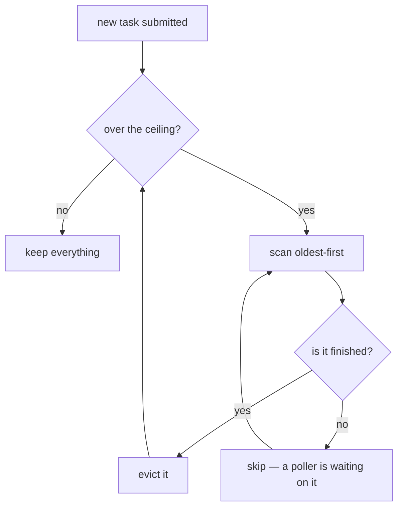

# Bounded caches and eviction

Any store that grows with use and never shrinks will eventually exhaust memory.
A bound plus an eviction policy is the fix — and *what* to evict is the
interesting part.

## What it is

An unbounded in-memory store is a memory leak with extra steps. The remedy has
two halves: a **ceiling**, and a **policy** for what to discard when it is
reached.

Common policies:

| Policy | Evicts | Good for |
|---|---|---|
| **FIFO** | oldest inserted | queues of finished work |
| **LRU** | least recently *used* | caches where recency predicts reuse |
| **LFU** | least frequently used | stable hot sets |
| **TTL** | anything older than a duration | data with a natural expiry |
| **Score-based** | lowest-ranked | candidate lists |

A policy that can evict something still in use is a bug, not a trade-off. That
constraint drives the design below.

## The picture



## Where this project uses it

### The task table

`poggio_webapp/backend/tasks.py` — a finished task keeps its whole log, and a
GemPy build logs steadily:

```python
# A finished task holds its whole log, and a GemPy build logs steadily. Without
# a ceiling a long-lived server accumulates every line of every build it has
# ever run. Only finished tasks are evicted, oldest first, so a running build
# can never lose the record a poller is waiting on.
MAX_RETAINED_TASKS = 200

TASKS = OrderedDict()
```

```python
def _evict_finished():
    """Drop the oldest finished tasks until the retention ceiling is met."""
    for task_id in list(TASKS):
        if len(TASKS) <= MAX_RETAINED_TASKS:
            return
        if TASKS[task_id]["status"] in _FINISHED:
            del TASKS[task_id]
```

Three decisions:

**`OrderedDict`**, so "oldest" is well defined. Insertion order gives FIFO for
free.

**Only finished tasks are evicted.** The browser polls `/api/tasks/<id>` while a
build runs; evicting a running task would make that poll 404 and lose the build's
status. So the scan checks `status in _FINISHED` and skips anything else — which
means the ceiling can be *exceeded* if 200 builds run at once. Overshooting a
memory bound is a far better failure than losing a live task.

**`list(TASKS)`** materialises the keys before iterating, because the loop
deletes from the dict it is walking.

Eviction happens inside the lock, at submission:

```python
with _TASKS_LOCK:
    TASKS[task_id] = {"status": "running", ...}
    _evict_finished()
```

`_evict_finished` is a read-decide-delete sequence, which is not atomic even
under the GIL. See [locks and critical sections](locks-and-critical-sections.md).

### Candidate lists

The same idea appears as output bounds in both detectors.

`poggio_webapp/pipeline/detect_features.py`:

```python
MAX_CANDIDATES = 250
...
if not duplicate:
    kept.append(candidate)

if len(kept) >= MAX_CANDIDATES:
    break
```

The list is sorted by score first, so the break keeps the **best** 250 —
score-based eviction, expressed as a bounded greedy pass. See
[non-maximum suppression](non-maximum-suppression.md).

`poggio_webapp/pipeline/detect_markers.py` bounds its rejected-candidate list,
and explains the reasoning:

```python
# Only NEAR MISSES are worth showing: a reject far outside the marker size
# band (graph-paper texture below it, stone outlines and the whole-sheet
# contour above it) was never a plausible marker, and rendering thousands of
# them buries the drawing. Shown: diameter within [0.5*min_d, 1.5*max_d] and
# roughly round, capped at the most circular 300.
near_misses.sort(key=lambda entry: -entry.get("circularity", 0.0))
near_misses = near_misses[:300]
```

Filter by plausibility, rank by quality, cap. The bound protects the *interface*
rather than memory — thousands of red dots would make the review page unusable.

`poggio_webapp/pipeline/harris_render.py` takes the fourth option and refuses:

```python
_MAX_UNITS = 250
...
if len(matrix.units) > _MAX_UNITS:
    raise HarrisRenderError(
        "Harris Matrix SVG rendering supports at most "
        f"{_MAX_UNITS} units; this matrix contains {len(matrix.units)}."
    )
```

Four bounds, three different responses: evict, truncate-by-rank, and refuse. Each
matched to whether silently dropping data would mislead.

## Why this and not something else

For the task table:

| Alternative | How it would work | Why it lost |
|---|---|---|
| **Unbounded** | Never evict | The status quo before the fix, and a slow leak: every log line of every build, forever. |
| **TTL sweep** | Drop tasks older than an hour | Time-based rather than pressure-based, so a burst of 10 000 builds in an hour still exhausts memory. It also needs a background thread or a check on every access. |
| **LRU** | Evict least recently polled | Would keep tasks a browser is still watching — genuinely appealing. It needs access tracking, and the natural pattern here is that a task is polled until it finishes and then never again, which makes FIFO-over-finished equivalent and simpler. |
| **Persist to disk** | Write task state to the job directory | Would survive restart, which is the *other* documented limitation. A larger change, and the files a build writes already survive; only the status is lost. |
| **FIFO over finished tasks** *(chosen)* | Oldest finished first, never a running one | Bounded memory, no background thread, and structurally incapable of evicting a live task. |

The generalisable rule: **choose the eviction policy from the access pattern,
and make it impossible to evict something in use.** The second half is what the
`status in _FINISHED` check buys, and it is why the ceiling is soft rather than
hard.

## What it costs

`_evict_finished` is O(n) in the worst case — a scan when over the ceiling —
and runs only at submission. At 200 entries, nothing.

The costs:

- **The ceiling is soft.** With 200 concurrent running builds, memory grows past
  it. Deliberate.
- **History is lost.** A task submitted 201 builds ago is gone, so a stale
  browser tab polling it gets a 404. Acceptable: task state is already documented
  as not surviving a restart.
- **The bound is a constant**, not configurable. 200 tasks of log text is a few
  megabytes.
- **Candidate caps hide data.** `MAX_CANDIDATES = 250` silently drops the
  251st-best feature. The mitigation is ranking first, so what is dropped is
  what scored worst.

## Where else you meet it

- **CPU and CDN caches**, where LRU and its approximations are standard.
- **`functools.lru_cache`** in Python, and memoisation generally.
- **Redis `maxmemory-policy`**, which offers exactly this menu of policies.
- **Log rotation**, which is TTL or size-based eviction of files.
- **Connection pools**, bounding a resource that would otherwise grow with load.
- **Object detectors**, which cap output boxes after ranking — the same
  score-based truncation as `MAX_CANDIDATES`.

## Related pages

- [Locks and critical sections](locks-and-critical-sections.md) — why eviction
  happens under a lock.
- [Race conditions](race-conditions.md) — what the lock prevents.
- [Non-maximum suppression](non-maximum-suppression.md) — the ranked truncation.
- [Fail-closed design](fail-closed-design.md) — refusing rather than truncating,
  in the renderer.
- [Asynchronous tasks](../architecture/asynchronous-tasks.md) — the task
  lifecycle.
