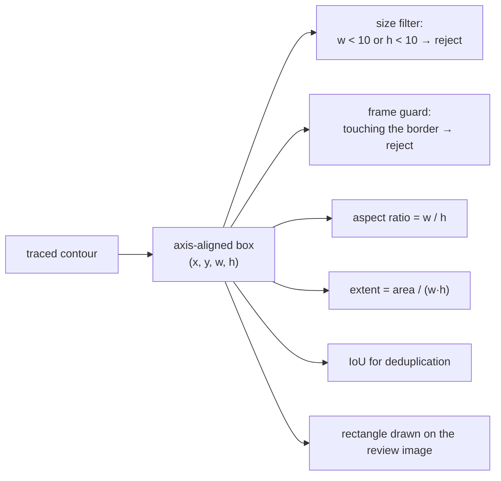

# Bounding boxes

The smallest axis-aligned rectangle containing a shape. Four numbers that cost
almost nothing and support size filtering, overlap tests, review overlays, and
the reviewer's own editing.

## What it is

For a set of points, the **axis-aligned bounding box** (AABB) is
`(min x, min y, width, height)`. Computing it is one pass with four running
extremes.

The alternative is the **rotated** minimum-area rectangle
(`cv2.minAreaRect`), which finds the tightest rectangle at any angle. It fits
elongated diagonal shapes far better, and it costs more, is defined by five
numbers including an angle, and no longer aligns with the pixel grid or with an
HTML overlay.

An AABB is a *conservative* bound: everything inside the shape is inside the
box, and much of the box may be empty. That looseness is not merely tolerated.
It is what makes [extent](extent-and-fill-ratio.md) informative.

## The picture



Why extent needs a *loose* box:

```
a filled disk          box area ≈ 1.27 × shape area   → extent ≈ 0.79
a diagonal line        box area ≈ 50 × shape area     → extent ≈ 0.02
```

A rotated minimum-area box would give the diagonal line an extent near 1.0,
destroying the very distinction being measured.

## Where this project uses it

`poggio_webapp/pipeline/detect_features.py`, immediately after the area check:

```python
x, y, width, height = cv2.boundingRect(contour)

if width < 10 or height < 10:
    continue

if width > 0.34 * analysis_width:
    continue

if height > 0.34 * analysis_height:
    continue

if (
    x <= 2
    or y <= 2
    or x + width >= analysis_width - 2
    or y + height >= analysis_height - 2
):
    continue

aspect_ratio = width / height
...
extent = area / float(width * height)
```

Five uses of four numbers:

**Minimum size.** Below 10 px in either dimension, the shape measures that
follow are dominated by quantisation.

**Maximum size**, as a fraction of the image. A candidate wider than a third of
the sheet is a layer band or the sheet border, not a discrete feature.
Expressing it as a fraction keeps it meaningful at any input resolution.

**Frame guard.** A shape clipped by the image edge has a meaningless area and
[aspect ratio](aspect-ratio.md), and the outermost contour of any image is the
frame itself, which would otherwise be candidate number one every time.

**[Aspect ratio](aspect-ratio.md)** and **[extent](extent-and-fill-ratio.md)**,
both derived directly from the box.

Boxes also survive into the output and are the coordinates the reviewer works
with:

```python
raw_candidates.append({
    "x": round(x * inverse_scale, 1),
    "y": round(y * inverse_scale, 1),
    "width": round(width * inverse_scale, 1),
    "height": round(height * inverse_scale, 1),
    ...
})
```

`inverse_scale` maps them back from the downsampled analysis image to full
resolution. See [multi-scale analysis](multi-scale-analysis.md).

They are also the geometry [IoU](intersection-over-union.md) is computed on for
[deduplication](non-maximum-suppression.md), and what
`write_review_overlay()` draws:

```python
cv2.rectangle(image, (x, y), (x + width, y + height), (50, 150, 50), 4)
```

## Why this and not something else

| Alternative | How it would work here | Why it lost |
|---|---|---|
| **Rotated minimum-area rectangle** | `cv2.minAreaRect` | Tighter on elongated diagonal shapes, and it breaks [extent](extent-and-fill-ratio.md) as a discriminator: a diagonal line's rotated box is nearly full, so extent stops separating lines from blobs. It also complicates [IoU](intersection-over-union.md), which becomes a polygon-clipping problem instead of four `min`/`max` calls, and it does not map cleanly onto an HTML overlay the reviewer drags. |
| **[Convex hull](convex-hull.md)** | The tightest convex boundary | Also computed here, for [solidity](solidity.md). It is a polygon rather than four numbers, so it is not a cheap filtering primitive. |
| **[Minimum enclosing circle](minimum-enclosing-circle.md)** | The tightest circle | Used in `detect_markers.py`, where the targets *are* round. For arbitrary stone shapes a circle is a poor proxy. |
| **The full contour** | Filter on the polygon directly | Every question the box answers would become a polygon operation, hundreds of times more expensive, for filters whose whole purpose is to be cheap enough to run on every candidate. |
| **AABB** *(chosen)* | Four integers | O(n) to compute, O(1) to test, aligns with the pixel grid and with the review interface, and its very looseness is what makes extent meaningful. |

The design pattern is **cheap filter first**. Box tests eliminate most
candidates before [convex hull](convex-hull.md), the most expensive measure,
is computed at all. Ordering the filters from cheapest to dearest is why the
detector runs in milliseconds on thousands of contours.

## What it costs

O(n) over the contour's vertices to compute, four integers to store, O(1) for
every test. Nothing meaningful.

The cost is looseness. A thin diagonal shape has a box many times its own area,
so a box-based size filter is generous, deliberately, since the tighter shape
measures follow. And for a rotated shape, [aspect ratio](aspect-ratio.md)
measures the *box*, not the object: a 45° elongated stone has an aspect ratio
near 1.0. The filter's band is `0.16 – 6.2`, wide enough that this does not
cause rejections.

## Where else you meet it

- Object detection. Every YOLO or R-CNN output is a bounding box with a
  class and a score, deduplicated with [IoU-based NMS](non-maximum-suppression.md),
  the identical pattern to `_dedupe` here.
- Collision detection in games, where a broad-phase AABB test precedes exact
  geometry.
- Spatial indexes: R-trees store bounding boxes precisely because they are
  cheap to test.
- Web layout, where `getBoundingClientRect()` is this idea in the DOM.
- Ray tracing, where bounding volume hierarchies skip whole subtrees.

## Related pages

- [Aspect ratio](aspect-ratio.md) and
  [extent](extent-and-fill-ratio.md): the measures derived from the box.
- [Intersection over union](intersection-over-union.md): overlap between two
  boxes.
- [Non-maximum suppression](non-maximum-suppression.md): what that overlap
  feeds.
- [Minimum enclosing circle](minimum-enclosing-circle.md): the marker
  detector's equivalent primitive.
- [Multi-scale analysis](multi-scale-analysis.md): why coordinates are scaled
  back.
