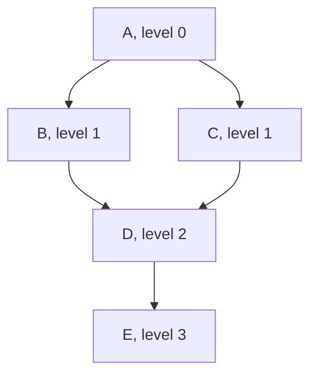

# Breadth-first search

Explore a graph level by level, nearest first. The natural choice for
shortest-path and layering questions: considered here, used in one disguised
form, and rejected for the traversal that needed depth.

## What it is

BFS visits every node at distance 1, then every node at distance 2, and so on.
The implementation differs from [depth-first search](depth-first-search.md) by
one line: take from the **front** of the pending collection rather than the
back.

```
BFS:  pending.pop(0)     # a queue,  first in first out
DFS:  pending.pop()      # a stack,  last in first out
```

That single change alters what the traversal is good at:

| | BFS | DFS |
|---|---|---|
| Finds | shortest paths (unweighted) | any path, deep first |
| Natural for | levels, distance, layering | cycles, backtracking, ancestry |
| Memory | O(width), which can be huge | O(depth) |
| Knows "on the current path" | no | **yes** |

That last row is why cycle detection uses DFS. A cycle is a back-edge to a node
still on the current path, and BFS has no current path.

## The picture



```
BFS from A:  A → B, C → D → E        by distance
DFS from A:  A → B → D → E → C       one path to the bottom, then back
```

For a Harris Matrix, the BFS ordering *is* the reading order: everything at the
same level is contemporaneous as far as the recorded relations say.

## Where this project uses it

### Not for cycle detection

`poggio_webapp/pipeline/harris_matrix.py` uses DFS, and the reason is
structural rather than a preference:

```python
def _find_cycle(nodes, edges):
    """The first cycle found by a three-colour depth-first search, or None.

    White (0) unvisited, grey (1) on the current path, black (2) finished. An
    edge to a grey node closes a cycle, and the path slice from that node names
    the units actually on it.
    """
```

The grey state means "on the current path from the start node." BFS explores
many partial paths simultaneously and never has a single current path, so the
grey state has no meaning in it. Detecting a cycle with BFS is possible (via
[Kahn's algorithm](topological-sorting.md), which is BFS-shaped), but it
identifies the *set* of nodes that could not be sorted rather than a concrete
path.

Naming the path is what makes the error actionable:

```python
errors.append(
    _issue(
        "cycle",
        f"Chronological cycle detected: {' -> '.join(cycle)}.",
        cycle,
        _cycle_relation_ids(cycle, relation_ids_by_edge),
    )
)
```

### Not for reachability either

```python
def _path_exists(start, target, edges, excluded_edge):
    ...
    pending = [start]
    visited = set()

    while pending:
        node = pending.pop()  # ← stack: depth-first
        if node == target:
            return True
```

Here BFS would work equally well (reachability does not care about path
length), and DFS is preferred for memory: O(depth) rather than O(width), and it
tends to reach a distant target sooner on a chain-like graph, which a
chronology is.

### Kahn's algorithm is BFS in disguise

`_topological_sort` is BFS-shaped: maintain a frontier of nodes with no
remaining predecessors, take one, and add whatever becomes ready.

```python
ready = [node for node in nodes if indegree[node] == 0]
heapq.heapify(ready)
order = []

while ready:
    node = heapq.heappop(ready)
    order.append(node)
    for neighbor in adjacent[node]:
        indegree[neighbor] -= 1
        if indegree[neighbor] == 0:
            heapq.heappush(ready, neighbor)
```

The frontier is a **min-heap** rather than a plain queue, which changes the
order within a level from arrival order to sorted order, and that is what makes
the output [deterministic](determinism-and-stable-sorting.md). See
[topological sorting](topological-sorting.md).

### Level assignment for the diagram

`poggio_webapp/pipeline/harris_render.py` computes each node's vertical rank:

```python
def _longest_path_ranks(order, edges):
    adjacent = defaultdict(list)
    for younger_id, older_id in edges:
        adjacent[younger_id].append(older_id)
    for children in adjacent.values():
        children.sort()

    ranks = {node_id: 0 for node_id in order}
    for younger_id in order:
        for older_id in adjacent[younger_id]:
            ranks[older_id] = max(
                ranks[older_id],
                ranks[younger_id] + 1,
            )
    return ranks
```

This looks like BFS levelling and is deliberately **not**. BFS would give each
node its *shortest* distance from a root; this takes the **longest** path,
because it iterates in topological order and takes a maximum.

The difference matters archaeologically. If Locus 5 is one step below Locus 1 by
one route and three steps below by another, BFS would place it at level 1,
drawing it above units it is known to be younger than. The longest path places
it at level 3, below everything it must be below. See
[layered graph drawing](layered-graph-drawing.md).

## Why this and not something else

| Alternative | Best for | Why it lost, or won here |
|---|---|---|
| **BFS** | Shortest paths, level order | Correct for reachability, and it lacks the "current path" notion cycle detection needs, and its shortest-path levelling is *wrong* for a Harris Matrix. |
| **[DFS](depth-first-search.md)** *(chosen for traversal)* | Cycles, ancestry, backtracking | Gives the grey state, names the cycle path, and uses O(depth) memory. |
| **Kahn's (BFS-shaped)** *(chosen for ordering)* | Topological order | The right shape for a frontier-based sort, and the heap makes it deterministic. |
| **Longest-path levelling** *(chosen for layout)* | Layered drawing | Guarantees every edge points downward, which BFS levelling does not. |
| **Dijkstra** | Weighted shortest paths | No weights here: every relation is one step. |
| **Bidirectional search** | Long shortest paths | Optimisation for a problem this does not have. |

Three related traversals, three different choices, each following from what the
answer is used for. The instructive one is the last: the obvious BFS levelling
would produce a diagram that *looks* fine and violates superposition.

## What it costs

O(V + E) time, same as DFS. Memory is O(width) rather than O(depth), so for a wide
shallow graph BFS can hold far more nodes at once.

For a chronology the shape favours DFS: relations form long chains (a deep
sequence of deposits) more often than wide fans, so depth is small relative to
width at any given level.

The real cost of choosing wrongly is not performance. Using BFS levelling for
the diagram would silently produce a Harris Matrix that draws a unit above one
it is younger than: a chronologically false picture that renders perfectly.

## Where else you meet it

- Shortest route on an unweighted map, and "degrees of separation" in social
  networks.
- Web crawling, where BFS from a seed reaches broad coverage before depth.
- Garbage collection, where mark-sweep collectors often use BFS for cache
  locality.
- Puzzle solving: the shortest solution to a Rubik's cube is a BFS
  question.
- Network broadcast and flood fill, where the paint-bucket tool uses either.
- Chess engines, where iterative deepening blends the two.

## Related pages

- [Depth-first search](depth-first-search.md): the traversal chosen here.
- [Cycle detection](cycle-detection.md): why depth is required.
- [Topological sorting](topological-sorting.md): Kahn's BFS-shaped frontier.
- [Layered graph drawing](layered-graph-drawing.md): why longest-path beats
  shortest-path levelling.
- [Heaps and priority queues](heaps-and-priority-queues.md): what replaces the plain queue.
