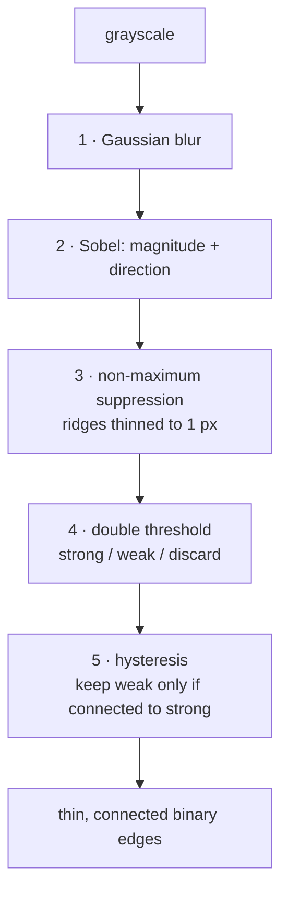

# Canny edge detection

The standard edge detector: five stages that turn a grayscale image into thin,
connected, binary edges. Used twice in this repository, with thresholds chosen
two different ways.

## What it is

John Canny's 1986 algorithm was derived from three explicit optimality criteria —
good detection, good localisation, and a single response per edge — and the five
stages each serve one of them.

1. **[Gaussian blur](gaussian-blur.md)** — suppress noise before
   differentiating.
2. **[Sobel gradients](image-gradients-and-sobel.md)** — compute magnitude and
   direction.
3. **[Non-maximum suppression](edge-thinning-non-maximum-suppression.md)** — keep
   only pixels that are a local maximum *along the gradient direction*, thinning
   ridges to one pixel.
4. **[Double thresholding](hysteresis-thresholding.md)** — classify pixels as
   strong, weak, or discarded.
5. **Edge tracking by hysteresis** — keep weak pixels only if they connect to a
   strong one.

That last pair is what makes Canny robust. A single threshold either breaks
faint edges into dashes or admits noise; two thresholds plus connectivity keeps
a faint edge that is *part of a real edge* and drops a faint pixel that stands
alone.

## The picture



On a line drawing, one important consequence: a drawn stroke has **two** edges,
one on each side, so Canny returns a closed loop around every line. That is why
[contour tracing](contour-tracing.md) on Canny output yields long thin loops for
boundary lines and compact loops for stones — and why
[shape descriptors](circularity.md) can tell them apart.

## Where this project uses it

Twice, with the thresholds set by two different philosophies.

### Fixed thresholds, for deskew

`poggio_webapp/pipeline/preprocess.py`:

```python
def deskew(gray):
    """Estimate small skew from near-horizontal strokes and rotate to correct."""
    edges = cv2.Canny(gray, 50, 150)
    lines = cv2.HoughLines(edges, 1, np.pi / 180, threshold=200)
```

`50, 150` is the textbook 1:3 ratio. Fixed values are acceptable because the
consumer is the [Hough transform](hough-line-transform.md), which is a *voting*
method: it needs enough edge pixels along a line to accumulate votes, and it is
indifferent to extra noise pixels that vote for nothing in particular. The
downstream [median](median-and-robust-statistics.md) over the detected angles
adds a second layer of robustness.

### Median-adaptive thresholds, for feature detection

`poggio_webapp/pipeline/detect_features.py`:

```python
# Canny identifies ink boundaries while avoiding most paper-background
# variation. Closing repairs small gaps in hand-drawn feature outlines.
median_intensity = float(np.median(gray))
lower_threshold = int(max(20, 0.55 * median_intensity))
upper_threshold = int(
    min(
        255,
        max(lower_threshold + 30, 1.25 * median_intensity),
    )
)

edges = cv2.Canny(gray, lower_threshold, upper_threshold)
```

Here the thresholds are derived from the image's own
[median](median-and-robust-statistics.md) intensity. The reasoning:

- The median is the **paper tone**, since most of a drawing is blank paper. It
  is used rather than the mean because it is unaffected by a dark legend block
  or a shadowed corner.
- `0.55 × median` and `1.25 × median` scale with how bright the paper is, so a
  dim photograph and a bright scan get proportionate thresholds.
- `max(20, ...)` floors the lower threshold so a very dark image does not admit
  everything.
- `max(lower + 30, ...)` guarantees the two thresholds stay separated, which is
  what makes hysteresis work at all — if they collapsed together, Canny would
  degrade to single-threshold detection.
- `min(255, ...)` keeps the upper threshold in range.

Four guards on two numbers. This is the difference between "use the median" and
a version that survives an all-black input.

Why adaptive here and fixed there: the feature detector's output feeds
[shape descriptors](solidity.md) that assume closed contours, so a broken
outline is not merely noisier — it is unmeasurable. See
[morphological closing](morphological-closing.md), the step immediately after.

## Why this and not something else

| Alternative | How it would work here | Why it lost |
|---|---|---|
| **[Sobel](image-gradients-and-sobel.md) magnitude + threshold** | Threshold the gradient directly | Simpler, and produces thick, fuzzy edges several pixels wide with no thinning and no connectivity rule. Contour tracing on that gives blobby outlines whose [area](contour-area-and-perimeter.md) and [perimeter](contour-area-and-perimeter.md) are dominated by edge thickness. |
| **Laplacian zero-crossings (Marr–Hildreth)** | Second derivative, find sign changes | Gives inherently thin, closed contours — genuinely attractive here. Much more noise-sensitive, and it produces spurious closed loops in flat regions where the second derivative wanders around zero. |
| **[Adaptive thresholding](adaptive-thresholding.md), then contours** | Binarise the ink, trace the regions | What `detect_markers.py` does, and correctly: it wants *filled* marks, so region-based binarisation is right. `detect_features.py` wants *outlines* of shapes that may be hollow, so an edge detector is right. Two modules, two representations, matched to what each is looking for. |
| **Canny** *(chosen)* | Five-stage classical detector | Thin, connected, single-response edges, with two thresholds that give a robustness knob. Available everywhere and well understood. |
| **Structured forests / HED (learned)** | A trained edge detector | Better on natural photographs, where "edge" means a semantic boundary. Here the edges *are* ink transitions, so the classical operator is exactly right — and it is inspectable, which a learned detector is not. |

The recurring principle: on a drawing, the thing being detected is defined by a
known convention, so a designed operator beats a discovered one.

## What it costs

O(n) overall — a blur, two Sobel passes, a thinning pass, and a connectivity
walk. Milliseconds on the 2200 px analysis image `detect_features` uses.

The parameters are the cost. Two thresholds interact, and their *ratio* matters
as much as their values. The two call sites here handle that in the two
legitimate ways: hard-code a known-good ratio where the consumer is robust, or
derive them from an image statistic with explicit guards where it is not.

Canny's known weakness on this input is that it does not guarantee **closed**
contours — a faint patch in a hand-drawn outline breaks the loop. Hence
[morphological closing](morphological-closing.md) immediately afterwards.

## Where else you meet it

- **`cv2.Canny`** is one of the most-called functions in computer vision.
- **Photoshop's "Find Edges"** and every comparable filter.
- **Autonomous driving**, in classical lane-detection pipelines: Canny then
  Hough, the same pairing as `preprocess.deskew`.
- **Document scanning apps**, detecting the page boundary before perspective
  correction.
- **Medical imaging**, as a first pass for organ boundary delineation.

## Related pages

- [Image gradients and Sobel](image-gradients-and-sobel.md) — stage 2.
- [Edge thinning](edge-thinning-non-maximum-suppression.md) — stage 3.
- [Hysteresis thresholding](hysteresis-thresholding.md) — stages 4 and 5.
- [Gaussian blur](gaussian-blur.md) — stage 1.
- [Hough line transform](hough-line-transform.md) — what deskew feeds the edges
  to.
- [Morphological closing](morphological-closing.md) — repairing what Canny
  leaves broken.
