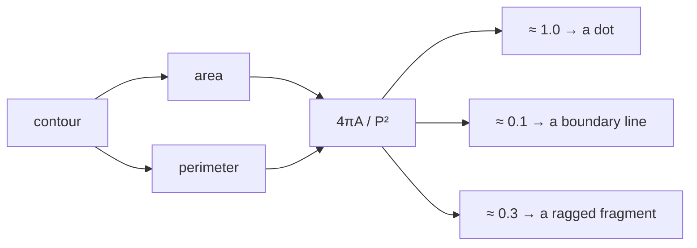

# Circularity

How close a shape is to a perfect circle, as one dimensionless number derived
from area and perimeter. The primary filter that separates a recorder's vertex
dot from the boundary line it sits on.

## What it is

```
circularity = 4π · area / perimeter²
```

The isoperimetric inequality says that among all shapes with a given perimeter,
the circle encloses the most area. So `4πA/P²` reaches its maximum of **1.0**
for a perfect circle and falls toward 0 for anything long, thin, or ragged.

It is **dimensionless**: area is in square units, perimeter squared is in
square units, and the ratio is scale-free. A 2 mm dot and a 2 cm dot both score
1.0.

It is also **rotation-invariant**: neither area nor perimeter changes when a
shape is rotated.

Also called *compactness*, *shape factor*, or *isoperimetric quotient*.

## The picture

```
circle           circularity 1.00
square           circularity 0.785
equil. triangle  circularity 0.605
4:1 rectangle    circularity 0.503
20:1 line-like   circularity 0.114
ragged blob      circularity 0.30 or lower
```



The reason it is so effective on this input: a drawn boundary line is
*extremely* elongated. Its circularity is a small fraction, nowhere near any
plausible dot. The separation is not marginal.

## Where this project uses it

### As a hard filter: marker detection

`poggio_webapp/pipeline/detect_markers.py`:

```python
circularity = 4 * math.pi * area / (perimeter**2)

entry["circularity"] = float(circularity)

if (
    min_d <= diameter <= max_d
    and circularity >= min_circularity  # default 0.65
    and solidity >= min_solidity
    and fill >= 0.5
):
    cand.append(entry)
else:
    rejected.append(entry)
```

**`min_circularity = 0.65`** looks lax for something that should be a circle,
and it is calibrated rather than lax. A digitised circle's perimeter is measured
along a staircase of pixel steps, which overestimates it by around 5%. Since
circularity divides by `P²`, that error is *squared*: a perfect digital circle
measures roughly 0.9, and a small one (a 2 mm dot may be only a dozen pixels
across) measures lower still. 0.65 accommodates a real discretisation bias.

Circularity is also the ranking key for what gets offered back to the reviewer:

```python
near_misses = [
    entry
    for entry in rejected
    if 0.5 * min_d <= entry["diam"] <= 1.5 * max_d
    and entry.get("circularity", 0.0) >= 0.4
]
near_misses.sort(key=lambda entry: -entry.get("circularity", 0.0))
near_misses = near_misses[:300]
```

Rejects are not discarded. The most circular 300 near-misses are returned so a
person can rescue a real vertex the filter dropped. See
[human-in-the-loop review](human-in-the-loop-review.md).

### As a scoring term: feature detection

`poggio_webapp/pipeline/detect_features.py`:

```python
circularity = 4.0 * math.pi * area / (perimeter * perimeter)

compactness = min(1.0, max(0.0, circularity))

score = 0.45 * compactness + 0.35 * min(1.0, solidity) + 0.20 * min(1.0, extent)

if score < 0.28:
    continue
...
suggested_type = (
    "rock/stone"
    if compactness >= 0.24 and 0.35 <= aspect_ratio <= 2.8
    else "other feature"
)
```

Here it is **evidence, not a verdict**: the heaviest term at 0.45 in a weighted
score, and one input to a *suggested* label a reviewer confirms or changes. A
stone is compact but not circular, so a hard threshold would be wrong.

The `min(1.0, max(0.0, ...))` clamp guards against the discretisation bias
running the other way: a small, very smooth contour can compute slightly above
1.0, which would otherwise inflate the score.

Same formula, two roles: hard gate for a manufactured mark, weighted evidence
for a natural object.

## Why this and not something else

| Alternative | What it measures | Why it lost |
|---|---|---|
| **[Aspect ratio](aspect-ratio.md)** | `w / h` of the bounding box | Also used. It is orientation-dependent (a 45° elongated shape has an aspect ratio near 1.0) and it says nothing about raggedness. Circularity catches both. |
| **[Solidity](solidity.md)** | `area / hull area` | Also used, and it measures *dentedness*, not elongation. A long convex ellipse has solidity ≈ 1 and circularity ≈ 0.3. Complementary, not competing. |
| **[Fill ratio](extent-and-fill-ratio.md)** | `area / πr²` against the enclosing circle | Also used. It catches rings, which circularity does not: a thin annulus has low circularity but so does a squiggle. Fill separates hollow from solid. |
| **Ellipse eccentricity** | `fitEllipse`, then the axis ratio | A cleaner elongation measure, and it needs ≥5 points and is unstable on small noisy contours (a 2 mm dot may have very few). |
| **Hu moments** | Rotation-invariant moment descriptors | More discriminative for template *matching*, and uninterpretable. "Circularity ≥ 0.65" can be explained to an archaeologist; a Hu moment threshold cannot. |
| **Circularity** *(chosen)* | Elongation + raggedness, in one number | Free given area and perimeter, dimensionless, rotation-invariant, and directly interpretable. |

The design point is that **no single descriptor suffices**. The marker filter
runs four in conjunction (size, circularity, solidity, fill) because each is
blind to a different failure. Circularity misses a ring; fill catches it.
Circularity misses nothing about a boundary line; it is the first and strongest
gate.

## What it costs

Free, given [area and perimeter](contour-area-and-perimeter.md): three
arithmetic operations. It is computed early, precisely because it is cheap and
highly discriminative, before the O(n log n) [convex hull](convex-hull.md).

The costs are two known biases:

- Perimeter overestimation on digitised shapes, squared by the formula. This is
  handled by setting the threshold at 0.65 rather than near 1.0.
- Small-contour instability. Below about 20 boundary pixels, quantisation
  dominates. The `width < 10 or height < 10` guard in `detect_features.py` and
  the paper-millimetre diameter band in `detect_markers.py` both keep contours
  out of that regime.

## Where else you meet it

- Cell biology, where circularity distinguishes round cells from spread or
  elongated ones. It is one of the most-used measures in ImageJ.
- Sedimentology, classifying grain roundness; the archaeological
  neighbour of this project's use.
- Quality control, checking that a machined hole or moulded part is round.
- Particle analysis in materials science.
- Coastline and fractal studies, where the same ratio quantifies how
  convoluted a boundary is.

## Related pages

- [Contour area and perimeter](contour-area-and-perimeter.md): the inputs.
- [Solidity](solidity.md): the dentedness measure used alongside.
- [Extent and fill ratio](extent-and-fill-ratio.md): the hollowness measures.
- [Aspect ratio](aspect-ratio.md): the cheap elongation measure.
- [Morphological opening](morphological-opening.md): the step that makes
  circularity measurable on a dot attached to a line.
