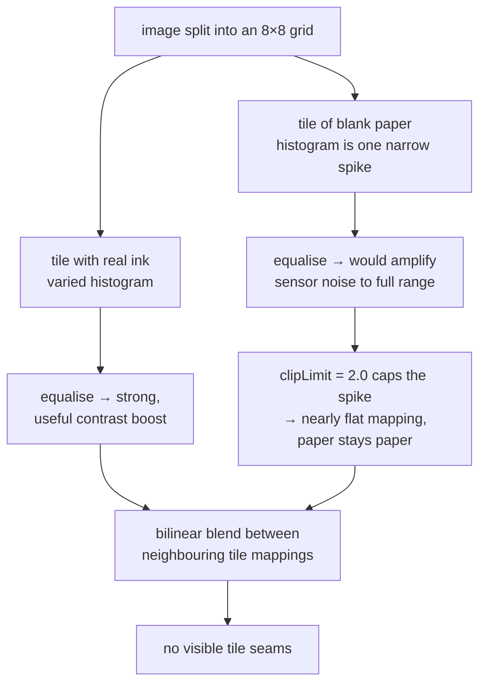

# CLAHE

Contrast-Limited Adaptive Histogram Equalisation: equalise each region of the
image separately, but cap how aggressive the stretch is allowed to get.

## What it is

Three ideas stacked, each fixing the previous one's failure.

1. **Histogram equalisation** spreads intensities to use the full range. It
   uses one mapping for the whole image, so it cannot serve a sheet whose
   corners differ in exposure. See
   [histogram equalisation](histogram-equalisation.md).

2. **Adaptive** — compute a separate mapping for each tile of a grid. Now the
   dark corner gets its own stretch. But a tile of blank paper contains only
   tiny intensity variations, and equalisation dutifully stretches those to
   full range: **noise becomes structure.**

3. **Contrast-limited** — before building the mapping, clip each histogram bin
   at a ceiling and redistribute the excess evenly. A tile with almost no real
   variation now gets an almost-flat mapping, because the clip caps how steep
   the transfer curve can be.

Tiles are then blended by bilinear interpolation between neighbouring tile
mappings, so no grid seams appear in the output.

## The picture



The clip limit is the whole reason CLAHE is usable on documents. Without it,
adaptive equalisation turns every blank region into visual noise — and that
noise then becomes contours for [Canny](canny-edge-detection.md) and
[contour tracing](contour-tracing.md) to find.

## Where this project uses it

`poggio_webapp/pipeline/preprocess.py`, fourth in a five-step chain:

```python
def clean(gray, upscale=2):
    """The recommended pipeline: flatten -> upscale -> CLAHE -> mild sharpen."""
    flat = flatten_background(gray)
    if upscale and upscale != 1:
        flat = cv2.resize(
            flat, None, fx=upscale, fy=upscale, interpolation=cv2.INTER_LANCZOS4
        )
    clahe = cv2.createCLAHE(clipLimit=2.0, tileGridSize=(8, 8))
    eq = clahe.apply(flat)
    blur = cv2.GaussianBlur(eq, (0, 0), sigmaX=1.2)
    sharp = cv2.addWeighted(eq, 1.5, blur, -0.5, 0)
    return sharp
```

Two parameter choices worth naming:

**`clipLimit=2.0`** is conservative. OpenCV's default is 40; values above about
4 start producing the halos and amplified grain that CLAHE exists to prevent.
On a drawing whose faint pencil must survive but whose blank paper must stay
blank, low is right.

**`tileGridSize=(8, 8)`** means 64 tiles regardless of image size. On a
3000-pixel scan each tile is roughly 375 px — comfortably larger than any
boundary line, so no single stroke dominates its own tile's histogram and gets
flattened away.

**Position in the chain matters.** CLAHE runs *after*
[background flattening](homomorphic-illumination-correction.md), which has
already removed the smooth illumination gradient. The two are complementary,
not redundant: flattening fixes the *spatial* problem, CLAHE fixes the
remaining *tonal* one. And it runs *after* the upscale, so tiles are computed on
the final pixel grid rather than being interpolated along with everything else.

Note that `high_contrast()` does **not** use CLAHE — it goes straight from
flattening to [adaptive thresholding](adaptive-thresholding.md), because a
binary output has no use for improved grey levels.

## Why this and not something else

| Alternative | How it would work here | Why it lost |
|---|---|---|
| **Global [histogram equalisation](histogram-equalisation.md)** | One mapping for the whole sheet | Cannot serve corners with different exposure, and amplifies noise without limit. |
| **Adaptive equalisation without the clip (AHE)** | Per-tile, no ceiling | This is the historical predecessor, and the noise amplification on flat regions is severe enough that the clipped version replaced it entirely. |
| **Linear or percentile contrast stretch** | Map the 1st–99th percentile to full range | Predictable, cheap, no noise amplification, and global — same objection as equalisation. Percentile clipping does make it robust to specks, which plain min/max is not. |
| **Gamma correction** | One exponent applied everywhere | One parameter, smooth, non-adaptive. The right γ for a 1980 ink sheet is wrong for a 2025 phone photo. |
| **Do nothing** | Trust the scan | Right for a well-lit 300 DPI scan. The driving case is Trench 23, "scanned well below the 300 DPI the drawing guidelines recommend," where the boundary lines sit near the noise floor. |
| **Learned enhancement (a small CNN)** | Train an enhancement network on scan/clean pairs | No training pairs exist, and it would introduce an unexplainable step into a pipeline whose value is that a person can audit every stage. |

The recurring argument: the inputs are **archival and uncontrolled**, so the
operation must adapt — but a pipeline that later hunts for
[fabricated geometry](fabrication-detection.md) cannot afford an enhancement step that invents
structure. CLAHE with a low clip limit is adaptation with a leash.

## What it costs

O(n) overall: one histogram per tile, each over its own pixels, then a lookup
plus a bilinear blend per pixel. Memory is 64 histograms of 256 bins —
negligible.

The conceptual cost is the same as equalisation's: **intensity after CLAHE is
not photometric.** It is a locally-ranked value. Nothing downstream may treat it
as evidence of how dark the ink really was. Nothing here does — the output feeds
human tracing and edge detection, both of which use contrast, not absolute
level.

## Where else you meet it

- **Medical imaging** — CLAHE is standard in X-ray, MRI, and retinal fundus
  preprocessing, and much of the published tuning literature comes from there.
- **Underwater and aerial photography**, where haze and attenuation vary
  strongly across the frame.
- **Thermal cameras**, which apply something very like it continuously.
- **OCR pipelines** for degraded historical documents — the closest cousin to
  this project's use.
- **Tesseract and similar engines** recommend it for low-contrast scans.

## Related pages

- [Histogram equalisation](histogram-equalisation.md) — the algorithm CLAHE
  localises and bounds.
- [Homomorphic illumination correction](homomorphic-illumination-correction.md) —
  runs immediately before, on the spatial half of the problem.
- [Unsharp masking](unsharp-masking.md) — runs immediately after.
- [Adaptive thresholding](adaptive-thresholding.md) — the same
  local-adaptation idea applied to binarisation.
- [Prepare the image](../workflows/02-prepare-image.md) — the workflow step.
