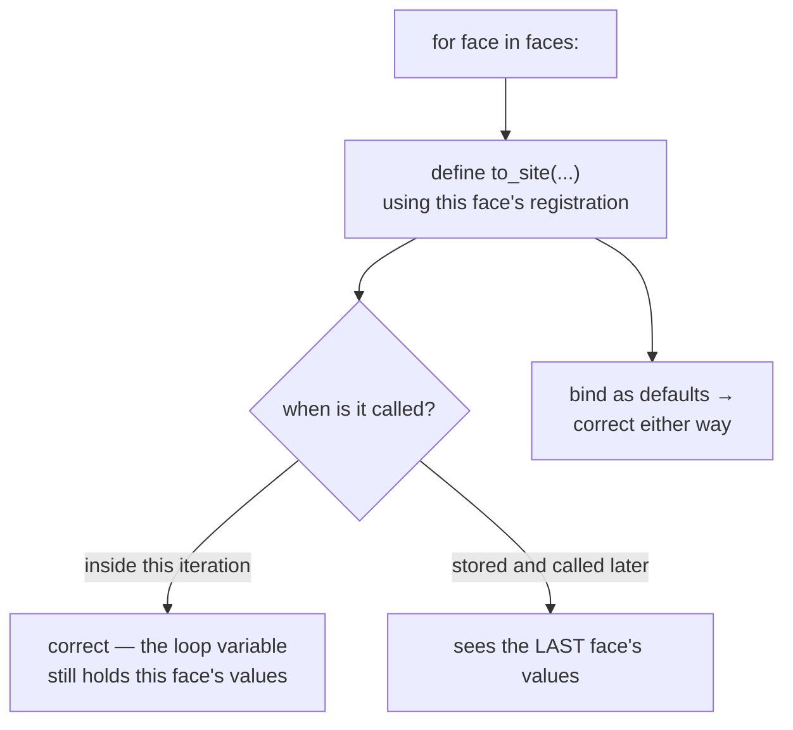

# Closure late-binding capture

A function defined inside a loop remembers the *variable*, not its value at the
time. A classic Python trap, and one this codebase defuses explicitly rather
than relying on luck.

## What it is

A **closure** is a function that references variables from its enclosing scope.
Python closures capture the **variable**, not the value — so the function sees
whatever that variable holds *when it is called*, not when it was defined.

```python
functions = []
for i in range(3):
    functions.append(lambda: i)

[f() for f in functions]        # [2, 2, 2] — not [0, 1, 2]
```

All three closures share the same `i`, which is 2 by the time any of them runs.

The standard fix is a **default argument**, which is evaluated at definition
time:

```python
functions.append(lambda i=i: i)   # [0, 1, 2]
```

The trap only bites when the closure **outlives the iteration** — stored in a
list, returned, or passed as a callback. A closure called *within* the same
iteration sees the right value and works fine.

That last point is what makes this subtle: code with the pattern can be
completely correct today and break the moment someone stores the function
instead of calling it immediately.

## The picture



## Where this project uses it

`poggio_webapp/pipeline/convert_coords.py`, inside the per-face loop:

```python
for fi, face in enumerate(profiles.get("trenchProfiles", [])):
    fname = face.get("face") or f"face_{fi}"
    cfg = faces_cfg.get(fname)
    if cfg is None:
        missing.append(fname)
        continue
    X0, Y0 = cfg["originX"], cfg["originY"]
    Z0 = cfg["surfaceZ"]
    th = math.radians(cfg["bearing_deg"])
    sin_t, cos_t = math.sin(th), math.cos(th)

    # The registration values are bound as defaults rather than closed
    # over: to_site is only ever called inside this iteration, but binding
    # makes that explicit and keeps the closure from tracking the loop.
    def to_site(x, depth, X0=X0, Y0=Y0, Z0=Z0, sin_t=sin_t, cos_t=cos_t):
        X = X0 + x * sin_t
        Y = Y0 + x * cos_t
        Z = Z0 - depth
        return X, Y, Z
```

The comment is the interesting part, and it says three things.

**It acknowledges the code is already correct.** "`to_site` is only ever called
inside this iteration." No bug exists today.

**It states why the binding is there anyway.** "Binding makes that explicit and
keeps the closure from tracking the loop." The function no longer depends on
*when* it is called — a property, not a coincidence.

**It pre-empts a future change.** If someone later collects these functions —
to convert faces lazily, or to build a per-face transform table — the code keeps
working. Without the binding, that change would produce every face's points
converted with the *last* face's registration: a model that is silently and
catastrophically wrong, with no error.

That is the failure mode worth dwelling on. Every point would land somewhere;
the CSV would look normal; the model would build. The walls would simply be in
the wrong places.

Five values are bound — `X0`, `Y0`, `Z0`, `sin_t`, `cos_t` — which is verbose,
and the alternative is a subtle dependency on call site.

Note what is *not* bound: `x` and `depth` are the genuine parameters. The
defaults are a technique for capture, not part of the interface, which is why
they come last.

## Why this and not something else

| Alternative | How it would capture the registration | Why it lost |
|---|---|---|
| **Close over the loop variables** | Reference `X0`, `Y0`, … directly | Correct only while the function is called within the iteration. A future refactor breaks it silently. |
| **Default arguments** *(chosen)* | `def to_site(x, depth, X0=X0, ...)` | Values fixed at definition. Verbose, and the verbosity is visible where a silent dependency would not be. |
| **`functools.partial`** | `partial(_to_site, X0, Y0, Z0, sin_t, cos_t)` | Also binds at creation and needs a module-level `_to_site`, moving the arithmetic away from the loop that gives it meaning. |
| **A helper function taking the config** | `to_site(x, depth, cfg)` | Cleanest in one sense, and it passes the whole config on every call and re-derives `sin`/`cos` per point, or forces the caller to hold five values anyway. |
| **A small class** | `SiteTransform(cfg).convert(x, depth)` | Explicit and immune to the trap — arguably the best design. Heavier than needed for four lines of arithmetic used in one loop, though it is exactly what `manual_extraction.Calibration` is. |
| **Compute inline, no function** | Repeat the arithmetic at each use | Duplicates the axis convention, which is precisely the thing that must not diverge. See [compass bearings](compass-bearings-vs-mathematical-angles.md). |

The pattern this repository actually favours for the *same* problem elsewhere is
the fifth row: `manual_extraction.Calibration` and
`detect_markers.SectionCoordinateTransform` are both `frozen=True` dataclasses
holding their parameters — the first with a `convert` method, the second applied
by `pixel_to_section_coordinates`. Immune by construction — see
[immutability and defensive copying](immutability-and-defensive-copying.md).

`to_site` stays a closure because it is four lines used in one loop, and the
default-argument binding buys the same safety for one line of syntax.

## What it costs

Nothing at runtime — default arguments are evaluated once at definition.

The costs:

- **Verbosity.** Five parameters that are not really parameters.
- **A confusing signature.** `to_site(x, depth, X0=..., Y0=..., ...)` looks like
  it takes seven arguments. A caller could pass a different `X0`, which nothing
  prevents. The comment is what stops that reading badly.
- **It has to be remembered.** Nothing warns about the unbound form. `ruff`'s
  `B023` rule (function definition does not bind loop variable) catches exactly
  this and is **not** enabled here — the selected rules are `E, F, W, I, UP, B`,
  so `B023` *is* in scope via `B`. Which means the linter would flag the unbound
  form, and the binding satisfies it.

## Where else you meet it

- **JavaScript's `var` in loops**, the most famous instance — fixed in ES6 by
  `let`, which is block-scoped and captures per iteration.
- **Event handlers registered in a loop**, where every handler fires with the
  last item's data.
- **Lambdas in list comprehensions**, in any language with reference capture.
- **Go before 1.22**, where loop variables were reused across iterations — a
  common enough bug that the language changed the semantics.
- **C++ lambda capture**, where `[=]` and `[&]` make the choice explicit at the
  syntax level.

## Related pages

- [Late binding versus import-time binding](late-binding-vs-import-time-binding.md) —
  the same word, a different trap.
- [Immutability and defensive copying](immutability-and-defensive-copying.md) —
  the frozen-dataclass alternative used elsewhere here.
- [Compass bearings versus mathematical angles](compass-bearings-vs-mathematical-angles.md) —
  the convention `to_site` encodes.
- [Pure functions and testability](pure-functions-and-testability.md) — why
  explicit inputs are preferable.
