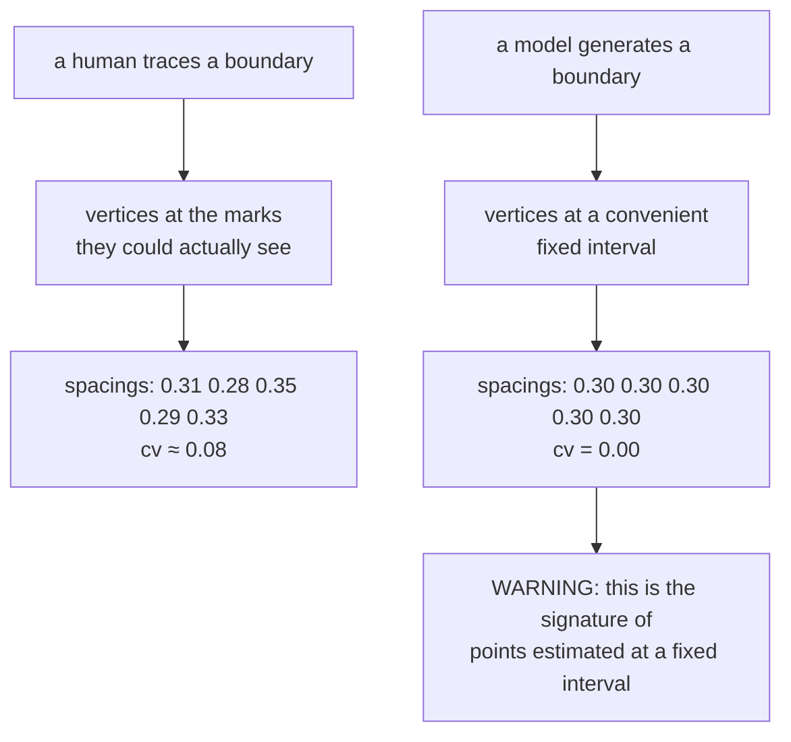

# Coefficient of variation

Standard deviation divided by the mean — spread expressed as a *fraction* of
size. In this project it is the statistic that detects a boundary a machine
invented rather than traced.

## What it is

```
cv = σ / μ
```

Standard deviation alone cannot be compared across different scales: a σ of
0.05 m is large for vertices 0.1 m apart and negligible for vertices 2 m apart.
Dividing by the mean removes the units and makes the number comparable between
drawings, scales, and sheets.

- **cv near 0** — the values are almost identical.
- **cv near 1** — the spread is as large as the average.

It is meaningful only for positive quantities with a true zero, which spacings
are.

## The picture

The signal it detects:



The distinction is not subtle. Real traced boundaries on this project's own data
sit around **cv 0.20**; the fabricated ones came out at **cv 0.00**.

## Where this project uses it

`poggio_webapp/pipeline/validator.py`, under a section header that explains
exactly why the check exists:

```python
# --- fabrication detection -------------------------------------------------
# The T104 field-wall extraction produced geometrically fabricated boundaries
# twice: every point on a fixed x interval, and each locus's boundary an exact
# copy of the one above offset by a constant depth. The extraction prompt
# already warns against this and it happened anyway, so check for it here
# instead of trusting the model to police itself. Real traced boundaries have
# irregular vertex spacing (Trench 23 sits around cv 0.20); fabricated ones
# come out at cv 0.00.

UNIFORM_SPACING_CV = 0.02  # coefficient of variation below this = suspicious
PARALLEL_OFFSET_TOLERANCE_M = 0.005
```

That comment is the most important thing on this page. It records **what
happened**, **why the obvious fix was insufficient**, and **the observed values
that calibrate the threshold.**

The check itself:

```python
def check_uniform_spacing(points, where, report):
    """Warn when boundary vertices sit on a perfectly regular x interval."""
    pts = _pairs(points)
    if len(pts) < 5:
        return
    xs = [x for x, _ in pts]
    dx = [b - a for a, b in zip(xs, xs[1:])]
    mean = sum(dx) / len(dx)
    if mean <= 0:
        return
    var = sum((d - mean) ** 2 for d in dx) / len(dx)
    cv = (var**0.5) / mean
    if cv < UNIFORM_SPACING_CV:
        report.warn(
            where,
            f"boundary vertices are evenly spaced every {mean:.3g} m "
            f"({len(pts)} points, spacing variation {cv:.3f}) — this is "
            "the signature of points estimated at a fixed interval "
            "rather than read off the recorder's marked vertices. "
            "Re-extract, or detect the markers computationally.",
        )
```

Three design decisions worth naming.

**A warning, not an error.** Regular spacing is *evidence* of fabrication, not
proof. A boundary genuinely traced at regular intervals is unlikely but
possible. The message says what the signature means and what to do about it,
rather than blocking.

**It is skipped for manual tracing.** From `check_face`:

```python
if source != "manual_editor":
    check_uniform_spacing(layer.get("bottomBoundary"), f"{where} bottom", report)
```

A human tracing on graph paper legitimately produces regular spacing — they
click along the grid. Running the check there would flood the report with false
positives on the *supported* path. That exemption is the difference between a
rule someone thought about and one that was copied.

**Minimum five points.** A cv over three gaps carries almost no information.

The companion check catches the other observed failure — a boundary
copy-pasted downward:

```python
def check_parallel_layers(layers, where, report):
    """Warn when two layers' boundaries are the same shape shifted by a
    constant depth — a copy-paste artifact, not real stratigraphy."""
    ...
    diffs = [b[1] - a[1] for a, b in zip(pa, pb)]
    spread = max(diffs) - min(diffs)
    if spread <= PARALLEL_OFFSET_TOLERANCE_M:
        report.warn(where, ...)
```

Two independent signatures, both derived from what actually went wrong.

## Why this and not something else

| Alternative | What it would detect | Why it lost |
|---|---|---|
| **Standard deviation alone** | Absolute spread | Not comparable across scales. A σ threshold correct for a 1 m wall is wrong for a 10 m one, so it would need to be re-tuned per drawing. |
| **Range** (`max − min`) | Extreme spread | Determined by two values only. One irregular gap in an otherwise perfectly uniform boundary would mask the pattern. |
| **Exact-equality test** | All spacings identical | Too brittle — [floating-point](floating-point-representation.md) rounding means generated values are rarely bit-identical. cv degrades gracefully. |
| **Chi-squared test for uniformity** | Statistical significance | More principled, and it produces a p-value that needs an interpretation and a significance level. cv is a directly interpretable ratio, and the threshold is calibrated against observed real data. |
| **Compare against the source image's ink** | Whether the boundary lies on drawn ink | **Direct evidence rather than a statistical hint** — and it is not implemented. The README says so plainly: "Statistical signatures … are hints; overlap with actual ink pixels would be direct evidence, and automating that check is on the [roadmap](../project/roadmap.md)." |
| **Coefficient of variation** *(chosen)* | Scale-free regularity | One number, dimensionless, comparable across every drawing, with an empirically calibrated threshold. |

The last two rows together are the honest position: this is a **hint**, chosen
because it is cheap, scale-free, and detects the failure that actually occurred.
The stronger check is known, named, and scheduled.

## What it costs

O(n) — two passes over the spacings. Nothing.

The costs are the limits of any statistical signature:

- **False negatives.** A fabricator using *irregular* invented spacing passes
  cleanly. The check detects a specific lazy pattern, not fabrication in
  general.
- **False positives are possible**, which is why it warns rather than errors,
  and why it is disabled for the manual path.
- **The threshold is empirical.** 0.02 comes from observing cv ≈ 0.20 on real
  traces and 0.00 on fabricated ones. That is a big margin, and it is a
  calibration against two datasets rather than a derived bound. The comment
  records the observations so a future maintainer can recalibrate rather than
  guess.

## Where else you meet it

- **Analytical chemistry and laboratory medicine**, where "relative standard
  deviation" is the standard measure of assay precision.
- **Finance**, where the coefficient of variation compares risk per unit of
  return across assets of different sizes.
- **Ecology**, comparing variability in populations of very different
  abundances.
- **Manufacturing**, where process capability indices are scale-free spread
  measures of the same family.
- **Fraud detection generally.** Benford's law is the same idea in a different
  dress: fabricated data has statistical signatures real data does not.

## Related pages

- [Mean and variance](mean-and-variance.md) — the two ingredients.
- [Fabrication detection](fabrication-detection.md) — the broader concern this serves.
- [Epsilon comparison](epsilon-comparison.md) — the other empirically calibrated
  threshold nearby.
- [Validation rules](../reference/validation-rules.md) — every warning and error
  code.
- [Accuracy and provenance](../concepts/accuracy-and-provenance.md) — why a
  drawing that looks immaculate can be invented.
