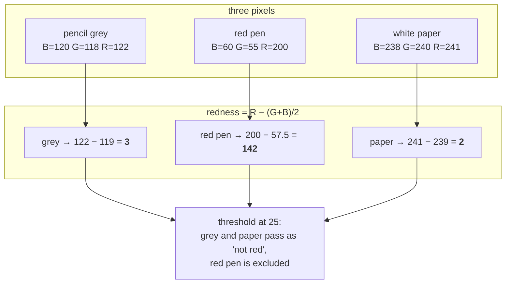

# Colour-channel arithmetic

Combining a pixel's colour channels with ordinary arithmetic to build a
single-purpose detector, instead of converting to a colour space and hoping.

## What it is

Given a pixel's `(B, G, R)` values, you can compute any function of them you
like. Some very simple functions turn out to be excellent detectors for one
specific thing:

| Expression | Detects |
|---|---|
| `0.299R + 0.587G + 0.114B` | brightness — this is [grayscale](grayscale-conversion.md) |
| `R − (G + B)/2` | **redness**: how much more red than everything else |
| `G − (R + B)/2` | greenness — the basis of vegetation indices |
| `max(R,G,B) − min(R,G,B)` | saturation — how far from grey |

These are called *channel indices* or *band ratios* depending on the field.
They are one array expression each, they need no calibration, and they are
completely deterministic.

The catch is that each one answers exactly one question. That is also the
appeal.

## The picture

Three pixels, and what each expression says about them:



Note what the expression is robust to: grey and white paper have wildly
different brightness — 119 versus 239 — and both score near zero for redness.
The measure is *insensitive to illumination* because the subtraction cancels
the common component. That is precisely what a phone photograph of a field
sheet, lit unevenly across the paper, needs.

## Where this project uses it

`poggio_webapp/pipeline/detect_markers.py` must find pencil vertex dots and
must *not* find the recorder's red annotation:

```python
def _ink_mask(img, block_px, C=10):
    """Dark-and-not-red ink, adaptively thresholded so light pencil and
    uneven phone-photo lighting don't fragment the strokes."""
    gray = cv2.cvtColor(img, cv2.COLOR_BGR2GRAY)
    b, g, r = cv2.split(img.astype(np.int32))
    redness = r - (g + b) / 2.0
    ad = cv2.adaptiveThreshold(gray, 255, cv2.ADAPTIVE_THRESH_MEAN_C,
                               cv2.THRESH_BINARY_INV, block_px, C)
    return cv2.bitwise_and(ad, (redness < 25).astype(np.uint8) * 255)
```

Two independent tests, combined with
[bitwise AND](binary-masks-and-bitwise-operations.md):

1. **Dark** — decided by [adaptive thresholding](adaptive-thresholding.md), so
   it survives a lighting gradient across the sheet.
2. **Not red** — decided by the channel expression, which is *already*
   illumination-robust and needs no adaptive machinery at all.

The `.astype(np.int32)` matters. The channels arrive as `uint8`; subtracting
them in `uint8` wraps around, so `55 − 200` becomes 111 rather than −145 and
every red pixel reads as strongly *not* red. Widening first is the whole fix.
See [bit depth and dynamic range](bit-depth-and-dynamic-range.md).

## Why this and not something else

| Alternative | How it would work here | Why it lost |
|---|---|---|
| **HSV hue thresholding** | Convert to HSV, keep pixels whose hue is outside the red band | The textbook answer, and it fails on this input. Hue is numerically unstable when saturation is low, and faint red pen on paper under indoor light is low-saturation. Its hue lands anywhere. The subtraction degrades gracefully; hue degrades catastrophically. |
| **Lab colour space, threshold a\*** | Convert to CIELAB; `a*` is literally a red–green axis | Genuinely principled, and roughly a perceptually uniform version of the same idea. Costs a full non-linear colour-space conversion of the whole image to make one binary decision, and introduces a white-point assumption that a phone photo does not satisfy anyway. |
| **A trained pixel classifier** | Label red and non-red pixels, fit a small model | Huge machinery for one linear inequality — and it would put a trained artefact inside a module whose entire justification is that no model touches geometry. See [human-in-the-loop review](human-in-the-loop-review.md). |
| **Just use the red channel** (`r < threshold`) | Red pen is bright in R, so exclude bright-R pixels | Breaks on white paper, which is bright in all three channels. The subtraction is what makes it a *relative* test. |
| **Re-photograph without red annotation** | Change field practice | The archive already exists. |

The pattern generalises: when you want "more X than the others," subtract the
others. It is cheap, it cancels illumination, and it has no parameters beyond
the threshold.

## What it costs

Three array operations over the image, O(pixels), plus one temporary at
`int32` — four bytes per pixel per channel, so a widened copy of a 20 MP image
is around 240 MB. On the analysis-sized images this project uses it is
negligible; on a full-resolution photo it is worth knowing about.

No calibration, no training data, no parameters to tune per image beyond the
single threshold.

## Where else you meet it

- **Remote sensing.** NDVI, the standard vegetation index, is
  `(NIR − Red) / (NIR + Red)` — the same shape, normalised. Every satellite
  greenness map you have seen is this arithmetic.
- **Green-screen keying.** Chroma keying in video is commonly
  `G − max(R, B) > threshold`.
- **Astronomy.** Colour indices such as B−V classify stars by subtracting
  magnitudes in two filters.
- **Medical imaging.** Dual-energy X-ray subtracts two exposures to separate
  bone from soft tissue.
- **Skin detection** in older face-tracking systems used channel ratios for
  exactly the illumination-robustness reason.

## Related pages

- [Colour spaces and channels](colour-spaces-and-channels.md) — the systems
  this avoids converting to.
- [Grayscale conversion](grayscale-conversion.md) — the other channel
  combination used here.
- [Bit depth and dynamic range](bit-depth-and-dynamic-range.md) — why the
  `int32` widening is not optional.
- [Adaptive thresholding](adaptive-thresholding.md) — the other half of the ink
  mask.
- [Binary masks and bitwise operations](binary-masks-and-bitwise-operations.md) —
  how the two halves combine.
