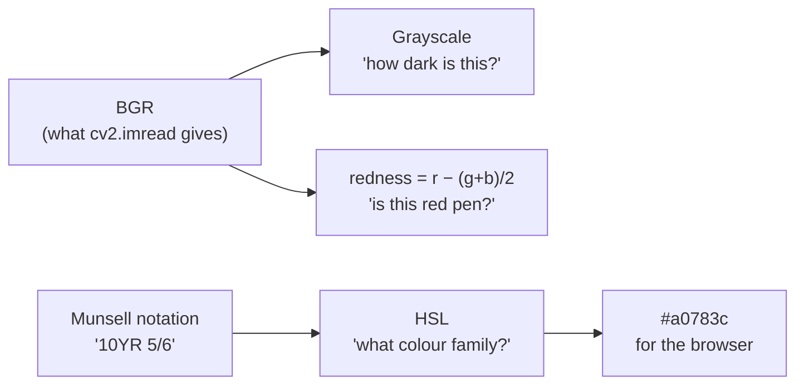

# Colour spaces and channels

The same colour can be written as three numbers in several different systems,
and which system you pick decides which questions are easy to ask.

## What it is

A *colour space* is a coordinate system for colour. A *channel* is one axis of
it.

- **RGB** — red, green, blue. How screens and sensors work. Good for display,
  bad for reasoning: "is this darker?" and "is this more red?" are both mixtures
  of all three numbers.
- **BGR** — the same three axes in the opposite order. OpenCV's default, for
  historical reasons, and a reliable source of colour-swapped bugs.
- **HSL / HSV** — hue, saturation, lightness (or value). Separates *what colour*
  from *how vivid* from *how bright*, which is how people describe colour.
- **Grayscale** — one channel, intensity only.
- **Munsell** — hue, value, chroma, defined by physical reference chips rather
  than by arithmetic. The system archaeology actually uses.

Converting between them is not neutral. Every conversion answers some questions
more cheaply and some less.

## The picture



Note that two different conversions run off the same BGR image in this project,
because they answer two different questions.

## Where this project uses it

### Splitting channels to answer one specific question

`poggio_webapp/pipeline/detect_markers.py` needs "dark, and not red," because
recorders annotate in red pen and those marks are not boundary vertices:

```python
def _ink_mask(img, block_px, C=10):
    """Dark-and-not-red ink, adaptively thresholded so light pencil and
    uneven phone-photo lighting don't fragment the strokes."""
    gray = cv2.cvtColor(img, cv2.COLOR_BGR2GRAY)
    b, g, r = cv2.split(img.astype(np.int32))
    redness = r - (g + b) / 2.0
    ad = cv2.adaptiveThreshold(gray, 255, cv2.ADAPTIVE_THRESH_MEAN_C,
                               cv2.THRESH_BINARY_INV, block_px, C)
    return cv2.bitwise_and(ad, (redness < 25).astype(np.uint8) * 255)
```

Two channels' worth of information, combined by
[bitwise AND](binary-masks-and-bitwise-operations.md). See
[colour-channel arithmetic](colour-channel-arithmetic.md) for why `redness` is
computed this way rather than by a hue conversion.

### Converting a physical colour system for display

`poggio_webapp/static/shared/munsell-color.js` maps Munsell notation to a
screen colour, and goes through HSL rather than RGB because Munsell's three
axes line up with HSL's:

```javascript
const lightness  = clamp(8 + (parsed.value * 8), 4, 92);      // Munsell value
const saturation = clamp(12 + (parsed.chroma * 6.5), 0, 82);  // Munsell chroma
return hslToHex(hueDegrees(parsed.hueFamily, parsed.hueNumber),
                saturation, lightness);
```

The docstring is careful about what this is:

> Displays, lighting, and the physical Munsell system differ, so the result is
> a useful visual correspondence rather than a colorimetric replacement for a
> chip.

## Why this and not something else

For the red-pen problem specifically:

| Alternative | How it would work here | Why it lost |
|---|---|---|
| **`cv2.cvtColor` to HSV, threshold hue** | Convert the whole image, select the red hue band | Hue is unstable at low saturation, and pencil on paper under phone lighting is exactly that. Red ink at low saturation lands anywhere in hue. The subtraction is three array operations against a full colour-space conversion. |
| **Train a colour classifier** | Label red and non-red pixels, fit a model | Enormous machinery for one linear inequality, and it introduces a trained artefact into a pipeline whose selling point is that no model touches geometry. |
| **Ask the user to photograph without red annotation** | Change the recording practice | The archive already exists. The 1980 sheets are not going to be redrawn. |

For Munsell display:

| Alternative | Why it lost |
|---|---|
| **A lookup table of measured sRGB values per chip** | The most accurate option, and genuinely better if you have the table. It is thousands of entries under a licence, for a feature whose purpose is helping a reader tell two layers apart in a legend. |
| **Direct Munsell → XYZ → sRGB colorimetry** | Correct, and requires the Munsell renotation dataset plus a chromatic adaptation model. Same objection, more code. |

Both losing options are *more correct*. They lost to the honest framing that
this is a legend swatch, not a measurement, stated in the docstring rather than
implied.

## What it costs

Channel split and arithmetic is O(pixels) with a small constant. A full
colour-space conversion is also O(pixels) but allocates a whole new image; on a
73 MB decoded photo that matters.

Converting to grayscale immediately, as `preprocess.py` does, discards two
thirds of the memory before any expensive filtering runs.

## Where else you meet it

- **Green-screen keying** in video — the same "is this pixel that colour?"
  question, solved the same cheap way.
- **Chroma subsampling** in JPEG and video codecs, which exploits the eye's
  weaker colour resolution by storing brightness at full detail and colour at
  half.
- **Photoshop's channel mixer** and **Lightroom's HSL panel** are these
  operations with a user interface.
- **Remote sensing** — vegetation indices such as NDVI are literally
  `(near-infrared − red) / (near-infrared + red)`, the same shape as `redness`.

## Related pages

- [Grayscale conversion](grayscale-conversion.md) — the most common conversion
  here, and why its weights are not equal.
- [Colour-channel arithmetic](colour-channel-arithmetic.md) — the `redness`
  trick in full.
- [Binary masks and bitwise operations](binary-masks-and-bitwise-operations.md) —
  how two channel tests are combined.
- [Munsell colour](../archaeology/index.md) — what the notation means to an
  archaeologist.
