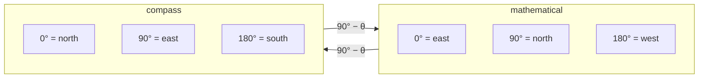

# Compass bearings versus mathematical angles

Two conventions for measuring an angle that disagree about where zero is and
which way is positive. Mixing them produces coordinates that are wrong by a
reflection, and the error looks entirely plausible.

## What it is

**Mathematical convention**: angles measured **counter-clockwise from the
positive x-axis (east)**. This is what `sin`, `cos`, and `atan2(y, x)` assume.

**Compass convention**: angles measured **clockwise from north**. This is what
a surveyor writes down, what a total station reports, and what
`bearing_deg` means in this project's grid config.

They differ in two independent ways: the zero direction and the rotation sense.
The conversion is:

```
mathematical = 90° − compass
compass      = 90° − mathematical
```

Both directions are the same formula, which is a good sign that it is a
reflection rather than a rotation, and reflections are exactly the errors that
produce a mirror-image model.

The practical rules:

| | Mathematical | Compass |
|---|---|---|
| East component | `cos θ` | **`sin θ`** |
| North component | `sin θ` | **`cos θ`** |
| From components | `atan2(y, x)` | **`atan2(east, north)`** |

Compass bearings swap `sin` and `cos`, and swap the arguments to `atan2`.

## The picture



```
bearing 90° (due east):
  correct    X = X0 + x·sin(90°) = X0 + x     Y = Y0 + x·cos(90°) = Y0
             → all displacement in X (east). Correct.

  if sin/cos were swapped:
             X = X0 + x·cos(90°) = X0        Y = Y0 + x·sin(90°) = Y0 + x
             → all displacement in Y (north). A wall running east
               would be modelled running north.
```

## Where this project uses it

The convention is chosen once and honoured in four places.

### Face-local metres to site coordinates

`poggio_webapp/pipeline/convert_coords.py`:

```python
th = math.radians(cfg["bearing_deg"])
sin_t, cos_t = math.sin(th), math.cos(th)


def to_site(x, depth, X0=X0, Y0=Y0, Z0=Z0, sin_t=sin_t, cos_t=cos_t):
    X = X0 + x * sin_t
    Y = Y0 + x * cos_t
    Z = Z0 - depth
    return X, Y, Z
```

`sin` on X and `cos` on Y. The grid config's own `_comment` defines the term for
whoever fills it in:

```python
"_comment": (
    "Fill in real site values from the master Geospatial Spreadsheet "
    "(opening-coordinates column for the season). bearing_deg = the "
    "direction the face's local +x axis points, in degrees clockwise "
    "from GRID NORTH -- the site's artificial reference direction, the "
    "one the total station sets as HA 0 (90 East, 180 South, 270 "
    "West). It is NOT magnetic north and NOT projected north; Grid "
    "North sits about 2.5 degrees off the latter. ..."
)
```

Note what the comment has to rule out. "Clockwise from north" is not enough of a
specification when a site has three norths to choose from. See
[grid registration](../archaeology/grid-registration.md).

### Projecting a site position back onto a wall

`poggio_webapp/pipeline/true_dip.py`:

```python
angle = math.radians(bearings[face])
s = (x * math.sin(angle)) + (y * math.cos(angle))
```

The same pairing, used in the inverse direction: a
[projection](vector-projection.md) onto the wall's direction vector
`(sin θ, cos θ)`.

### Recovering a bearing from components

The same file, and this is where the `atan2` argument order matters:

```python
def _dip_from_normal(normal):
    """(dip_degrees, azimuth_degrees) for a plane normal, pointing upward.

    For an upward normal the downhill horizontal direction is (n_x, n_y), and a
    compass bearing is atan2(east, north) -- not the mathematical atan2(y, x).
    """
    ...
    return dip, math.degrees(math.atan2(x, y)) % 360.0
```

The docstring names the trap explicitly. `atan2(x, y)` rather than the habitual
`atan2(y, x)`, and it is exactly the kind of line that gets "corrected" by
someone tidying up, which is why the reason sits next to it.

### Computing a wall's far endpoint

`poggio_webapp/pipeline/merge_walls.py`:

```python
def face_endpoints(face_cfg, length_m):
    """The face's two ends in site coordinates: ((X0, Y0), (X1, Y1)).

    Uses convert()'s axis convention exactly -- X = X0 + x*sin(bearing),
    Y = Y0 + x*cos(bearing), bearing in degrees clockwise from north -- so
    bearing 90 puts all displacement into X and none into Y.
    """
    X0 = float(face_cfg["originX"])
    Y0 = float(face_cfg["originY"])
    theta = math.radians(float(face_cfg["bearing_deg"]))
    L = float(length_m)
    return (X0, Y0), (X0 + L * math.sin(theta), Y0 + L * math.cos(theta))
```

The docstring restates the convention **and gives a worked check**: bearing 90
puts everything in X. That check is testable by eye, which is the point: a
convention that can only be verified by re-deriving it will eventually be got
wrong.

Four sites, one convention, three docstrings restating it. That redundancy is
proportionate: the failure mode is silent, and the symptom (walls meeting at
the wrong corner, a model reflected about a diagonal) looks like a data-entry
error rather than a code bug.

## Why this and not something else

| Alternative | How it would work here | Why it lost |
|---|---|---|
| **Store mathematical angles internally, convert at the edges** | Convert on input, convert back on output | Fewer surprising `sin`/`cos` pairings inside, and it adds two conversion points where a sign can be lost, and it means the value in `meta.json` differs from the value the surveyor recorded. Debugging then requires converting in your head. |
| **Store compass bearings, use them directly** *(chosen)* | Swap `sin`/`cos`, swap `atan2` arguments | The stored number is the surveyed number. What is written in the grid config is what a total station reported, so a person can check it against their field notes without arithmetic. |
| **Store unit vectors instead of angles** | `(east, north)` components | Sidesteps the convention entirely and is genuinely appealing: no `sin`, no `cos`, no `atan2`. It is two numbers where a surveyor supplies one, and the config is hand-edited by archaeologists. |
| **Use a geospatial library (pyproj, shapely)** | Let a library own the conventions | Correct for real projections and datums, and heavy for what is ultimately a local Cartesian grid with a rotation. Would not remove the need to know which convention the library expects. |

The deciding argument is **the stored value should match the recorded value**.
Registration is entered by a person from survey notes; any transformation
between what they write and what is stored is a place for a transcription error
to become invisible.

## What it costs

Nothing computationally. `sin` and `cos` cost the same whichever quantity they
are assigned to.

The cost is entirely in **discipline**, and the repository pays it in
documentation: the grid config's `_comment`, three docstrings, and a worked
check. There is no type-level protection (a bearing and a mathematical angle
are both `float`), so nothing prevents mixing them.

That is the residual risk, and it is real. A stronger design would use distinct
types (`Bearing` and `Radians` as separate classes) so the compiler or the test
suite catches a mix. For a codebase of this size, four consistent call sites
with explicit docstrings is a defensible position, and the convention is at
least stated at every one of them.

## Where else you meet it

- Aviation and marine navigation, where headings are always compass
  bearings.
- Meteorology, where wind direction is the compass bearing the wind comes
  *from*: a third convention, and a classic source of sign errors.
- Structural geology, where strike and dip azimuth are compass bearings.
- GIS, where azimuth is compass and many APIs quietly expect mathematical
  angles.
- Robotics, where a robot's heading convention rarely matches the map's.

## Related pages

- [Plane normals](plane-normals.md): where `atan2(x, y)` appears.
- [Translation, rotation, and scaling](translation-rotation-scaling.md): the
  rotation this parameterises.
- [Vector projection](vector-projection.md): projecting onto a bearing.
- [Grid registration](../archaeology/index.md): where the number comes from.
- [Place on site](../workflows/06-place-on-site.md): the workflow step that
  collects it.
