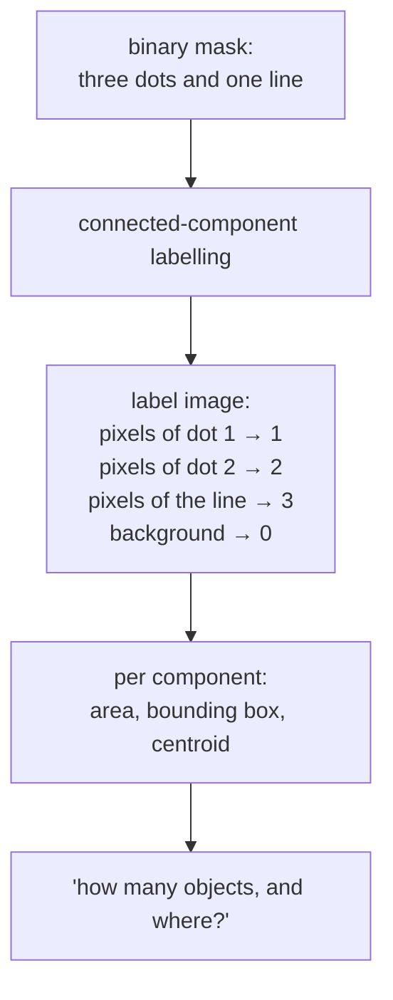

# Connected-component labelling

Turning a binary mask into a list of separate objects by finding which
foreground pixels touch which. The obvious way to count blobs — and not the way
this project counts them.

## What it is

A [binary mask](binary-masks-and-bitwise-operations.md) says which pixels are
foreground. It does not say how many *things* there are. Connected-component
labelling answers that: scan the mask, assign every group of mutually touching
foreground pixels a shared integer label, and return one label image plus
per-component statistics.

"Touching" needs a definition. **4-connectivity** counts only the pixels sharing
an edge; **8-connectivity** also counts diagonals. A thin diagonal line is one
component under 8-connectivity and a string of separate dots under 4.

The classical two-pass algorithm:

1. Sweep the image assigning provisional labels, recording that two labels are
   equivalent whenever they meet.
2. Resolve the equivalences — which is [Union-Find](union-find.md), doing
   exactly the job it does everywhere else — and relabel.

Modern implementations (`cv2.connectedComponentsWithStats`) return area,
bounding box, and centroid for each component for free.

## The picture



The distinction from [contour tracing](contour-tracing.md) is what matters
here:

| | Connected components | Contour tracing |
|---|---|---|
| Returns | a label per **pixel**, plus stats | an ordered list of **boundary points** |
| Knows about holes | yes — but a hole is just background | yes — via [hierarchy](contour-hierarchy.md) |
| Gives you a shape you can measure | area and box only | perimeter, [convex hull](convex-hull.md), [approximation](ramer-douglas-peucker.md), [circularity](circularity.md) |
| Cost | one or two passes | one pass, output proportional to boundary length |

## Where this project uses it

It does not. Both detectors go straight from mask to
[contour tracing](contour-tracing.md).

`poggio_webapp/pipeline/detect_markers.py`:

```python
contours, _ = cv2.findContours(
    opened,
    cv2.RETR_LIST,
    cv2.CHAIN_APPROX_SIMPLE,
)

for contour in contours:
    area = cv2.contourArea(contour)
    perimeter = cv2.arcLength(contour, True)
    (cx, cy), radius = cv2.minEnclosingCircle(contour)
    ...
    circularity = 4 * math.pi * area / (perimeter**2)
    hull_area = cv2.contourArea(cv2.convexHull(contour))
    solidity = area / hull_area if hull_area > 0 else 0
```

The reason is visible in those lines. The filter that separates a recorder's
vertex dot from a stone outline is built from **perimeter**,
[circularity](circularity.md), [convex hull](convex-hull.md), and
[solidity](solidity.md) — every one of which is a property of the *boundary*.
Connected components give area and a bounding box and nothing else; you would
have to trace the boundary anyway to compute the rest.

`detect_features.py` needs the same shape vocabulary, plus
[Ramer–Douglas–Peucker](ramer-douglas-peucker.md) simplification to store the
outline as a polygon a reviewer can see. Again, a boundary problem.

## Why this and not something else

| Alternative | How it would work here | Why it lost |
|---|---|---|
| **Connected components with stats** | `cv2.connectedComponentsWithStats(mask)`, filter by area and box | Perfectly good for counting and for size filtering, and it cannot express "is this round?" or "is this filled?" — the two questions that actually separate a pencil dot from a stone outline. |
| **[Contour tracing](contour-tracing.md)** *(chosen)* | `cv2.findContours`, then shape descriptors | Returns the boundary, which every downstream measure needs, and gives the polygon the feature reviewer sees directly. |
| **Both** | Label components, then trace each one | Redundant. Contours already separate the objects; the labelling adds a pass and a full-size `int32` label image for information already available. |
| **Blob detection (`SimpleBlobDetector`)** | OpenCV's built-in, with circularity and convexity filters | Genuinely close to what `detect_markers` does by hand, and it hides the thresholds inside a parameter object rather than exposing them as named, tunable, paper-millimetre quantities. The hand-rolled version can also emit **rejected** candidates with their scores, which the review UI needs. |
| **Template matching** | Correlate a picture of a dot across the image | Scale- and rotation-sensitive, and it would have to be re-tuned per photograph. |

The decisive point is that this project does not want a *count*. It wants a
filtered, scored, reviewable list of candidates — including the ones it
rejected:

```python
# Shown: diameter within [0.5*min_d, 1.5*max_d] and roughly round, capped at
# the most circular 300. x_m/depth_m are deliberately absent:
# /markers/confirm recomputes them from pixel coordinates.
```

A method that returns a label image would still need every shape measure
computed afterwards from the boundary. Starting at the boundary skips a step.

Connected-component labelling *is* used inside this repository — just not on
pixels. `merge_walls._endpoint_components` and
`harris_matrix.correlation_components` solve the identical
[connected-components](connected-components.md) problem on graphs, with
[Union-Find](union-find.md), which is also what the two-pass pixel algorithm
uses internally.

## What it costs

Two passes over the image plus the equivalence resolution — effectively
O(n·α(n)), so linear in practice. Memory is one `int32` label image, four bytes
per pixel: 36 MB on a 9-megapixel mask, against a few kilobytes for a contour
list.

That memory asymmetry is a real secondary argument. Contours are proportional
to boundary length; labels are proportional to area.

## Where else you meet it

- **Cell counting in microscopy** — the canonical use, where area and centroid
  really are all you need.
- **OCR segmentation**, splitting a binarised page into candidate glyphs.
- **Flood fill / the paint-bucket tool**, which is single-component labelling on
  demand.
- **Minesweeper's cascade** when you click an empty square.
- **Percolation studies** in physics, asking whether a connected path spans a
  lattice.

## Related pages

- [Contour tracing](contour-tracing.md) — what this project uses instead.
- [Binary masks and bitwise operations](binary-masks-and-bitwise-operations.md) —
  the input either method takes.
- [Union-Find](union-find.md) — the structure inside the two-pass algorithm,
  and used directly elsewhere in this repository.
- [Connected components](connected-components.md) — the same problem on graphs.
- [Shape descriptors](circularity.md) — the measures that made contours the
  better fit.
