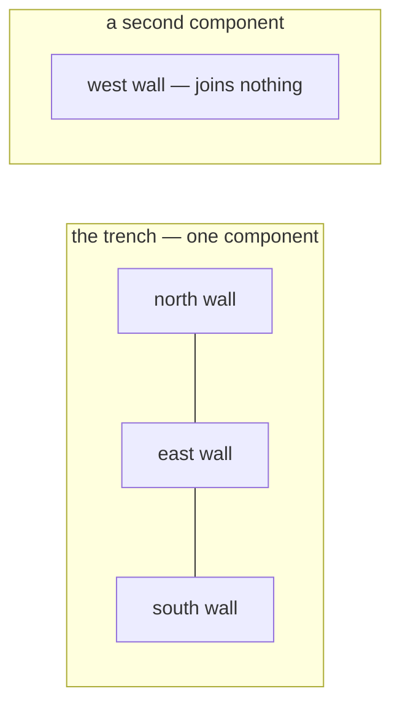

# Connected components

Groups of nodes that can reach one another. Used here to decide whether four
separately drawn walls actually enclose a pit, and to spot a stratigraphic unit
nobody related to anything.

## What it is

In an undirected graph, a **connected component** is a maximal set of nodes
mutually reachable through edges. Every node is in exactly one.

Two standard ways to find them:

**Traversal.** Run a [DFS](depth-first-search.md) or
[BFS](breadth-first-search.md) from each unvisited node; everything reached is
one component. O(V + E), and it must be re-run from scratch whenever edges
change.

**[Union-Find](union-find.md).** Merge the endpoints of each edge into the same
set. Near-constant time per edge, and it absorbs new edges incrementally.

For directed graphs there are two variants: **weakly connected** (ignore
direction) and **strongly connected** (mutual reachability *respecting*
direction). This project needs weak connectivity in both places — "are these
joined at all," not "can each reach the other."

## The picture



Four walls, two components. The larger one is the trench; the singleton is a
wall whose registration puts it somewhere else entirely — almost always a
mis-typed survey coordinate.

## Where this project uses it

### Are these walls actually a trench?

`poggio_webapp/pipeline/merge_walls.py` builds a graph whose nodes are faces and
whose edges mean "these two walls share a corner," then finds components with
[Union-Find](union-find.md):

```python
def _endpoint_components(endpoints, tolerance_m):
    """Group faces that meet at a corner. endpoints: {face: (start, end)}.
    Returns a list of face-name lists, each list in first-seen order."""
    names = list(endpoints)
    parent = {name: name for name in names}

    def find(name):
        while parent[name] != name:
            parent[name] = parent[parent[name]]
            name = parent[name]
        return name

    for i, a in enumerate(names):
        for b in names[i + 1:]:
            touching = any(
                math.dist(pa, pb) <= tolerance_m
                for pa in endpoints[a] for pb in endpoints[b])
            if touching:
                parent[find(a)] = find(b)

    groups = {}
    for name in names:
        groups.setdefault(find(name), []).append(name)
    return list(groups.values())
```

The interpretation is the interesting part:

```python
components = _endpoint_components(endpoints, tolerance_m)
# The trench is whichever group of walls is largest; ties go to the
# group holding the earliest face, so the answer is deterministic.
# An open end (a wall of an unexcavated side) is fine; a wall that
# joins nothing at either end is the real problem.
order = {name: i for i, name in enumerate(endpoints)}
trench = max(components,
             key=lambda g: (len(g), -min(order[n] for n in g)))
for name in endpoints:
    if name not in trench:
        warnings.append(
            f"face {name!r} is not connected to the rest of the "
            f"trench: neither of its ends lands within "
            f"{tolerance_m} m of another wall's end. Adjacent "
            "walls must share corner coordinates")
```

Three decisions in that comment:

**The largest component is the trench.** A pragmatic definition, and the right
one — a single mis-registered wall is far more likely than a majority of walls
being wrong.

**Ties break by earliest face**, so the result does not depend on dictionary
iteration order. See [determinism and stable sorting](determinism-and-stable-sorting.md).

**An open end is fine; a wall joining nothing is not.** A trench often has an
unexcavated side, so requiring a closed loop would produce false alarms. The
component test asks the weaker, correct question.

It is a **warning**, not an error — bad geometry is the operator's judgement to
make. Compare `_check_registration` in `trench_builder.py`, which does refuse on
placeholder registration, because that failure produces "a confident-looking
model of nothing."

### Which units have no chronology?

`poggio_webapp/pipeline/harris_matrix.py` reports the same structure for a
different purpose:

```python
connected_components = {
    component
    for edge in edges
    for component in edge
}
members_by_component = defaultdict(list)
for unit_id, component in components.items():
    members_by_component[component].append(unit_id)
for component in sorted(nodes - connected_components):
    members = sorted(members_by_component[component])
    warnings.append(_issue(
        "isolated-unit",
        f"Unit component {component} has no chronological relations.",
        members,
    ))
```

A unit with no relations is not an error — a newly imported layer legitimately
has none yet — but it will float unplaced in the diagram, so the user is told.

Note it reports the **members** of the isolated component, not the
representative ID. After [correlation collapse](union-find.md) the
representative is one arbitrary unit's ID; the user needs the human-meaningful
list.

The same file uses connected-component thinking a second time, for the
correlations themselves — `correlation_components` computes exactly this over
the undirected correlation graph.

## Why this and not something else

| Alternative | How it would find the groups | Why it lost — or won |
|---|---|---|
| **DFS or BFS per unvisited node** | Traverse and collect | Correct and O(V + E). It must be re-run entirely whenever an edge is added, and correlations change on every accepted suggestion. [Union-Find](union-find.md) absorbs each new edge incrementally. |
| **[Union-Find](union-find.md)** *(chosen)* | Merge endpoints | Near-constant per edge, incremental, and its representative can be made [deterministic](determinism-and-stable-sorting.md) by choosing `min()`. |
| **Adjacency matrix + transitive closure** | Close the relation, read off blocks | O(n³) time, O(n²) memory to answer what Union-Find answers in near-O(1). |
| **Strongly connected components (Tarjan)** | Respect edge direction | Answers a different question. Two walls sharing a corner is symmetric; two units with a chronological relation are *connected* for this purpose regardless of which is younger. |
| **Require a closed loop** | Insist every wall joins two others | Would reject a trench with an unexcavated side — a normal situation. |

The generalisable point: **connectivity is often the right question when a
stronger property looks tempting.** "Do these walls form a closed rectangle?"
would be a stronger and wrong test. "Is any wall disconnected?" is weaker and
catches the failure that actually occurs.

## What it costs

With Union-Find, near-O(E·α(V)) — effectively linear.

In `merge_walls` the dominant cost is not the components at all but the **O(n²)
pairwise endpoint comparison** that builds the edges: every wall's two endpoints
against every other wall's. At four walls that is trivial; at four thousand it
would need a spatial index.

The costs of the interpretation:

- **"Largest component is the trench" is a heuristic.** With two walls in each
  of two groups, the tie-break decides — deterministically, and possibly wrongly.
- **Tolerance-dependent.** Two walls 6 cm apart at a 5 cm tolerance are separate
  components. That is why `tolerance_m` is a named parameter, not a literal. See
  [epsilon comparison](epsilon-comparison.md).
- **Connectivity says nothing about shape.** Four walls could be connected in a
  line rather than a rectangle and pass. The check is a floor, not a proof —
  which is why [the placeholder-registration refusal](../workflows/09-multi-wall-trench.md)
  exists separately and is fatal.

## Where else you meet it

- **Image segmentation** — [connected-component labelling](connected-component-labelling.md)
  is this on a pixel grid, and its classic two-pass algorithm uses Union-Find.
- **Network reliability**, asking whether a failure partitions a network.
- **Social network analysis**, finding isolated communities.
- **Kruskal's minimum spanning tree**, which adds an edge only if its endpoints
  are in different components.
- **Percolation theory**, asking whether a connected path spans a lattice.
- **Compilers**, finding unreachable code as a connectivity question on the
  control-flow graph.

## Related pages

- [Union-Find](union-find.md) — the structure used, and why `min()` is the
  representative.
- [Graphs and terminology](graphs-and-terminology.md) — the vocabulary.
- [Depth-first search](depth-first-search.md) — the traversal alternative.
- [Connected-component labelling](connected-component-labelling.md) — the same
  problem on pixels.
- [Combine walls into one trench](../workflows/09-multi-wall-trench.md) — the
  workflow that surfaces the warning.
