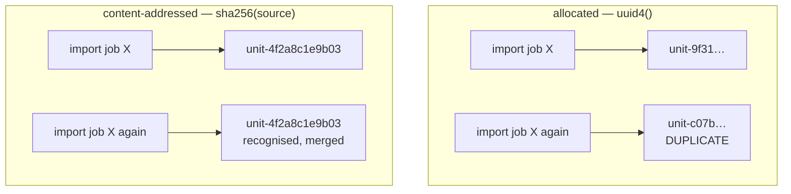

# Content-addressed identifiers

Naming a thing by what it *is* rather than by when it was created. The property
that lets this project regenerate suggestions without losing the decisions a
user already made about them.

## What it is

Two ways to give something an identifier:

**Allocated** — a counter, a UUID, a database sequence. The ID is independent of
the content, so the same thing created twice gets two IDs.

**Content-addressed** — derive the ID from the content by
[hashing](hash-functions-and-sha256.md). The same content always gets the same
ID, no matter when, where, or how many times it is computed.

Content addressing buys four properties at once:

| Property | Why it follows |
|---|---|
| **[Idempotency](idempotency.md)** | Recomputing produces the same ID, so a merge recognises what it has already got |
| **Deduplication** | Identical things collide by design, which is the intent |
| **No coordination** | Two processes derive the same ID without a shared counter |
| **Verifiability** | The ID can be recomputed and checked against the content |

The cost is rigidity: change the content and the ID changes. That is exactly
right for a value, and exactly wrong for an entity with a life of its own.

Both kinds appear in this repository, and which is used where is the interesting
part.

## The picture



## Where this project uses it

### Units, named by where they came from

`poggio_webapp/pipeline/harris_import.py`:

```python
def _unit_id(job_id, schema_type, face, layer_index) -> str:
    identity = f"{job_id}|{schema_type}|{face}|{layer_index}"
    suffix = hashlib.sha256(identity.encode("utf-8")).hexdigest()[:12]
    return f"unit-{suffix}"
```

The ID is a function of the unit's **source position** — not its label, not its
description, not its Munsell reading. That choice is deliberate: a user can
rename a unit or edit its description and it remains the same unit, because
identity is anchored to provenance rather than to mutable content.

That is what makes re-import safe:

```python
for imported_unit in imported_units:
    existing_unit = units_by_id.get(imported_unit.id)
    if existing_unit is None:
        imported_matrix.units.append(imported_unit)
        units_by_id[imported_unit.id] = imported_unit
        continue
    for source_ref in imported_unit.source_refs:
        if source_ref not in existing_unit.source_refs:
            existing_unit.source_refs.append(source_ref)
```

No "already imported" flag, no timestamp comparison. The ID *is* the check.

### Suggestions, named by what they propose

`poggio_webapp/pipeline/harris_suggestions.py`:

```python
def _suggestion_id(suggestion_type: str, *unit_ids: str) -> str:
    return f"suggestion-{_hash_suffix(suggestion_type, *unit_ids)}"
```

Which produces the property that matters most on this page:

```python
existing_by_id = {suggestion.id: suggestion for suggestion in matrix.suggestions}
...
for suggestion in generated:
    previous = existing_by_id.get(suggestion.id)
    if previous is not None:
        suggestion.status = previous.status
    suggestions_by_id[suggestion.id] = suggestion
```

**A user's accept or reject decision survives regeneration.** Suggestions are
recomputed from scratch every time sources are imported; because each one gets
the same ID it had before, its `status` can be carried across.

With allocated IDs this would be impossible without a separate table of "which
proposal did the user already reject," keyed on… the proposal's content. Content
addressing removes the table by making the ID the key.

### And where identifiers are *not* content-addressed

`poggio_webapp/pipeline/editor/session.py`:

```python
job_id = uuid.uuid4().hex[:12]
```

`poggio_webapp/backend/harris_store.py`:

```python
for _attempt in range(100):
    matrix_id = secrets.token_hex(6)
    matrix_directory = _matrix_directory(matrix_id)
    if matrix_directory.exists():
        continue
```

`poggio_webapp/backend/tasks.py`:

```python
task_id = str(uuid.uuid4())
```

All three are random, and correctly so. A job, a matrix, and a task are
**entities with a lifetime**, not values. Starting a second job on the same
drawing must create a second job — if the ID were derived from the drawing, the
two would collide and the first would be overwritten.

The rule that emerges: **content-address values, allocate entities.** A unit
imported from a fixed source position is a value. A workspace someone creates is
an entity.

Note the collision handling differs too. `harris_store` retries on an existing
directory, because random IDs *can* collide and the filesystem is the arbiter.
Content-addressed IDs need no such loop — a collision would mean identical
content, which is the desired outcome.

## Why this and not something else

| Alternative | How it would identify a suggestion | Why it lost |
|---|---|---|
| **`uuid4()`** | Random per generation | Every regeneration produces new IDs, so accept/reject decisions are lost. A separate "dismissed proposals" table keyed on content would be needed — reinventing content addressing badly. |
| **Sequential integers** | A counter | Needs shared mutable state, and the numbers mean nothing across regenerations. |
| **A natural key** | `"ordering:unit-a:unit-b"` | Honest and readable, and unbounded in length, and it embeds face labels that may contain arbitrary text. A fixed-width hex ID is safe as a regex-validated field and a heap key. |
| **Hash of the whole object** | Include labels and descriptions | Would change the ID when a user renames a unit — so renaming a locus would orphan every relation pointing at it. Hashing *provenance only* is what keeps identity stable under editing. |
| **Hash of source position** *(chosen)* | Job, schema, face, layer index | Stable under editing, unique per source, and regenerable from the source document alone. |

That fourth row is the subtle one, and it is the decision that makes the scheme
work. Content addressing is not "hash everything" — it is "hash the part of the
content that *defines* the thing." Choosing provenance rather than the full
object is what separates a usable identity from one that breaks on every edit.

## What it costs

A hash per ID — microseconds.

The costs:

- **The identity string is a contract.** Change the field order, the separator,
  or add a component, and every ID changes. Stored suggestions lose their
  accept/reject history and stored relations point at units that no longer
  exist. That is a data migration, not a refactor.
- **Provenance-based identity has a blind spot.** If a source job's layers are
  reordered, layer index 3 now refers to a different deposit while keeping the
  same unit ID. Nothing detects this. The mitigation is that
  `SourceRef` records `source_label` alongside the index, so a reader can see the
  mismatch.
- **Truncation is a bet on scale.** 48 bits is collision-free for hundreds of
  units by an enormous margin, and it is a bet.
- **IDs are opaque.** `unit-4f2a8c1e9b03` tells a human nothing. Hence
  `HarrisUnit.label`, which carries the meaning, and the
  `generic-label` warning that fires when it is still `Polygon 3`.

## Where else you meet it

- **Git.** Every object is named by the SHA of its content; this is why the same
  file in two repositories has the same blob hash.
- **Docker image layers** and **Nix store paths**.
- **IPFS**, where the address *is* the content hash.
- **Package lock files**, pinning a dependency by digest rather than by version.
- **Deduplicating backup systems**, storing each unique block once.
- **Subresource integrity** in browsers.

## Related pages

- [Hash functions and SHA-256](hash-functions-and-sha256.md) — the mechanism.
- [Idempotency](idempotency.md) — the property this enables.
- [Immutability and defensive copying](immutability-and-defensive-copying.md) —
  the companion discipline.
- [Regular expressions](regular-expressions.md) — how the ID format is enforced.
- [Provenance and data lineage](provenance-and-data-lineage.md) — why identity
  is anchored to source position.
