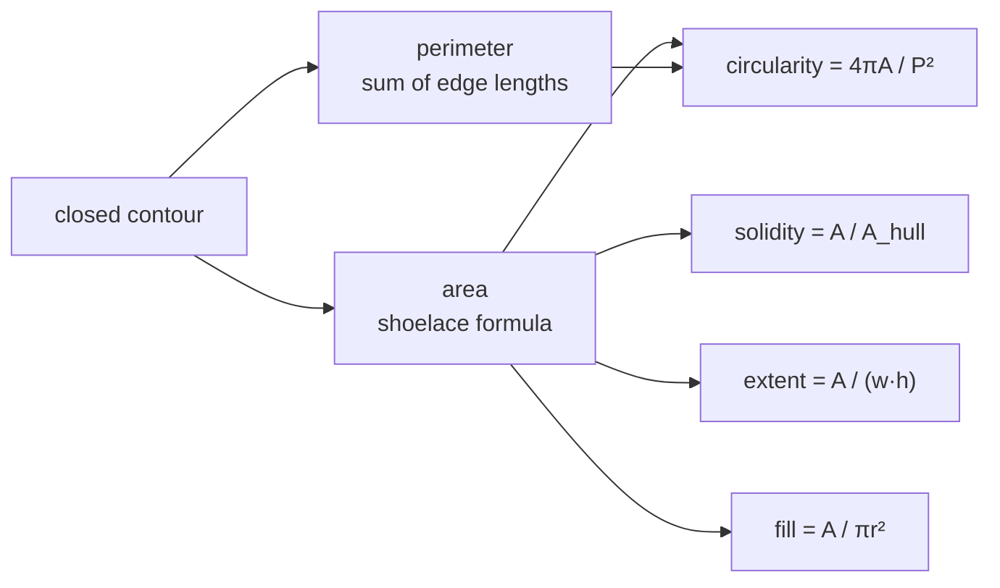

# Contour area and perimeter

The two primitive measurements of a traced shape. Almost every other descriptor
in this repository is a ratio built from them.

## What it is

Given a closed polygon of ordered vertices:

**Area** comes from the [shoelace formula](shoelace-formula.md) —
`½|Σ(xᵢyᵢ₊₁ − xᵢ₊₁yᵢ)|`. The signed version also tells you the winding
direction, which is why `cv2.contourArea` can return a negative number and why
this repository takes `abs()`.

**Perimeter** is the sum of the edge lengths, `Σ√(Δx² + Δy²)`, closed back to
the start.

Alone, neither says anything about shape — a long thin rectangle and a square
can have the same area, or the same perimeter. **Together** they do: for a fixed
perimeter, the area is largest when the shape is a circle. That relationship is
what [circularity](circularity.md) exploits, and it is the reason both values
are computed first.

## The picture

Three shapes, all of area 100:

```
square 10×10          perimeter 40      P²/A = 16.0
rectangle 25×4        perimeter 58      P²/A = 33.6
circle r≈5.64         perimeter 35.4    P²/A = 12.57  ← the minimum possible
line-like 100×1       perimeter 202     P²/A = 408
```



## Where this project uses it

Both detectors compute them immediately after
[contour tracing](contour-tracing.md), and both guard against degenerate values.

`poggio_webapp/pipeline/detect_markers.py`:

```python
for contour in contours:
    area = cv2.contourArea(contour)
    perimeter = cv2.arcLength(contour, True)

    if area <= 0 or perimeter <= 0:
        continue
```

`poggio_webapp/pipeline/detect_features.py`:

```python
area = abs(float(cv2.contourArea(contour)))
perimeter = float(cv2.arcLength(contour, True))

if area < min_area or area > max_area or perimeter <= 0:
    continue
```

Three details worth naming.

**The `abs()`** — `cv2.contourArea` returns a signed value whose sign encodes
winding direction. A clockwise contour gives a negative area, and every ratio
built from it would be negative.

**The zero guards** — `area <= 0` and `perimeter <= 0` protect the divisions
that follow. `circularity = 4πA/P²` divides by `P²`; `extent = A/(w·h)` and
`solidity = A/A_hull` divide by other measured quantities, each with its own
guard:

```python
solidity = area / hull_area if hull_area > 0 else 0
fill = area / (math.pi * radius * radius) if radius > 0 else 0
```

**The area band is a fraction of the image**, not a pixel constant:

```python
min_area = max(55.0, image_area * float(min_area_fraction))
max_area = image_area * float(max_area_fraction)
```

with `min_area_fraction = 0.000018` and `max_area_fraction = 0.035`. Since the
analysis image is capped at 2200 px by
[area-averaging downsampling](area-averaging-downsampling.md), a fraction of the
image area means the same physical thing across inputs. `detect_markers.py`
achieves the same invariance differently, by converting paper millimetres
through the calibration — see [structuring elements](structuring-elements.md).

`arcLength(contour, True)` — the `True` means *closed*, adding the segment from
the last vertex back to the first. On an open curve it would be `False`, and
this project always passes `True` because a shape that is not closed has no
meaningful area to pair the perimeter with. That is exactly why
[morphological closing](morphological-closing.md) runs first in
`detect_features.py`.

## Why this and not something else

| Alternative | How it would work here | Why it lost |
|---|---|---|
| **Pixel count instead of polygon area** | Count foreground pixels in the region | Equivalent for a filled region, and unavailable here: `detect_features` works on [Canny](canny-edge-detection.md) *edges*, where the interior is not foreground at all. The shoelace formula computes the area a boundary encloses whether or not it is filled. |
| **Bounding-box area** | `width × height` | Far cheaper, and it measures the box rather than the shape. It is used here — as [extent](extent-and-fill-ratio.md)'s denominator — precisely as a *contrast* to the true area. |
| **Convex-hull area** | Area of the hull | Also used here, as [solidity](solidity.md)'s denominator, for the same reason. |
| **Moments (`cv2.moments`)** | Central and Hu moments give area, centroid, orientation, and rotation-invariant descriptors | Strictly more powerful, and Hu moments are the classical tool for shape *matching*. Here the discriminations needed are "is it round?" and "is it filled?", which the simple ratios express directly and legibly. A Hu moment threshold would be an unexplainable number. |
| **Area and perimeter** *(chosen)* | Two O(n) sums over the vertex list | The primitives every downstream ratio needs, computed once. |

## What it costs

O(v) each in the number of vertices — and vertex counts are already small
because `CHAIN_APPROX_SIMPLE` collapsed straight runs. Both are effectively
free.

The subtlety worth knowing is **discretisation bias**. A digitised circle's
perimeter is measured along a staircase of pixel steps, which overestimates it
by up to about 5%. Since [circularity](circularity.md) divides by `P²`, that
bias is squared — a perfect digital circle measures around 0.9 rather than 1.0.
Hence the threshold in `detect_markers.py`:

```python
min_circularity = 0.65
```

0.65 rather than something near 1.0 is not laxness; it is calibration against a
known measurement bias.

## Where else you meet it

- **GIS**, computing the area of a parcel or catchment from its polygon.
- **CAD and CAM**, deriving material usage and cut length from a profile.
- **Cell biology**, where area and perimeter of segmented cells are standard
  morphometric measures.
- **Surveying** — the shoelace formula is sometimes called the surveyor's
  formula for exactly this reason.
- **Game physics**, computing polygon mass and moment of inertia.

## Related pages

- [Shoelace formula](shoelace-formula.md) — how the area is computed.
- [Circularity](circularity.md) — the ratio these two combine into.
- [Solidity](solidity.md), [extent and fill ratio](extent-and-fill-ratio.md) —
  other ratios built on area.
- [Contour tracing](contour-tracing.md) — produces the polygon.
- [Morphological closing](morphological-closing.md) — why closure is required
  first.
