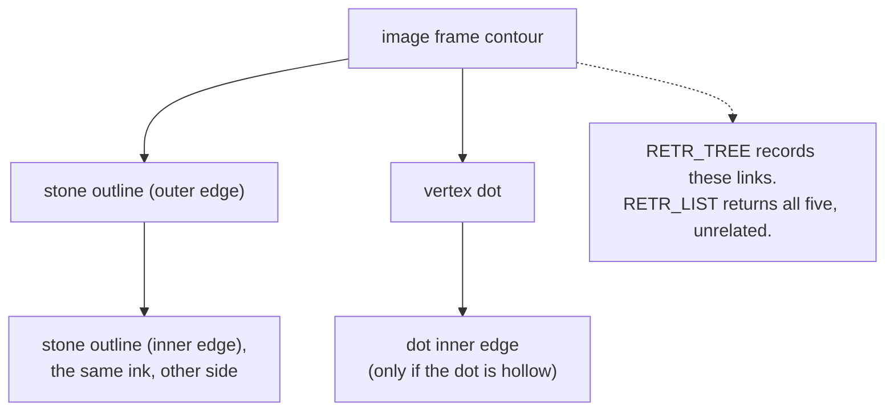

# Contour hierarchy

Contours nest: a shape inside a hole inside a shape. Recording that nesting is
one way to handle duplicates, and this project deliberately chooses a different
way.

## What it is

[Contour tracing](contour-tracing.md) returns every boundary it finds, and
boundaries come in families. A drawn ring produces two: an outer edge and an
inner one. A stone drawn inside a layer produces a contour inside another.

OpenCV can return that structure as a `hierarchy` array, one row per contour:

```
[next, previous, first_child, parent]
```

with `-1` for absent. From it you can ask which contour encloses which, and how
deep the nesting goes.

The retrieval mode chooses how much is returned:

| Mode | Returns |
|---|---|
| `RETR_EXTERNAL` | outermost contours only; children discarded |
| `RETR_LIST` | every contour, flat: **hierarchy is all −1** |
| `RETR_CCOMP` | two levels: outer boundaries and their holes |
| `RETR_TREE` | the full nesting tree |

The reason this matters on a line drawing is that
[Canny](canny-edge-detection.md) reports both sides of every stroke. A single
drawn line yields an outer and an inner contour that are nearly identical, a
duplicate that has to be dealt with somehow.

## The picture



A pen stroke, in cross-section:

```
paper  ██ ink ██  paper
       ↑        ↑
    edge 1    edge 2      → two contours, ~1 stroke-width apart
```

## Where this project uses it

Both detectors request `RETR_LIST` and discard the hierarchy entirely. Note the
`_` in each call.

`poggio_webapp/pipeline/detect_markers.py`:

```python
contours, _ = cv2.findContours(
    opened,
    cv2.RETR_LIST,
    cv2.CHAIN_APPROX_SIMPLE,
)
```

`poggio_webapp/pipeline/detect_features.py`:

```python
contours, _ = cv2.findContours(
    edges,
    cv2.RETR_LIST,
    cv2.CHAIN_APPROX_SIMPLE,
)
```

The duplicates are real, and each module handles them **geometrically** instead.

### Marker detection: distance-based deduplication

```python
# Remove nested-contour duplicates. Keep the largest contour from each
# group whose centers are closer than half the minimum marker diameter.
cand.sort(key=lambda entry: -entry["diam"])

kept = []
for entry in cand:
    is_separate = all(
        ((entry["cx"] - existing["cx"]) ** 2 + (entry["cy"] - existing["cy"]) ** 2)
        > (0.5 * min_d) ** 2
        for existing in kept
    )
    if is_separate:
        kept.append(entry)
```

The comment says "nested-contour duplicates" explicitly. Largest-first, then
suppress anything whose centre is within half a marker diameter: a greedy
[non-maximum suppression](non-maximum-suppression.md).

### Feature detection: overlap-based deduplication

```python
overlap = _iou(candidate, existing)
close_centers = center_distance < center_threshold

if overlap >= 0.68 or (close_centers and overlap >= 0.35):
    duplicate = True
    break
```

Same intent, using [intersection over union](intersection-over-union.md) because
features are arbitrary shapes rather than approximately circular ones.

## Why this and not something else

| Alternative | How it would work here | Why it lost |
|---|---|---|
| **`RETR_EXTERNAL`** | Keep only outermost contours | Tempting, and it discards real evidence. A vertex dot drawn *inside* the closed loop of a boundary line would be a child, and would be silently dropped. The detectors must not lose a marker because of where it happens to sit. |
| **`RETR_TREE` + hierarchy filtering** | Keep a contour only if its parent is not near-identical | Structurally correct and *precisely* what "nested duplicate" means. It requires walking the tree, comparing each child to its parent by area or shape, and choosing a similarity threshold anyway, so the geometric threshold reappears, wrapped in more code. |
| **`RETR_CCOMP`** | Two levels: outers and holes | The natural fit for filled regions with holes. `detect_features` works on **edges**, where the "outer/hole" distinction is an artefact of stroke width rather than a real property of the object. |
| **`RETR_LIST` + geometric dedup** *(chosen)* | Flat list, suppress by proximity or overlap | One uniform mechanism. It handles nested duplicates *and* the unrelated near-duplicates that arise from [morphology](morphological-closing.md) merging or splitting shapes, cases hierarchy filtering cannot see at all. |

The last row is the real argument. Hierarchy solves exactly one class of
duplicate. Geometric suppression solves that class **plus** overlapping
candidates from separate contours, which occur here because
[closing](morphological-closing.md) with a 3×3 kernel can produce two nearly
coincident outlines from one wobbly hand-drawn stroke. One mechanism covering
both is simpler than two mechanisms covering one each.

There is a second, quieter reason: geometric suppression is **ranked**.
`detect_features` sorts by score before suppressing, so the *best* candidate
survives:

```python
ordered = sorted(
    candidates, key=lambda c: (float(c["score"]), float(c["area_px"])), reverse=True
)
```

Hierarchy has no notion of quality. It would keep the parent whether or not
the parent is the better shape.

## What it costs

Requesting `RETR_LIST` is marginally cheaper than `RETR_TREE`, since no parent
links are recorded, a negligible saving.

The cost is paid in the deduplication, which is O(k²) in the number of surviving
candidates: each new candidate is compared against everything kept. With
`MAX_CANDIDATES = 250` that is at most ~31 000 comparisons. Fine. It would need
a spatial index at ten thousand candidates, which the size and shape filters
ensure never happens.

What is given up is genuine information. Knowing that a contour is *inside*
another is archaeologically meaningful (a stone inside a layer, a
[feature](../archaeology/index.md) within a [locus](../archaeology/locus.md)),
and that relationship is currently established by a human during review, and by
`manual_extraction._assign_features()`, which assigns a feature to a layer by
depth band rather than by containment:

```python
low, high = sorted((top_depth, bottom_depth))
if low - 0.02 <= depth <= high + 0.02:
    chosen = i
    break
```

Containment in the *drawing* and containment in the *stratigraphy* are different
questions, and the project answers the second one directly rather than inferring
it from the first.

## What it costs

Covered above.

## Where else you meet it

- SVG fill rules: even-odd and non-zero winding exist precisely to decide
  which nested subpath is a hole.
- Font glyph outlines: the counter of an "o" is a nested contour with
  opposite winding.
- GIS polygons with holes: a lake inside an island inside a lake.
- PCB design, where copper pours have nested keep-out regions.
- 3D printing slicers, deciding which loops in a layer are perimeters and
  which are holes.

## Related pages

- [Contour tracing](contour-tracing.md): what produces the contours.
- [Non-maximum suppression](non-maximum-suppression.md): the deduplication used
  instead.
- [Intersection over union](intersection-over-union.md): the overlap measure in
  the feature detector.
- [Morphological closing](morphological-closing.md): a source of near-duplicate
  contours.
- [Markers, features, and finds](../concepts/markers-features-and-finds.md):
  the archaeological distinctions this cannot infer.
