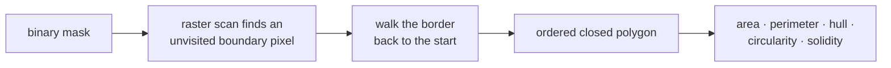

# Contour tracing

Walking the boundary of every connected region in a binary image and returning
it as an ordered list of points. The step that turns pixels into objects, in
both of this project's detectors.

## What it is

Given a [binary mask](binary-masks-and-bitwise-operations.md), contour tracing
finds each connected foreground region and returns its outline as an **ordered
sequence of boundary pixels** — a closed polygon, walked consistently clockwise
or counter-clockwise.

OpenCV implements the Suzuki–Abe algorithm (1985): a single raster scan that,
on encountering an unvisited boundary pixel, follows the border around the
region and back to the start, marking as it goes. One pass, output proportional
to total boundary length.

The ordering is what makes it valuable. An ordered closed polygon supports the
whole vocabulary of shape measurement:

| Measure | Needs an ordered boundary? |
|---|---|
| [Area](contour-area-and-perimeter.md) via the shoelace formula | yes |
| [Perimeter](contour-area-and-perimeter.md) | yes |
| [Convex hull](convex-hull.md) | yes |
| [Minimum enclosing circle](minimum-enclosing-circle.md) | yes |
| [Polygon simplification](ramer-douglas-peucker.md) | yes |

[Connected-component labelling](connected-component-labelling.md) also finds the
regions, but returns a label per *pixel* — giving area and a bounding box and
nothing else.

Two retrieval choices matter: **what** to return (`RETR_LIST` = every contour
flat, `RETR_EXTERNAL` = outermost only, `RETR_TREE` = with nesting — see
[contour hierarchy](contour-hierarchy.md)) and **how** to store it
(`CHAIN_APPROX_NONE` = every boundary pixel, `CHAIN_APPROX_SIMPLE` = collapse
straight runs to their endpoints).

## The picture



`CHAIN_APPROX_SIMPLE` on a rectangle:

```
CHAIN_APPROX_NONE:    every pixel on the border — hundreds of points
CHAIN_APPROX_SIMPLE:  4 points — the corners
```

Straight runs are redundant, and dropping them costs nothing:
[area](contour-area-and-perimeter.md) and
[perimeter](contour-area-and-perimeter.md) are unchanged, because the
intermediate points lie exactly on the segments they were removed from.

## Where this project uses it

Both detectors, with identical retrieval flags and very different downstream
intent.

### Marker detection — filled regions

`poggio_webapp/pipeline/detect_markers.py`:

```python
contours, _ = cv2.findContours(
    opened,
    cv2.RETR_LIST,
    cv2.CHAIN_APPROX_SIMPLE,
)

for contour in contours:
    area = cv2.contourArea(contour)
    perimeter = cv2.arcLength(contour, True)
    (cx, cy), radius = cv2.minEnclosingCircle(contour)
    ...
    circularity = 4 * math.pi * area / (perimeter**2)
    hull_area = cv2.contourArea(cv2.convexHull(contour))
    solidity = area / hull_area if hull_area > 0 else 0
    fill = area / (math.pi * radius * radius) if radius > 0 else 0
```

Four boundary-derived measures in six lines. The input is a *region* mask —
[adaptive threshold](adaptive-thresholding.md) then
[opening](morphological-opening.md) — so a pencil dot is a filled disk and its
contour is that disk's edge.

### Feature detection — outlines

`poggio_webapp/pipeline/detect_features.py`:

```python
contours, _ = cv2.findContours(
    edges,
    cv2.RETR_LIST,
    cv2.CHAIN_APPROX_SIMPLE,
)
```

Here the input is [Canny](canny-edge-detection.md) output, which is *edges*, not
regions. A drawn stone produces a closed loop of edge pixels around its outline,
so the contour is the outline itself. That is why
[morphological closing](morphological-closing.md) runs first: an unclosed loop
has near-zero area and every shape measure collapses.

Both use `RETR_LIST`, because both then filter by shape rather than by nesting —
see [contour hierarchy](contour-hierarchy.md) for why that is a deliberate
choice and how each module handles nested duplicates instead.

### The frame-touching guard

`detect_features.py` discards anything reaching the image border:

```python
if (
    x <= 2
    or y <= 2
    or x + width >= analysis_width - 2
    or y + height >= analysis_height - 2
):
    continue
```

Two reasons. A shape clipped by the frame has a meaningless
[area](contour-area-and-perimeter.md) and
[aspect ratio](aspect-ratio.md); and the outermost contour of any bordered image
is the frame itself, which would otherwise be candidate number one every time.

## Why this and not something else

| Alternative | How it would work here | Why it lost |
|---|---|---|
| **[Connected-component labelling](connected-component-labelling.md)** | Label pixels, use per-component stats | Gives area, bounding box, centroid. It does not give perimeter, hull, or circularity — the measures that actually separate a dot from a stone outline. You would have to trace the boundary anyway. Also costs a full-size `int32` label image. |
| **Marching squares** | Trace iso-contours of a scalar field | Designed for continuous fields; produces sub-pixel contours. Overkill on binary input, and the sub-pixel precision is discarded by the integer-pixel measures that follow. |
| **Chain codes (Freeman)** | Encode the boundary as a sequence of 8 directions | The classical compact representation, and it is what Suzuki–Abe produces internally. OpenCV hands back point lists because that is what the measurement functions consume. |
| **Contour tracing** *(chosen)* | Suzuki–Abe, ordered closed polygons | One pass, output proportional to boundary length, and directly consumable by every shape measure both detectors need. |
| **Region growing / watershed** | Segment from seeds | A different problem formulation — better for touching objects, needs markers, which is what is being detected. |

The decisive argument is representational: this project needs to **measure
shapes**, and shape measures are boundary integrals. Starting from the boundary
skips a conversion that every alternative would have to perform anyway.

## What it costs

O(n) for the raster scan plus O(total boundary length) for the walks. Memory is
proportional to boundary length, not area — a few kilobytes for a contour list
against tens of megabytes for a label image.

`CHAIN_APPROX_SIMPLE` typically reduces point counts by an order of magnitude on
drawings, which have many straight runs.

The genuine cost is a flood of candidates. On a hatched drawing, every hatch
stroke is a contour. Both modules answer this by filtering hard and immediately:

```python
if area < min_area or area > max_area or perimeter <= 0:
    continue
if width < 10 or height < 10:
    continue
```

and by capping the result at `MAX_CANDIDATES = 250` after
[deduplication](non-maximum-suppression.md).

## Where else you meet it

- **Vector tracing** — Illustrator's Image Trace and Inkscape's Trace Bitmap
  begin here.
- **OCR**, segmenting a binarised page into glyph candidates.
- **CNC and laser cutting**, converting a bitmap into toolpaths.
- **Medical imaging**, delineating an organ boundary for measurement.
- **`potrace`** and similar bitmap-to-vector converters.
- **Map digitisation**, which is this project's problem applied to cartography.

## Related pages

- [Contour hierarchy](contour-hierarchy.md) — nesting, and why `RETR_LIST` is
  used here.
- [Connected-component labelling](connected-component-labelling.md) — the
  alternative, and why it lost.
- [Contour area and perimeter](contour-area-and-perimeter.md) — the first
  measures taken.
- [Convex hull](convex-hull.md), [circularity](circularity.md),
  [solidity](solidity.md) — the shape filter.
- [Ramer–Douglas–Peucker](ramer-douglas-peucker.md) — simplifying the result for
  storage.
