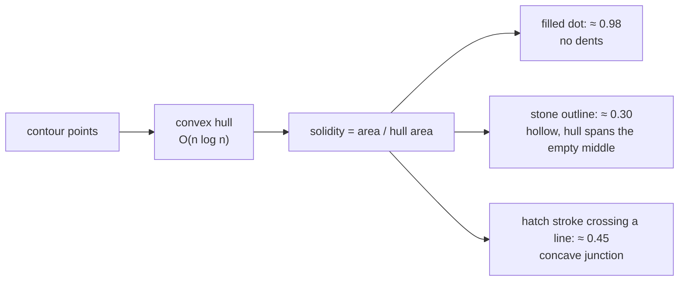

# Convex hull

The tightest shape you get by stretching a rubber band around a set of points.
Both detectors compute it for one reason: comparing a shape to its own hull
measures how *dented* the shape is.

## What it is

A shape is **convex** if the straight line between any two of its points stays
inside it. A circle and a square are convex; a crescent, a star, and a letter C
are not.

The convex hull of a point set is the smallest convex shape containing them all.
Physically: hammer a nail at every point and stretch a rubber band around the
outside.

Several algorithms compute it in **O(n log n)**: Graham scan (sort by angle,
walk maintaining left turns), Andrew's monotone chain (sort by x, build upper
and lower chains), or Quickhull. All rely on the
[orientation test](signed-area-and-orientation-test.md) to decide left turn from
right.

The hull is always a superset of the shape, so `area / hull_area ≤ 1` always.
That ratio is [solidity](solidity.md), and it is the entire reason both
detectors compute a hull.

## The picture



```
a filled disk         hull ≈ the disk          solidity ≈ 0.98
a crescent            hull spans the bay       solidity ≈ 0.55
a ring outline        hull covers the hole     solidity ≈ 0.20
a plus sign           hull is a square         solidity ≈ 0.55
```

## Where this project uses it

Both detectors, in the same idiom, for the same measure.

`poggio_webapp/pipeline/detect_markers.py`:

```python
hull_area = cv2.contourArea(
    cv2.convexHull(contour)
)

solidity = (
    area / hull_area
    if hull_area > 0
    else 0
)
...
if (
    min_d <= diameter <= max_d
    and circularity >= min_circularity
    and solidity >= min_solidity        # default 0.9
    and fill >= 0.5
):
```

`min_solidity=0.9` is strict, and the module docstring says what it is for:

> solidity/fill filters + dedupe: dots are small FILLED disks; **stone outlines
> and nested contour duplicates are not**

A pencil dot is convex, so its solidity is near 1. Anything with a dent (a
stone outline, a stroke junction, two marks merged by
[thresholding](adaptive-thresholding.md)) falls well below 0.9.

`poggio_webapp/pipeline/detect_features.py` uses the same computation with a
much looser threshold:

```python
convex_hull = cv2.convexHull(contour)
hull_area = abs(float(cv2.contourArea(convex_hull)))

solidity = area / hull_area if hull_area > 0 else 0.0
...
# Layer boundaries and grid lines generally have low extent or
# solidity. Small text loops are mostly removed by size limits.
if solidity < 0.34 or extent < 0.09:
    continue

score = 0.45 * compactness + 0.35 * min(1.0, solidity) + 0.20 * min(1.0, extent)
```

**0.34 rather than 0.9**, because the target is different: a stone is a compact
blob but a genuinely irregular one, and a real archaeological feature may be
lobed or lensed. Here solidity is a *weak reject* plus a **scoring term**
weighted at 0.35: evidence, not a verdict.

The same measure, two thresholds an order of magnitude apart, because one
detector looks for a manufactured mark and the other for a natural object. That
contrast is the clearest illustration of why a shape descriptor is only
meaningful together with its threshold.

## Why this and not something else

| Alternative | How it would measure concavity | Why it lost |
|---|---|---|
| **[Circularity](circularity.md) alone** | `4πA/P²` | Also used, and it conflates two different defects: a shape can be non-circular because it is *elongated* or because it is *dented*. Solidity isolates dentedness: an elongated but convex ellipse has solidity ≈ 1 and low circularity. Together they separate the two. |
| **[Bounding box](bounding-boxes.md) extent** | `A / (w·h)` | Also used, as [extent](extent-and-fill-ratio.md). It is orientation-dependent: a diagonal ellipse has low extent while being perfectly convex. Solidity has no such bias. |
| **Concave hull / alpha shape** | A tighter, non-convex boundary | Would give a better outline of an irregular stone, and it needs an alpha parameter, a length scale, which is exactly the tuning this filter is trying to avoid. Convex hull is parameter-free. |
| **Convexity defects (`cv2.convexityDefects`)** | The individual dents and their depths | More informative: how many dents, how deep. It returns a variable-length list, so it cannot be a single threshold. Useful for counting fingers on a hand; overkill for "is this dented at all?" |
| **Hu moments** | Rotation-invariant shape descriptors | Powerful for shape *matching* against a template. They produce numbers nobody can interpret, and the discriminations needed here (round, filled, undented) are directly expressible. |
| **Convex hull + solidity** *(chosen)* | One O(n log n) call, one ratio | Parameter-free, scale-invariant, rotation-invariant, and it isolates exactly the defect that distinguishes a dot from an outline. |

## What it costs

O(n log n), dominated by the sort: the most expensive per-contour measure in
either detector. That is why it is computed **last**, after the
[area](contour-area-and-perimeter.md) band and the
[box](bounding-boxes.md) tests have already eliminated most candidates. In
`detect_features.py` it sits below the size, frame, and aspect-ratio guards for
exactly that reason.

It is a *lossy* summary: it says how much area is missing, never where. Two very
different shapes can share a solidity.

And it says nothing about holes in the interior that do not reach the boundary.
That is what [fill ratio](extent-and-fill-ratio.md), against the
[minimum enclosing circle](minimum-enclosing-circle.md), is for. The two
together cover both kinds of emptiness.

## Where else you meet it

- Collision detection: most physics engines decompose concave shapes into
  convex pieces, because convex-convex intersection is fast.
- Gesture recognition, counting extended fingers via convexity defects.
- Robot path planning, where obstacles are inflated to convex hulls.
- Statistics, where the convex hull of a scatter is a non-parametric
  bivariate range.
- Linear programming, whose feasible region is a convex hull of constraints
  and whose optimum sits on it.
- Packaging and materials, computing the volume a shape occupies in
  transport.

## Related pages

- [Solidity](solidity.md): the ratio this exists to compute.
- [Circularity](circularity.md): the complementary shape measure.
- [Extent and fill ratio](extent-and-fill-ratio.md): the other emptiness tests.
- [Signed area and the orientation test](signed-area-and-orientation-test.md):
  the primitive every hull algorithm is built on.
- [Contour area and perimeter](contour-area-and-perimeter.md): the numerator.
