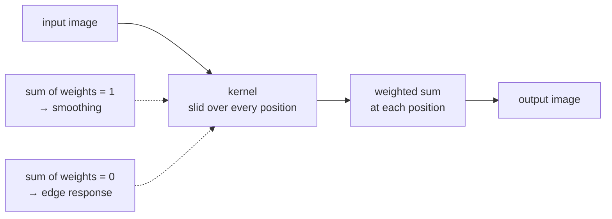

# Convolution

Slide a small grid of weights over an image, and at every position replace the
pixel with a weighted sum of its neighbours. Almost every image operation in
this repository is one of these, or is built from several.

## What it is

A *kernel* is a small array of numbers, typically 3×3 or 5×5. Convolution
places the kernel over each pixel, multiplies each kernel weight by the pixel
underneath it, adds the results, and writes that sum to the output.

The weights decide what the operation is:

| Kernel | Effect |
|---|---|
| `[[0,0,0],[0,1,0],[0,0,0]]` | nothing (copies the image) |
| `[[1,1,1],[1,1,1],[1,1,1]] / 9` | blur (box average) |
| `[[1,2,1],[2,4,2],[1,2,1]] / 16` | [Gaussian blur](gaussian-blur.md) |
| `[[-1,0,1],[-2,0,2],[-1,0,1]]` | horizontal gradient ([Sobel](image-gradients-and-sobel.md)) |
| `[[0,-1,0],[-1,5,-1],[0,-1,0]]` | sharpen |

One mechanism, many operations. That is the point.

Two properties do most of the work in practice:

- Weights that sum to 1 preserve brightness: a blur.
- Weights that sum to 0 respond to *change* and ignore flat regions: an
  edge detector.

## The picture

A 3×3 blur kernel over one pixel:

```
image neighbourhood        kernel (÷9)        result
  200  198  100             1  1  1
  199   96   98      ⊛      1  1  1     →   (200+198+100+199+96+98+
  201  200  199             1  1  1            201+200+199) / 9 = 165
```

The dark pixel at the centre (96) becomes 165, pulled toward its bright
neighbours. Do that everywhere and detail smooths away.

Swap the weights for `[[-1,-1,-1],[-1,8,-1],[-1,-1,-1]]` and the same
neighbourhood yields `8·96 − (200+198+100+199+98+201+200+199) = −627`: a large
response, because this pixel differs sharply from its surroundings. Flat paper
would yield zero.



## Where this project uses it

Rarely by name, almost always through a named OpenCV function that *is* a
convolution underneath.

`poggio_webapp/pipeline/preprocess.py` uses three in five lines:

```python
def clean(gray, upscale=2):
    """The recommended pipeline: flatten -> upscale -> CLAHE -> mild sharpen."""
    flat = flatten_background(gray)  # contains a σ=25 Gaussian
    ...
    blur = cv2.GaussianBlur(eq, (0, 0), sigmaX=1.2)  # convolution
    sharp = cv2.addWeighted(eq, 1.5, blur, -0.5, 0)  # combines two images
    return sharp
```

`flatten_background` convolves with a very wide Gaussian to estimate the
lighting field; the sharpening step convolves with a narrow one and subtracts
(see [unsharp masking](unsharp-masking.md)).

`poggio_webapp/pipeline/detect_features.py` blurs before edge detection, because
[Canny](canny-edge-detection.md) computes gradients and gradients amplify noise:

```python
gray = cv2.GaussianBlur(gray, (3, 3), 0)
```

[Morphological operations](structuring-elements.md) look similar (a small
shape slid over the image) but are *not* convolutions: they take a maximum or
minimum rather than a weighted sum. The distinction matters because
morphology is non-linear, which is exactly why it can remove a thin line
without smearing everything else.

## Why this and not something else

Convolution is not really "chosen": it is the vocabulary. The choices happen
one level down.

| Alternative | How it would work here | Why it lost |
|---|---|---|
| **Explicit per-pixel loops in Python** | `for y: for x: ...` | Semantically identical and thousands of times slower. A 3000×3000 image is 9 million iterations per filter in interpreted code. |
| **FFT-based convolution** | Transform to frequency space, multiply, transform back | Asymptotically better for *large* kernels. OpenCV switches to it internally where it wins. For a 3×3 kernel the transform costs far more than the direct sum. |
| **Separable convolution** | Apply a 1D kernel horizontally, then vertically | Not an alternative so much as an optimisation, and one OpenCV already applies. A 2D Gaussian factors into two 1D passes, turning k² multiplies per pixel into 2k. It is why `sigmaX=25` is affordable at all. |
| **Learned filters (a CNN)** | Train convolution weights from data instead of choosing them | The same operation with weights fitted rather than designed. It needs labelled data this project does not have, and it produces a filter nobody can explain, which is against the grain of a pipeline whose value is that every step is inspectable. |

That last row is worth sitting with. A convolutional neural network is
*literally this page's operation*, stacked, with the numbers learned instead of
chosen. The classical version is used here because the drawing conventions are
known in advance, so the right weights can be reasoned about rather than
discovered.

## What it costs

For a k×k kernel over an n-pixel image: **O(n·k²)** naively, **O(n·k)** if the
kernel is separable, **O(n log n)** via FFT for large k.

Concretely, a 3×3 kernel on a 9-megapixel image is about 81 million multiply-add
operations: milliseconds in optimised native code, minutes in a Python loop.

Edge handling is a real decision, not a detail. This project uses
`BORDER_REPLICATE` when rotating, so the edges of a deskewed sheet extend the
last real pixel rather than fading to black and creating a false edge for the
next stage to detect.

## Where else you meet it

- Every photo filter ever: blur, sharpen, emboss, edge glow.
- Audio. A reverb is convolution with an impulse response; the mathematics
  is identical in one dimension.
- Convolutional neural networks, the foundation of modern computer vision.
- Probability. The distribution of a sum of two independent random
  variables is the convolution of their distributions.
- Optics. A lens's blur *is* a convolution with its point-spread function,
  which is why deconvolution can partly undo it.

## Related pages

- [Gaussian blur](gaussian-blur.md): the most-used kernel here.
- [Unsharp masking](unsharp-masking.md): built from two convolutions.
- [Image gradients and Sobel](image-gradients-and-sobel.md): the edge kernels.
- [Structuring elements](structuring-elements.md): the similar-looking
  operation that is *not* a convolution.
