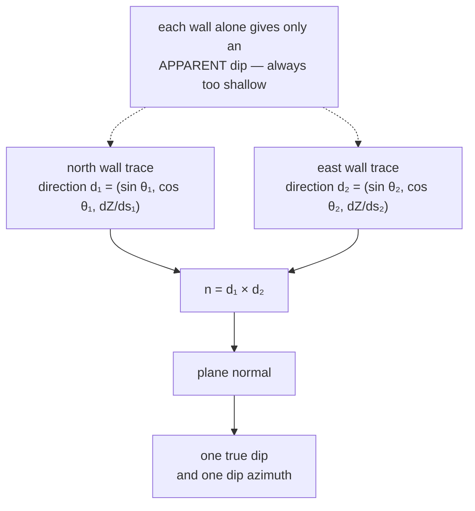

# Cross product

Two vectors in 3D determine a plane; the cross product returns the vector
perpendicular to it. This is how the project solves one true geological dip from
two walls that disagree.

## What it is

```
a × b = ( a_y b_z − a_z b_y ,
          a_z b_x − a_x b_z ,
          a_x b_y − a_y b_x )
```

The result is **perpendicular to both** inputs, with magnitude
`‖a‖‖b‖sin θ` — the area of the parallelogram they span. It is zero exactly when
the inputs are parallel, which is both a degeneracy to guard against and a useful
test.

In **2D** there is a scalar analogue, the z-component alone:

```
a × b = a_x b_y − a_y b_x
```

Its sign says whether `b` turns left or right from `a`, which is the
[orientation test](signed-area-and-orientation-test.md) that underpins
[segment intersection](line-segment-intersection.md),
[convex hull](convex-hull.md), and the [shoelace formula](shoelace-formula.md).

## The picture

The archaeological problem it solves:



Why two walls suffice: a plane in 3D has two degrees of freedom in orientation.
Each wall's trace fixes one direction lying in that plane. Two non-parallel
directions determine the plane completely — and therefore its normal, and
therefore its dip.

## Where this project uses it

### Solving one true dip from two walls

`poggio_webapp/pipeline/true_dip.py`, the heart of the module:

```python
first, second = pair
a = directions[first]
b = directions[second]
normal = (
    (a[1] * b[2]) - (a[2] * b[1]),
    (a[2] * b[0]) - (a[0] * b[2]),
    (a[0] * b[1]) - (a[1] * b[0]),
)
solved = _dip_from_normal(normal)
```

Each direction is built from the wall's bearing and the
[least-squares slope](ordinary-least-squares.md) of its trace:

```python
def _wall_direction(points):
    """(direction, ordered points) for one wall's trace, or (None, ordered).

    The direction is (sin bearing, cos bearing, dZ/ds): one step along the wall
    moves that far horizontally and dZ/ds vertically.
    """
```

The module docstring states the geology plainly:

> Two walls that are not parallel pin the plane down exactly. Each wall's trace
> gives a direction in space -- along the wall, tilted by that wall's apparent
> slope -- and the plane containing both directions has one normal, hence one
> true dip and one dip azimuth.

**The degeneracy is handled before the product is taken**, not after. Parallel
walls give a cross product near zero, whose direction is numerically garbage:

```python
def _best_pair(faces, bearings, threshold):
    """The two faces whose bearings are furthest from parallel, or None.

    Pairs are scored by |sin(difference)|: 1 for perpendicular walls, 0 for
    parallel ones.
    """
```

`|sin(Δbearing)|` is precisely the cross product's magnitude for two horizontal
unit directions — so the conditioning check *is* the cross product's own
magnitude, used as a quality score. Below `min_separation_deg = 10.0`, the
module refuses:

```python
notes.append(
    f"surface {surface!r} appears only on walls that are within "
    f"{min_separation_deg} degrees of parallel "
    f"...; a true dip cannot be solved from them, so the existing apparent "
    "dips stand")
```

### The 2D scalar form

`poggio_webapp/pipeline/editor/geometry.py`:

```python
def _direction(start, end, point):
    return (
        (end[0] - start[0]) * (point[1] - start[1])
        - (end[1] - start[1]) * (point[0] - start[0])
    )
```

`poggio_webapp/static/visualizer/layer-fill.mjs`:

```javascript
function orientation(a, b, c) {
  return (
    ((b.x - a.x) * (c.y - a.y))
    - ((b.y - a.y) * (c.x - a.x))
  );
}
```

Same expression, two languages, both feeding
[segment intersection](line-segment-intersection.md).

## Why this and not something else

For solving a plane from two directions:

| Alternative | How it would work here | Why it lost |
|---|---|---|
| **Least-squares plane fit to all points** | Fit `Z = ax + by + c` to every point on both walls | The obvious statistical answer, and it weights walls by how many vertices each happens to have — a densely traced wall would dominate a sparsely traced one purely by vertex count. The cross product weights the two walls' *directions* equally, which is what the geology means. |
| **Singular value decomposition** | The normal is the smallest singular vector | Numerically excellent and generalises to more than two walls. It requires a linear-algebra dependency in a module that currently imports only `csv` and `math`, and for exactly two directions the cross product *is* the answer. |
| **Solve the linear system directly** | Two equations, three unknowns, plus normalisation | Algebraically the same thing, written less clearly. |
| **Trigonometric apparent-dip formulas** | The standard structural-geology relation between two apparent dips | The classical hand method, and it is a nest of quadrant and sign cases. The vector form has none — it is three lines with no branches. |
| **Cross product** *(chosen)* | Three multiply-subtract pairs | Exact, branch-free, no dependency, and its magnitude doubles as the conditioning check. |

The choice also enables an honest refusal. Because the conditioning is visible
*before* the solve, the module can decline rather than emit a badly conditioned
answer:

> A plausible-looking invented orientation would be worse than the apparent dips
> already in the CSV, because it would look like an improvement.

## What it costs

Six multiplies and three subtractions. Free.

The real cost is **conditioning**. As two directions approach parallel, the
normal's magnitude approaches zero and its direction becomes dominated by
floating-point error — the answer degrades continuously toward noise with no
error raised. Hence the 10° threshold, chosen and named rather than left
implicit.

Orientation matters too: `a × b = −(b × a)`. Reversing the pair flips the
normal. `_dip_from_normal` handles this by forcing the normal upward before
computing anything:

```python
if z < 0:
    x, y, z = -x, -y, -z
```

## Where else you meet it

- **3D graphics.** Surface normals for lighting are computed as the cross
  product of two triangle edges — one of the most-executed operations in
  rendering.
- **Physics.** Torque is `r × F`; angular momentum and the Lorentz force are
  cross products.
- **Structural geology**, where this exact calculation solves true dip from two
  apparent dips.
- **Robotics and aerospace**, for rotation axes and angular velocity.
- **Computational geometry**, where the 2D scalar form is the primitive beneath
  convex hulls, triangulation, and point-in-polygon tests.

## Related pages

- [Plane normals](plane-normals.md) — turning the result into dip and azimuth.
- [Dot product](dot-product.md) — the other vector product.
- [Signed area and the orientation test](signed-area-and-orientation-test.md) —
  the 2D scalar form.
- [Ordinary least squares](ordinary-least-squares.md) — how each wall's slope is
  measured.
- [Apparent and true dip](../archaeology/index.md) — the archaeological meaning.
