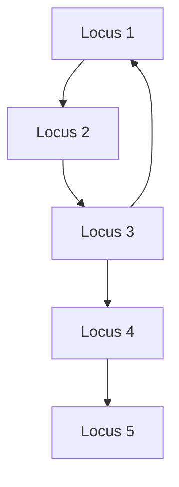

# Cycle detection

Finding a path that returns to where it started. In a chronology a cycle is
always an error — a deposit cannot be both younger and older than another — so
detecting one is how this project catches a contradiction it must not model.

## What it is

Two standard approaches for a directed graph.

**Three-colour [depth-first search](depth-first-search.md).** Mark nodes white
(unvisited), grey (on the current path), or black (finished). An edge to a grey
node closes a cycle, and the current path from that node *is* the cycle.

**[Kahn's algorithm](topological-sorting.md) as a by-product.** Repeatedly
remove nodes with no remaining predecessors. Whatever cannot be removed is on or
downstream of a cycle.

They answer slightly different questions. DFS returns a **concrete path**; Kahn
returns the **set of nodes** that could not be ordered — which includes
everything downstream of the cycle, not just the cycle itself.

This repository uses both, in different modules, and each pairs its choice with
work to make the answer specific.

## The picture



DFS reports `[1, 2, 3, 1]` — the cycle exactly.

Kahn reports that units 1, 2, 3, 4, and 5 could not be sorted — because 4 and 5
are *downstream* of the cycle and never become ready. Three of those five are
innocent.

## Where this project uses it

### DFS, in the Harris Matrix

`poggio_webapp/pipeline/harris_matrix.py` uses three-colour DFS and returns the
path:

```python
elif state[neighbor] == 1:
    return path[path_indexes[neighbor]:] + [neighbor]
```

Wired into validation as the gate on everything else:

```python
cycle = _find_cycle(nodes, edges)
if cycle is not None:
    errors.append(
        _issue(
            "cycle",
            f"Chronological cycle detected: {' -> '.join(cycle)}.",
            cycle,
            _cycle_relation_ids(cycle, relation_ids_by_edge),
        )
    )
    order = []
    display_edges = []
else:
    order = _topological_sort(nodes, edges)
    ...
```

Neither an order nor display edges is produced for a cyclic graph, because
neither is defined. No partial answer.

The error names the **relation records**, not just the units:

```python
def _cycle_relation_ids(cycle, relation_ids_by_edge):
    relation_ids = set()
    for younger, older in zip(cycle, cycle[1:]):
        relation_ids.update(relation_ids_by_edge[(younger, older)])
    return sorted(relation_ids)
```

A user is told which specific assertions form the contradiction, which is what
they need in order to go and check their notes.

The check runs on **every load and every save** —
`harris_store._validate_candidate` calls `validate_matrix_graph` and refuses to
persist an invalid graph — and on **every suggestion acceptance**, applied to a
copy first:

```python
suggestion.status = "accepted"

report = validate_matrix_graph(reviewed)
if not report["ok"]:
    raise _acceptance_error(suggestion, report)
return reviewed
```

That is a transaction: no accepted suggestion can leave the matrix
contradictory.

### Kahn, plus peeling, in the wall merge

`poggio_webapp/pipeline/merge_walls.py` detects a cycle as the topological
sort's failure:

```python
if len(order) < len(order_index):
    raise ValueError(_cycle_message(order, order_index, successors, faces_by_surface))
```

and then does the work Kahn does not — isolating the surfaces actually on the
cycle:

```python
def _cycle_message(order, order_index, successors, faces_by_surface):
    """Name the surfaces actually on a cycle, not everything downstream of it.
    Repeatedly drop unsorted surfaces with no remaining predecessor or no
    remaining successor; what survives is on a cycle."""
    remaining = set(order_index) - set(order)
    changed = True
    while changed:
        changed = False
        for name in sorted(remaining, key=lambda n: order_index[n]):
            has_successor = bool(successors[name] & remaining)
            has_predecessor = any(name in successors[other] for other in remaining)
            if not (has_successor and has_predecessor):
                remaining.discard(name)
                changed = True
    cycle = remaining or (set(order_index) - set(order))
```

Iterative peeling: anything with no remaining predecessor *or* no remaining
successor cannot be on a cycle, so drop it and repeat. What survives is on one.

The message then names each surface **and the wall it came from**:

```python
listed = ", ".join(
    f"{name!r} (on {', '.join(faces_by_surface[name])})"
    for name in sorted(cycle, key=lambda n: order_index[n])
)
return (
    "the walls contradict each other: these surfaces form a "
    "stratigraphic cycle and cannot be ordered young to old -- "
    + listed
    + ". Check the layer order on those walls, or correlate the loci "
    "explicitly; no order is guessed."
)
```

Both modules reach the same standard by different routes: **name the specific
contradiction, and state that nothing was guessed.**

## Why this and not something else

| Alternative | What it reports | Why it lost — or won |
|---|---|---|
| **Three-colour DFS** *(Harris)* | One concrete cycle path | Directly actionable. Requires the grey state, so [BFS](breadth-first-search.md) cannot substitute. |
| **Kahn's by-product** *(merge)* | The unsortable set | Free, since the sort runs anyway — and it over-reports, hence the peeling step. |
| **Tarjan's strongly connected components** | Every cycle group at once | More powerful. It is more code, and one concrete example is enough to make an error actionable. Worth revisiting if matrices ever contain many independent contradictions. |
| **Floyd–Warshall transitive closure** | Whether any node reaches itself | O(V³) time and O(V²) memory to answer what DFS answers in O(V + E), and it does not give a path. |
| **Union-Find** | Cycles in *undirected* graphs | The standard trick for Kruskal's algorithm, and it cannot detect directed cycles: A→B and B→A would look like one component either way. [Union-Find](union-find.md) is used here for correlations, which genuinely are undirected. |
| **Allow cycles and break them** | — | Silently discards a recorded observation and invents an order. |

The last row is the real decision, and both modules make it identically. A cycle
is not a nuisance to route around; it is **evidence that the record contains a
contradiction**, and the person who recorded it is the only one who can resolve
it.

## What it costs

O(V + E) — one traversal. It runs on every load, save, and suggestion
acceptance, and is far cheaper than the schema validation beside it.

The peeling loop in `_cycle_message` is O(V²) in the worst case, and it only
runs when a cycle already exists, on the small set of unsorted nodes.

The costs are borne by the user, deliberately:

- **A cyclic matrix cannot be saved.** Work that has become contradictory is
  rejected rather than stored.
- **A cyclic merge cannot be built.**
- **Detection cannot say which edge is wrong.** Three mutually contradictory
  statements contain at least one error, and nothing in the data says which.
  Only the excavation record can settle it.

## Where else you meet it

- **Build systems and package managers**, where a dependency cycle is a hard
  error.
- **Spreadsheets**, where a circular reference is exactly this.
- **Deadlock detection** in operating systems and databases — a cycle in the
  wait-for graph.
- **Compilers**, detecting recursive type definitions or circular module
  imports.
- **Reference-counting garbage collectors**, which need cycle detection because
  counts alone never reach zero in a cycle.
- **Currency arbitrage**, where a profitable cycle is the *goal* rather than the
  error.

## Related pages

- [Depth-first search](depth-first-search.md) — the traversal, and why it is
  iterative here.
- [Directed acyclic graphs](directed-acyclic-graphs.md) — the property being
  enforced.
- [Topological sorting](topological-sorting.md) — the algorithm whose failure is
  the other detector.
- [Union-Find](union-find.md) — the undirected cycle tool, and what it is used
  for here instead.
- [Build a Harris Matrix](../workflows/harris-matrix.md) — the workflow where the
  error surfaces.
