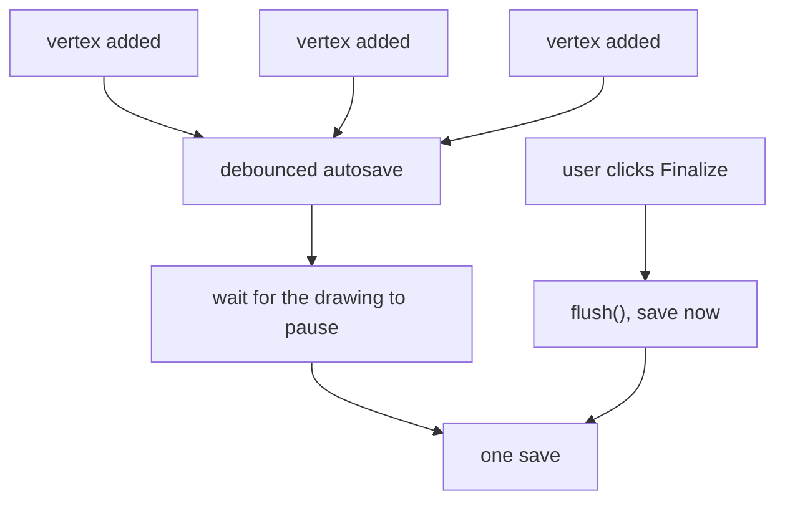

# Debouncing and throttling

Two ways to stop a rapid stream of events from triggering a rapid stream of
work. Debouncing waits for the stream to stop; throttling lets one through at a
fixed rate.

## What it is

A user typing, dragging, or resizing produces events far faster than the work
they trigger can usefully run.

**Debounce**: postpone the work until the events stop for a given interval.
Typing produces one call, after the last keystroke.

**Throttle**: allow at most one call per interval, discarding the rest.

```
events:    ● ● ● ●   ●   ● ● ●
debounce:              ▲           ▲     (after each quiet gap)
throttle:  ▲     ▲     ▲     ▲           (at a fixed rate)
```

Debounce suits work that only matters once the input settles: autosave, search
suggestions, validation. Throttle suits work that should keep up continuously:
scroll position, a progress bar.

A production debounce needs two more operations:

- `flush()`: run the pending call *now*, rather than waiting.
- `cancel()`: discard it without running.

Without `flush`, a user who saves and immediately navigates away loses whatever
was pending.

## The picture



## Where this project uses it

`poggio_webapp/static/canvas/grid.mjs` implements it from scratch:

```javascript
export function debounce(callback, waitMilliseconds, timers = globalThis) {
  if (typeof callback !== "function") {
    throw new TypeError("Debounced callback must be a function.");
  }
  if (!Number.isFinite(waitMilliseconds) || waitMilliseconds < 0) {
    throw new RangeError("Debounce delay must be a non-negative number.");
  }

  let timeoutId;
  let pendingCall;

  function invokePending(call) {
    if (pendingCall !== call) {
      return undefined;
    }

    pendingCall = undefined;
    timeoutId = undefined;
    return callback.apply(call.context, call.args);
  }

  function debounced(...args) {
    if (pendingCall !== undefined) {
      timers.clearTimeout(timeoutId);
    }

    const call = { args, context: this };
    pendingCall = call;
    timeoutId = timers.setTimeout(() => {
      invokePending(call);
    }, waitMilliseconds);
  }

  debounced.flush = () => {
    if (pendingCall === undefined) {
      return undefined;
    }

    timers.clearTimeout(timeoutId);
    return invokePending(pendingCall);
  };

  debounced.cancel = () => {
    if (pendingCall === undefined) {
      return;
    }

    timers.clearTimeout(timeoutId);
    pendingCall = undefined;
    timeoutId = undefined;
  };

  return debounced;
}
```

Four details that distinguish this from the three-line version usually written
inline.

**`timers = globalThis`, injectable timers.** The reason is testability: a test
can pass a fake clock and advance it deterministically rather than sleeping.
That single parameter is why debounce behaviour is covered by the browser test
suite at all. See
[pure functions and testability](pure-functions-and-testability.md).

**The `pendingCall !== call` identity check** inside `invokePending`. It guards a
real race: `flush()` invokes the pending call synchronously, and a `setTimeout`
callback already queued for that same call could otherwise run it a second time.
Comparing object identity makes the second invocation a no-op.

**`flush()` returns the callback's value**, so a caller can use the result of the
forced run.

**Argument validation up front**, with distinct error types: `TypeError` for a
non-function, `RangeError` for a bad delay. See
[error taxonomies](error-taxonomies.md).

**`call.context`** captures `this`, so the debounced function behaves correctly
as a method.

The canvas editor uses it for autosave while drawing: each vertex would otherwise
mean a request, and the whole point is one save after the pause.

## Why this and not something else

| Alternative | How it would handle rapid drawing | Why it lost |
|---|---|---|
| **Save on every event** | One request per vertex | Dozens of requests for one polygon, each writing the same file. |
| **Throttle** | One save per second, continuously | Keeps up during a long drag, and the *final* state may never be saved, because the last events fall inside a throttle window. For autosave, the last state is the one that matters. |
| **Save only on an explicit button** | No autosave | Work is lost on a crash or a closed tab. |
| **A library (`lodash.debounce`)** | The same, battle-tested | This project ships **no build step** and vendors nothing beyond Three.js. Adding a bundler to import one function is a large change for a 50-line utility. |
| **Debounce with `flush` and `cancel`** *(chosen)* | One save after the pause, forceable | Minimal requests, the final state is always saved, and `flush()` covers the navigate-away case. |

The no-build-step constraint recurs throughout the frontend, and it is a
deliberate architectural position. See
[frontend architecture](../architecture/frontend.md). It means small utilities
are written rather than imported, which is affordable only if they are written
*well*: hence the injectable timers, the identity guard, and the tests.

## What it costs

One timer and two variables per debounced function. Nothing.

The costs:

- Latency. Work happens after the delay, so a save is always slightly behind
  the drawing. `flush()` exists for the moments when it must not be.
- A pending call can be lost if the page closes before the timer fires.
  Mitigated by flushing on navigation.
- Choosing the interval is a judgement. Too short and the batching is
  pointless; too long and the user notices the lag.
- Debounce is the wrong tool for continuous feedback. A progress bar
  debounced would only update when progress *stopped*. Different problem,
  different tool.

## Where else you meet it

- Search-as-you-type, the canonical debounce.
- Window resize handlers, where relayout on every pixel is unaffordable.
- Autosave in editors and document tools.
- Button double-click protection, which is debounce with a leading edge.
- Hardware switch debouncing, where the term originates: a mechanical
  contact bounces for milliseconds, and firmware waits for it to settle.
- API rate limiting, which is throttling enforced by the server.

## Related pages

- [Pure functions and testability](pure-functions-and-testability.md): why the
  timers are injectable.
- [Error taxonomies](error-taxonomies.md): the distinct error types.
- [Race conditions](race-conditions.md): the identity check's purpose.
- [Frontend architecture](../architecture/frontend.md): the no-build-step
  constraint.
