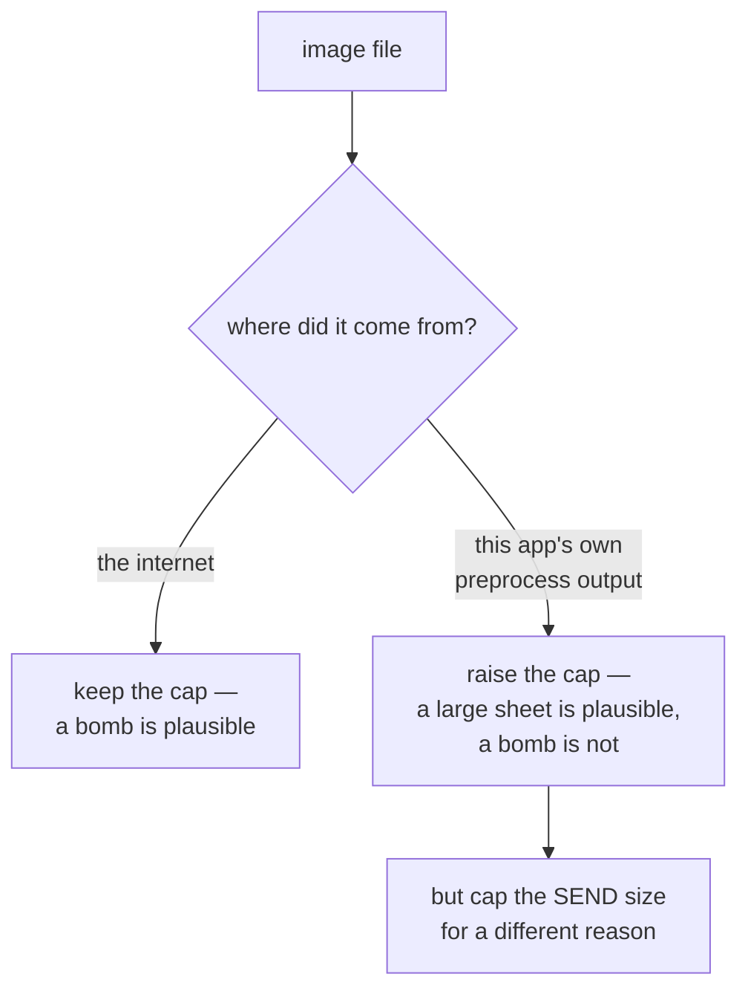

# Decompression bombs

A small file that expands to an enormous amount of memory. The defence is a
library-level cap — and this project deliberately raises that cap, which is the
interesting part.

## What it is

Compressed formats can encode a very large output in very few bytes. A 1 KB PNG
of uniform colour can decode to gigabytes of pixels. Opening it exhausts memory
and takes the process down.

Pillow ships a guard: `Image.MAX_IMAGE_PIXELS`, default about 89 million pixels.
Above it Pillow warns; at twice the limit it raises.

The guard is a **blunt instrument**. It cannot tell a malicious file from a
legitimately enormous one, and both exist. Whether it is right depends on where
the file came from — which is a question about the *deployment*, not the format.

## The picture



## Where this project uses it

Three modules raise the limit, each with the same reasoning.
`poggio_webapp/pipeline/extract_illustrator.py`:

```python
# These are locally-generated preprocessed scans (this app's own 02_preprocess
# output, often upscaled 2x+), not untrusted uploads from the internet — raise
# PIL's default decompression-bomb cap so a legitimately large sheet doesn't
# get rejected as a suspected attack.
Image.MAX_IMAGE_PIXELS = None
```

`extract_fieldwall.py` and `assign_markers.py` carry the same line.

The threat model is stated explicitly, and it is the right question to ask:

- The application runs **locally**, on the user's own machine.
- The file being opened is this application's **own preprocessing output**.
- Preprocessing deliberately [upscales](lanczos-resampling.md) up to 4×, so a
  4284 × 5712 photograph becomes 17136 × 22848 — **391 million pixels**, four
  times Pillow's default limit.

A legitimate workflow produces images past the cap. The cap would reject the
project's own intended output as an attack.

The README reinforces the deployment assumption: *"Nothing is uploaded anywhere:
your drawings, your data, and your models stay on your machine."*

### The cap that stays, for a different reason

Removing the decompression guard does not mean removing all size limits. The
same file immediately imposes one:

```python
# Preprocessing's upscale is tuned for keeping thin ink lines from vanishing
# on LOW-DPI scans — it has nothing to do with what Gemini needs to read the
# drawing, and an upscale factor picked for a scan can produce an enormous
# image on an already high-res photo (e.g. a 4284x5712 field photo at 3x+
# upscale). Sending that whole thing as base64 makes the request slow to the
# point of looking hung, with no accuracy benefit. Cap the longest side right
# before sending, independent of whatever upscale preprocessing used.
MAX_SEND_DIMENSION = 3072


def _cap_for_sending(img, max_dim=MAX_SEND_DIMENSION):
    w, h = img.size
    if max(w, h) <= max_dim:
        return img
    scale = max_dim / max(w, h)
    ...
```

Two different limits for two different reasons: **decode** as large as the
workflow needs, **send** no more than the API can usefully handle.

`detect_features.py` caps for a third reason — threshold stability:

```python
MAX_ANALYSIS_DIM = 2200
```

See [multi-scale analysis](multi-scale-analysis.md).

Three caps, three motivations, none of them confused with the others.

### And the limit that stays in place

`detect_markers.py` never raises the Pillow limit, because it works through
OpenCV rather than Pillow — a different library with different guards. It
instead refuses when the *input quality* is inadequate:

```python
if mm_px < 2:
    raise RuntimeError(
        "photo resolution too low for marker detection "
        f"({mm_px:.1f} px per paper mm) — retake closer or "
        "at higher resolution")
```

A limit on the other end of the scale, for a domain reason.

## Why this and not something else

| Alternative | How it would handle a 391-megapixel preprocessed scan | Why it lost — or won |
|---|---|---|
| **Keep the default cap** | Refuse it | Rejects the application's own intended output. A user who upscaled 4× — as the tool recommended — would be told their file looks like an attack. |
| **Raise the cap to a specific number** | `MAX_IMAGE_PIXELS = 500_000_000` | More cautious than `None`, and the number would be arbitrary and would need revisiting whenever the upscale ceiling changed. |
| **Set it to `None`** *(chosen)* | Decode anything | Correct **given the threat model**: the file is locally generated, the process is local, and the failure mode is the user's own machine running out of memory on their own file. |
| **Check dimensions before opening** | Read the header, decide | Genuinely better — it distinguishes a huge file from a small one that *expands* — and Pillow's own lazy `open` plus `.size` is how `preprocess.probe_dimensions` already reads dimensions cheaply. Would be a reasonable hardening if the deployment model ever changed. |
| **Reject anything above a size** | A hard upload limit | Would break the recommended workflow. |

The generalisable point: **a security control is only meaningful against a
threat model.** Pillow's cap defends a server accepting uploads from the
internet. This is a local single-user tool opening files it wrote itself thirty
seconds earlier. Applying the control unchanged would be cargo-culting — and the
comment says so, in those terms.

The corollary matters as much: **if the deployment model changes, this decision
changes with it.** If this were ever hosted for multiple users, `MAX_IMAGE_PIXELS
= None` would become a denial-of-service hole. That the comment names the
assumption ("not untrusted uploads from the internet") is what makes the
dependency visible to whoever makes that change.

## What it costs

Nothing at runtime — it is one assignment.

The costs:

- **The guard is gone.** A genuinely malicious image would be decoded. Accepted,
  because the attacker would have to be the user, on their own machine, against
  their own memory.
- **The assumption is load-bearing and easy to lose.** "Local only" is stated in
  the README and in three comments; it is not enforced by anything.
- **Memory failures are ugly.** A 391-megapixel RGB image is over a gigabyte
  decoded. On a small machine the failure is an `MemoryError` or an OOM kill
  rather than a clean message.
- **Three separate copies of the line**, one per module, rather than a shared
  helper. Small duplication, and it keeps each module's threat model stated
  where the risk is taken.

## Where else you meet it

- **The "zip bomb"**, the original — 42 KB expanding to petabytes through nested
  archives.
- **XML entity expansion** ("billion laughs"), which is why external entity
  processing is disabled by default in modern XML parsers.
- **Image libraries generally** — ImageMagick's resource limits exist for
  exactly this.
- **Regular expression denial of service**, the same idea in CPU time rather
  than memory — see [regular expressions](regular-expressions.md).
- **JSON and protobuf parsers**, which cap nesting depth and message size.

## Related pages

- [Input sanitisation](input-sanitisation.md) — the other upload-side defences.
- [Multi-scale analysis](multi-scale-analysis.md) — the analysis-size cap.
- [Lanczos resampling](lanczos-resampling.md) — the upscale that produces the
  large images.
- [Raster images and pixels](raster-images-and-pixels.md) — why decoded images
  are large.
- [Configuration](../reference/configuration.md) — the deployment assumptions.
