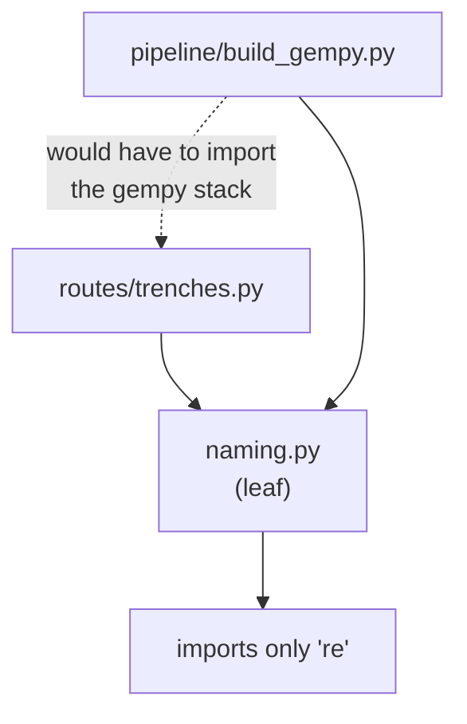

# Dependency direction and leaf modules

When two layers need the same thing, put it in a module that depends on
neither. Three modules in this repository exist for exactly that reason, and
each says so in its first paragraph.

## What it is

A **leaf module** imports nothing from the application it belongs to. It sits at
the bottom of the dependency graph, so anything may depend on it without
creating a cycle.

The problem it solves is common: two layers need a shared rule.

- Put it in the upper layer → the lower layer must import upward, inverting the
  direction.
- Put it in the lower layer → the upper layer drags in the lower layer's
  dependencies.
- **Put it in a leaf** → both depend downward, and neither pulls in the other.

The alternative that happens by default is duplication: each layer keeps its own
copy, and the copies drift.

## The picture



## Where this project uses it

### `storage.py` — the writable roots

```python
"""The single definition of where this app keeps things on disk.

A leaf module: it imports nothing from ``backend`` or ``pipeline``, so both
layers can depend on it without inverting the dependency direction.
...
"""

from pathlib import Path
```

One import, from the standard library. `backend/`, `pipeline/`, and the tests
all depend on it.

The docstring goes further, into *how* it must be used:

> Read these through the module — ``storage.JOBS_DIR``, never
> ``from storage import JOBS_DIR``. The ``from`` form binds the value at import
> time, which is what previously left four modules holding private copies that a
> test could not redirect.

See [late binding versus import-time binding](late-binding-vs-import-time-binding.md).

`backend/config.py` reinforces the same rule by *declining* to re-export:

```python
"""Web-layer configuration.

Filesystem roots live in the top-level ``storage`` module, which ``pipeline``
also depends on. Import that directly rather than re-exporting the paths here —
a re-export would rebind them and reintroduce the stale-copy problem.
"""
```

A module documenting what it deliberately does *not* contain.

### `naming.py` — the filesystem slug

```python
"""Turning user-supplied labels into safe names.

A leaf module, for the same reason ``storage`` is one: ``pipeline.build_gempy``
and ``backend.routes.trenches`` both need the filesystem slug, and
``routes/trenches.py`` previously kept its own copy specifically so that it
would not have to import the optional gempy stack to get it. Putting the rule
in a dependency-free module removes the reason for the copy.
"""
```

This one names the *specific* pressure that caused the duplication.
`build_gempy` imports GemPy, an optional heavy dependency. A route needing
`safe_filename` could not import `build_gempy` to get it without pulling GemPy
into every request. So it kept a copy — and the copies could diverge.

That is the general shape: **duplication is usually a symptom of a dependency
someone was avoiding.** Extracting the leaf removes the reason.

The module also insists on a distinction its callers must respect:

> The functions here encode genuinely different rules and are not
> interchangeable:
>
>   * ``safe_filename`` produces a name safe to use as a path component.
>   * ``clean_label`` tidies a label for display and storage; the result is not
>     path-safe and must not be used as one.
>   * ``canonical_trench`` and ``canonical_locus`` put an identifier into the
>     form the site's own data-entry standard requires, so that two spellings of
>     one trench are one trench.

Three functions that all "tidy a string", each with a different contract, kept
apart because confusing them causes real bugs — one of which is documented in
`safe_filename` as a path-traversal escape.

### `pipeline/site_vocab.py` — the site's own vocabularies

The newest leaf follows the pattern exactly:

```python
"""The site's own controlled vocabularies and identifier formats.
...
A leaf module, like ``naming`` and ``storage``: it imports nothing from this
package so that both the pipeline and the route layer can depend on it.

Why this exists at all: the application previously carried its own parallel
vocabularies -- a hand-written feature-type list in the drawing UI, and
``uuid4`` find identifiers -- which meant nothing it recorded could be matched
against the project's own records without a human translating. Identifiers are
the part of a record that has to survive leaving the machine that made it.
"""

from naming import canonical_locus, canonical_trench
```

The one import is another leaf, which keeps the graph acyclic. And the
justification is the same shape as `naming.py`'s: **parallel copies had already
appeared** — a feature list in the UI, a separate ID scheme — and the leaf
removes the reason for them.

## Why this and not something else

| Alternative | How it would share `safe_filename` | Why it lost |
|---|---|---|
| **Duplicate it** | A copy in each layer | What happened, and the copies drift. The traversal fix documented in `safe_filename` would have had to be applied twice. |
| **Put it in the upper layer** | `backend/naming.py` | `pipeline/build_gempy.py` would import from `backend`, inverting the direction and making the pipeline depend on the web layer. |
| **Put it in the lower layer** | `pipeline/naming.py` | A route wanting it would import `pipeline`, which is mostly harmless — until the module it needs is `build_gempy`, which drags in GemPy. This is the case that actually arose. |
| **Dependency injection** | Pass the function in as a parameter | Decouples fully, and threads a parameter through every call site for a pure function with no state. |
| **A leaf module** *(chosen)* | `naming.py` at the top level | Both layers depend downward, no cycle, no copies, and one place to fix a bug. |

The recognisable signal, worth naming: **when you find the same rule written
twice, ask which dependency the second copy was avoiding.** In this codebase
that question has been asked three times and produced three leaves, each with
the answer recorded in its docstring.

## What it costs

Almost nothing. Three small modules at the top level.

The costs:

- **Leaves must stay leaves.** One convenience import into `naming.py` would
  reintroduce the cycle. `site_vocab` imports `naming` — another leaf — which is
  the boundary of what is safe.
- **They can become junk drawers.** "Utilities with no dependencies" is a
  category anything can be dropped into. These stay coherent because each has a
  stated purpose: where things live, how labels are made safe, what the site's
  vocabularies are.
- **Top-level placement is a Python quirk.** `storage`, `naming`, and `app` sit
  beside the packages, which is why `pyproject.toml` configures
  `pythonpath = ["poggio_webapp", ...]` and explicit package discovery.
- **Nothing enforces it.** No tool prevents `naming.py` importing `backend`. It
  holds by review and by the docstrings that explain what would break.

## Where else you meet it

- **The stable dependencies principle**, which says depend in the direction of
  stability.
- **Dependency inversion** in SOLID, where both layers depend on an abstraction.
- **`libc`**, the ultimate leaf — everything depends on it, it depends on
  nothing.
- **Monorepo build graphs**, where a cycle is a hard error in Bazel or Nx.
- **Java's module system and Go's package rules**, both of which reject import
  cycles outright.

## Related pages

- [Layered architecture](layered-architecture.md) — the layers these serve.
- [Late binding versus import-time binding](late-binding-vs-import-time-binding.md) —
  the rule `storage.py` insists on.
- [Separation of concerns](separation-of-concerns.md) — the principle beneath.
- [Path traversal and containment](path-traversal-and-containment.md) — the bug
  `safe_filename` documents.
- [Find identifiers](../archaeology/find-identifiers.md) — what `site_vocab`
  encodes.
