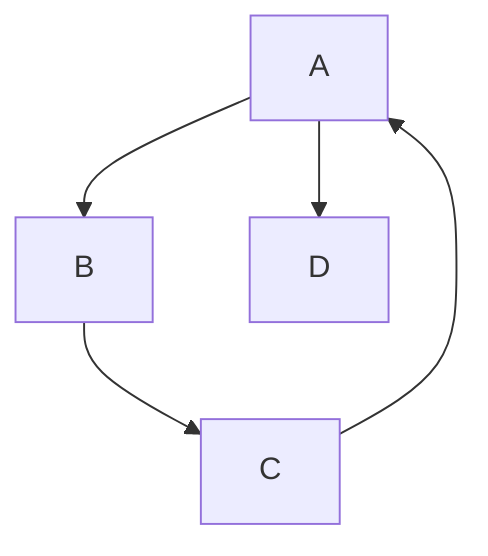

# Depth-first search

Explore as far as possible along one path before backing up. The traversal
underneath cycle detection and reachability in this project and, since a
recent fix, one that keeps its own stack rather than using Python's.

## What it is

Depth-first search visits a graph by following one edge as deep as it goes,
then backtracking to the most recent unexplored branch.

It is naturally recursive, which is how it is usually first written:

```
visit(node):
    mark node
    for each neighbour:
        if unmarked: visit(neighbour)
```

The recursion uses the **call stack** to remember where to backtrack to. That is
elegant and it is also a hidden resource limit: Python's default recursion limit
is 1000 frames, so a chain longer than that raises `RecursionError`.

The iterative form keeps an **explicit stack** instead. Same traversal, same
order, no dependence on interpreter limits.

DFS is the natural fit for questions about *paths* (is there a cycle, is one
node reachable from another) because a cycle is precisely a back-edge to a node
still on the current path.

## The picture



Three-colour DFS from A:

```
step  action                  path        state
1     enter A                 [A]         A grey
2     enter B                 [A,B]       B grey
3     enter C                 [A,B,C]     C grey
4     look at A → A is GREY   ─────────►  CYCLE: [A, B, C, A]
```

The colours:

| State | Meaning |
|---|---|
| 0 (white) | not yet visited |
| 1 (grey) | on the current path |
| 2 (black) | fully explored, off the path |

An edge to a **grey** node closes a cycle. An edge to a **black** node is
harmless: it reaches a region already finished, which in a DAG happens
constantly.

Two colours are not enough. Marking nodes merely "visited" would report a cycle
for the diamond `A→B, A→C, B→D, C→D`, where D is reached twice by two different
paths and there is no cycle at all.

## Where this project uses it

### Cycle detection, iteratively

`poggio_webapp/pipeline/harris_matrix.py`:

```python
def _find_cycle(nodes, edges):
    """The first cycle found by a three-colour depth-first search, or None.

    White (0) unvisited, grey (1) on the current path, black (2) finished. An
    edge to a grey node closes a cycle, and the path slice from that node names
    the units actually on it.

    The search keeps its own explicit stack rather than recursing. Every stored
    matrix is validated through here on load and on save, with no cap on unit
    count, so a long enough chain of relations turned a matrix that should
    merely be reported on into a RecursionError -- a 500 instead of a finding.
    Traversal order is unchanged: starts in sorted order, neighbours in the
    sorted order ``_adjacency`` already imposes.
    """
    adjacent = _adjacency(nodes, edges)
    state = {node: 0 for node in nodes}

    for start in sorted(nodes):
        if state[start] != 0:
            continue

        path = [start]
        path_indexes = {start: 0}
        state[start] = 1
        stack = [(start, 0)]

        while stack:
            node, neighbor_index = stack[-1]
            neighbors = adjacent[node]
            if neighbor_index < len(neighbors):
                stack[-1] = (node, neighbor_index + 1)
                neighbor = neighbors[neighbor_index]
                if state[neighbor] == 0:
                    state[neighbor] = 1
                    path_indexes[neighbor] = len(path)
                    path.append(neighbor)
                    stack.append((neighbor, 0))
                elif state[neighbor] == 1:
                    return path[path_indexes[neighbor] :] + [neighbor]
                continue
            stack.pop()
            path.pop()
            path_indexes.pop(node)
            state[node] = 2

    return None
```

The stack holds `(node, next_neighbour_index)` pairs. The index is what the
call stack would otherwise remember as "where the loop had got to."

`path` and `path_indexes` are maintained alongside so that when a grey node is
found, the cycle can be **named**:
`path[path_indexes[neighbor]:] + [neighbor]` slices out exactly the nodes on it.
That is what makes the error message actionable rather than just "a cycle
exists."

The docstring records why the form changed: recursion failed on deep matrices,
turning a reportable finding into a 500. The traversal order is explicitly
unchanged, which is what let the fix ship without altering any existing
behaviour.

`sorted(nodes)` for the outer loop and `sorted(edges)` inside
[`_adjacency`](adjacency-representations.md) mean the *same* cycle is reported
every time. See [determinism and stable sorting](determinism-and-stable-sorting.md).

### Reachability

The same file uses a simpler DFS for [transitive reduction](transitive-reduction.md):

```python
def _path_exists(start, target, edges, excluded_edge):
    adjacent = _adjacency(
        {node for edge in edges for node in edge},
        edges - {excluded_edge},
    )
    pending = [start]
    visited = set()

    while pending:
        node = pending.pop()
        if node == target:
            return True
        if node in visited:
            continue
        visited.add(node)
        pending.extend(reversed(adjacent.get(node, [])))
    return False
```

`pending.pop()` from the end makes it a stack, hence depth-first.
`reversed(...)` before extending preserves the neighbour order the recursive
form would have used, a small detail that keeps the traversal deterministic.

Only two colours here, and that is correct: this asks "is target reachable," not
"is there a cycle," so nodes need only be visited-or-not.

## Why this and not something else

| Alternative | How it would work | Why it lost, or won |
|---|---|---|
| **Recursive DFS** | Use the call stack | Shorter and clearer, and it fails at Python's recursion limit on a long chain, which was a real bug here. |
| **[Breadth-first search](breadth-first-search.md)** | Explore level by level with a queue | Correct for reachability, and wrong for cycle detection: BFS has no notion of "on the current path," which is exactly what the grey state encodes. |
| **Iterative deepening** | Repeated depth-limited DFS | Bounds memory at the cost of re-traversal. Solves a problem this does not have. |
| **Tarjan's strongly connected components** | Find all SCCs; any with >1 node contains a cycle | More powerful: it finds *every* cycle group at once, not just the first. It is more code, and the error message only needs one concrete cycle to be actionable. |
| **Kahn's algorithm as a cycle test** | Whatever cannot be sorted is on a cycle | Used in `merge_walls`, and it identifies the *set* of nodes involved rather than a path, so that module has a separate `_cycle_message` peeling step to isolate them. DFS gives the path directly. |
| **Iterative three-colour DFS** *(chosen)* | Explicit stack | No recursion limit, deterministic, and it returns a named path. |

## What it costs

O(V + E): every node and every edge visited once. Memory is O(V) for the state
map plus O(V) for the stack in the worst case.

The costs of the iterative form:

- More code. Roughly twice the lines of the recursive version, and the
  `(node, index)` stack entry is a construct a reader has to decode. The
  docstring exists to pay that back.
- Easy to get subtly wrong. The order of `stack[-1] = (node, index + 1)`
  before pushing the neighbour matters; getting it wrong revisits or skips
  edges.
- The `path` bookkeeping is manual. Recursion maintains it implicitly.

The benefit is that a failure mode was removed entirely rather than bounded. A
recursion limit could have been raised instead, and raising it trades one crash
for a different one at a different depth.

## Where else you meet it

- Maze solving, the canonical illustration.
- Compilers, walking abstract syntax trees.
- Garbage collectors, tracing reachable objects from roots.
- Topological sorting, in its DFS formulation, the alternative to
  [Kahn's](topological-sorting.md).
- Backtracking search: sudoku solvers, N-queens, constraint solvers.
- Filesystem traversal, which `os.walk` performs.
- `git log` ancestry queries, walking the commit DAG.

## Related pages

- [Cycle detection](cycle-detection.md): the main application here.
- [Breadth-first search](breadth-first-search.md): the alternative traversal.
- [Adjacency representations](adjacency-representations.md): what it walks.
- [Transitive reduction](transitive-reduction.md): the reachability consumer.
- [Stacks and explicit recursion](stacks-and-explicit-recursion.md): the data structure that replaced
  the call stack.
