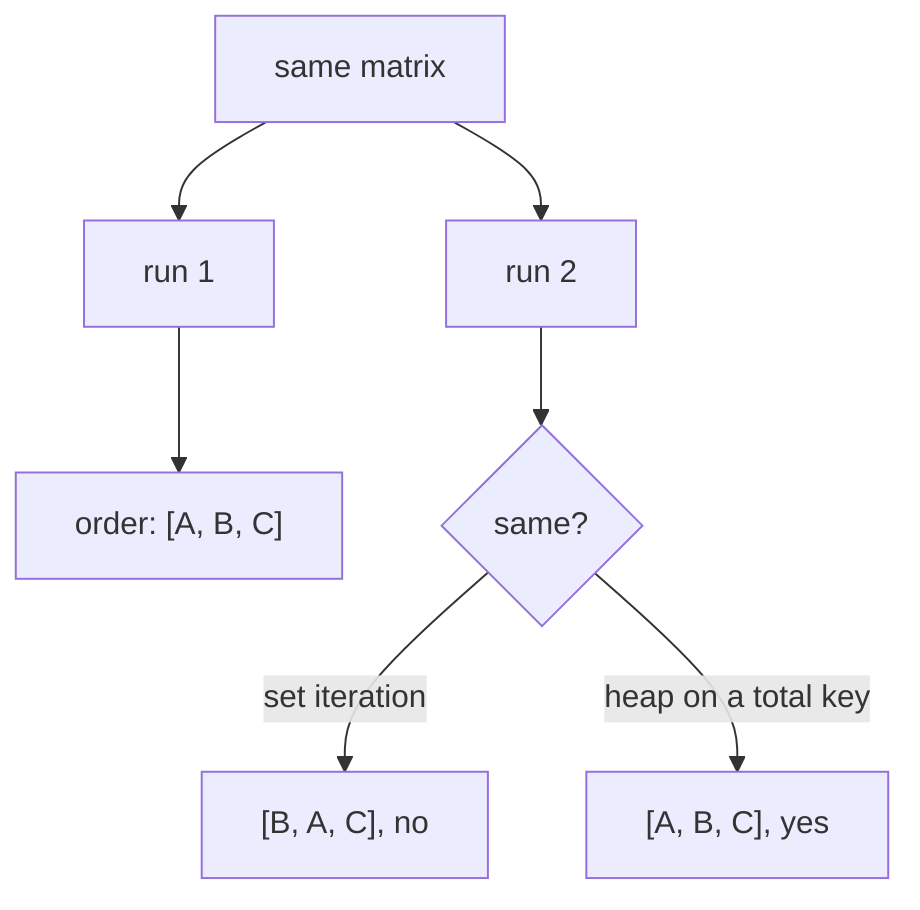

# Determinism and stable sorting

The same input produces the same output, every time, on every machine. Treated
here as a requirement rather than a nicety, because the outputs are
archaeological documents that have to be comparable across runs.

## What it is

An operation is **deterministic** when its result depends only on its inputs.
The things that break it:

- iterating a `set` or an unordered `dict`
- sorting with a key that leaves ties
- `random` without a seed, or `uuid4`
- wall-clock time
- floating-point summation in a varying order
- parallelism with unspecified completion order

A **stable** sort preserves the relative order of items that compare equal.
Python's `sorted` and `list.sort` are stable, which turns "sort by A, then by B"
into two passes rather than a composite key, and it is used deliberately in this
codebase.

Determinism matters here for three concrete reasons:

| Reason | Consequence if lost |
|---|---|
| **Diffability** | Two saves of an unchanged matrix would show spurious changes |
| **Reproducibility** | A model could not be rebuilt identically from archived inputs |
| **Testability** | Assertions would need to accept any of several valid answers |

## The picture



## Where this project uses it

### Sorting before every observable iteration

`poggio_webapp/pipeline/harris_matrix.py` sorts at nearly every loop:

```python
for correlation in sorted(matrix.correlations, key=lambda item: item.id):
for relation in sorted(matrix.relations, key=lambda item: item.id):
for start in sorted(nodes):
for unit in sorted(matrix.units, key=lambda item: item.id):
```

and inside the adjacency builder:

```python
def _adjacency(nodes, edges):
    adjacent = {node: [] for node in nodes}
    for younger, older in sorted(edges):
        adjacent[younger].append(older)
    return adjacent
```

`edges` is a `set`. Without `sorted`, neighbour order would vary between runs,
so [cycle detection](cycle-detection.md) could report a different cycle each
time on the same contradictory data.

### Total orders, so ties cannot arise

`poggio_webapp/pipeline/detect_features.py`:

```python
ordered = sorted(
    candidates,
    key=lambda candidate: (float(candidate["score"]), float(candidate["area_px"])),
    reverse=True,
)
```

Score first, **area as tie-break**. Two candidates with equal scores would
otherwise be ordered by input order, which depends on contour traversal. The
[greedy suppression](greedy-algorithms.md) that follows keeps whichever
comes first, so the tie decides the output.

`poggio_webapp/pipeline/merge_walls.py` breaks a different tie:

```python
# The trench is whichever group of walls is largest; ties go to the
# group holding the earliest face, so the answer is deterministic.
order = {name: i for i, name in enumerate(endpoints)}
trench = max(components, key=lambda g: (len(g), -min(order[n] for n in g)))
```

and `poggio_webapp/pipeline/true_dip.py` documents its own:

```python
def _best_pair(faces, bearings, threshold):
    """The two faces whose bearings are furthest from parallel, or None.

    Pairs are scored by |sin(difference)|: 1 for perpendicular walls, 0 for
    parallel ones. Ties keep the earlier pair in face order, so the result does
    not depend on dict iteration luck.
    """
```

"Does not depend on dict iteration luck" is the phrase that recurs, in different
words, across four modules.

### A heap instead of an unordered ready set

`poggio_webapp/pipeline/merge_walls.py`:

```python
# Kahn's algorithm. The ready set is a heap of first-seen positions, so
# whenever several surfaces are simultaneously available the earliest-seen
# one wins and the output is stable.
```

[Topological sort](topological-sorting.md) has a genuine free choice at each
step. The [heap](heaps-and-priority-queues.md) does not make one *more correct*;
it makes the same one get chosen every run.

### Stable sort, used as such

`poggio_webapp/pipeline/build_gempy.py`:

```python
x_span = group["X"].max() - group["X"].min()
y_span = group["Y"].max() - group["Y"].min()
ordered = group.sort_values("X" if x_span > y_span else "Y", kind="stable")
```

`kind="stable"` is explicit, because pandas' default is quicksort, which is *not*
stable. The docstring explains what stability buys:

> The points are ordered along the wall rather than by X and then Y: a wall
> running north-south has one X for every point, so sorting by X first would
> leave the group in whatever order the file happened to carry.

### Determinism as a CI gate

The repository does not merely aspire to this. From
`.github/workflows`:

```yaml
- name: Confirm generated diagrams are up to date
  # The diagrams are generated, so a hand-edited SVG or a stale commit
  # would otherwise ship silently.
  run: |
    python tools/docs/generate_diagrams.py .
    if ! git diff --quiet -- docs/assets/diagrams; then
      echo "::error::Generated diagrams differ from the committed files."
```

Regenerate, and fail on any difference. A non-deterministic generator would
break the build, which is exactly how a determinism requirement should be
enforced.

## Why this and not something else

| Alternative | How it would resolve a tie | Why it lost |
|---|---|---|
| **Leave ties to the container** | Whatever `set` or `dict` yields | The default, and it makes output depend on hash seeds and insertion history. Python randomises string hashing between processes by default, so this can differ *between runs on one machine*. |
| **Sort only the final output** | Order the result, not the intermediates | Insufficient: [greedy](greedy-algorithms.md) algorithms commit based on the order they *see*, so a different intermediate order gives a different set of survivors, not merely a different arrangement. |
| **Seed the randomness** | `random.seed(0)` | Works where randomness is deliberate. Nothing here uses randomness in a computation, which is itself why [RANSAC](median-and-robust-statistics.md) was passed over for the median. |
| **Accept non-determinism, test loosely** | Assert any valid answer | Weakens every test, and makes two saves of an unchanged document produce a spurious diff. |
| **Total orders everywhere** *(chosen)* | Explicit tie-breaks and sorted iteration | Costs a `sorted()` per loop, and makes the output a function of the input alone. |

The deciding argument is archival. A Harris Matrix SVG and a `points.csv` are
**documents**. If regenerating them from unchanged inputs produces different
bytes, then version control cannot show what actually changed, and a reader
cannot tell an edit from noise.

## What it costs

`sorted()` is O(n log n) where iteration is O(n). At the scale here (hundreds of
units, hundreds of candidates), unmeasurable.

The costs:

- Discipline. Every observable iteration needs it, and missing one produces a
  bug that appears intermittently and cannot be reproduced on demand.
- A tie-break has to be chosen, and the choice can be misleading if made
  carelessly. `merge_walls` uses first-seen document position rather than
  alphabetical order precisely because `Locus 10` sorts before `Locus 2`.
- It does not extend to floating point. Summing the same numbers in a
  different order can give a different last bit. Nothing here parallelises a
  reduction, so it does not arise.
- Determinism is not correctness. A consistently wrong answer is still
  wrong. It makes wrongness *reproducible*, which is what allows it to be found.

## Where else you meet it

- Reproducible builds, where the same source must produce byte-identical
  binaries.
- `git`, whose object hashes require deterministic serialisation.
- Compilers, where non-deterministic output breaks build caches.
- Scientific computing, where a published result must be reproducible from
  the same inputs.
- Machine learning, where seeded runs are the difference between a
  reproducible experiment and an anecdote.

## Related pages

- [Heaps and priority queues](heaps-and-priority-queues.md): the deterministic
  ready set.
- [Sets and membership](sets-and-membership.md): the container whose order is
  unspecified.
- [Greedy algorithms](greedy-algorithms.md): why intermediate order matters.
- [Union-Find](union-find.md): where determinism was chosen over an asymptotic
  optimisation.
- [Layered graph drawing](layered-graph-drawing.md): determinism over layout
  quality.
