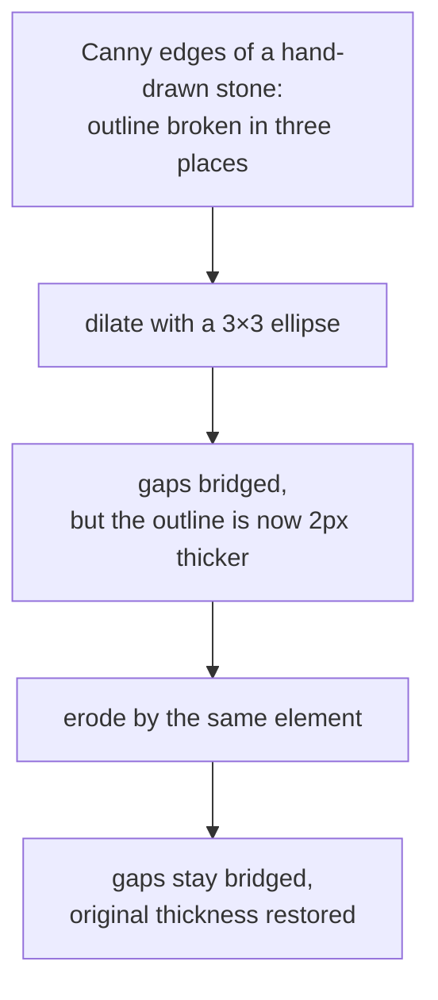

# Dilation

Growing the foreground of a binary image by adding every pixel the probe shape
can reach. The dual of [erosion](erosion.md), and the half of
[closing](morphological-closing.md) that bridges gaps.

## What it is

Slide a [structuring element](structuring-elements.md) over the image. A pixel
becomes foreground if the element, centred there, **touches the foreground
anywhere**.

The consequences are erosion's, mirrored:

- Objects grow by roughly the element's radius on every side.
- Gaps narrower than the element close.
- Small holes fill in.
- Objects closer together than the element merge.
- Isolated specks grow rather than vanish.

In grayscale, dilation is the local maximum over the element's footprint.

Erosion and dilation are formal duals: dilating the foreground is exactly
eroding the background. That relationship is why they are always described
together and almost always used in pairs.

## The picture

A 3×3 element on a hand-drawn outline with a 2-pixel gap:

```
before:   ████████..████████        ← a stone outline, broken
                  ↑↑
                gap the pen skipped

after:    ██████████████████        ← bridged; now a closed contour
```



That pairing, dilate then erode, is
[closing](morphological-closing.md), and it is the form this project uses.
Dilation alone would bridge the gaps *and* fatten every outline, inflating the
[area](contour-area-and-perimeter.md) that the candidate filter measures.

## Where this project uses it

Twice, and never alone. Both uses are inside a compound operation.

### Restoring size after erosion: inside `MORPH_OPEN`

`poggio_webapp/pipeline/detect_markers.py`:

```python
opened = cv2.morphologyEx(
    ink,
    cv2.MORPH_OPEN,
    cv2.getStructuringElement(cv2.MORPH_ELLIPSE, (k, k)),
)
```

[Erosion](erosion.md) removes the boundary lines and leaves every surviving dot
k pixels smaller. The dilation puts that size back. It matters because the very
next filter is a size band expressed in paper millimetres:

```python
min_d = min_marker_paper_mm * mm_px
max_d = max_marker_paper_mm * mm_px
...
if (min_d <= diameter <= max_d and circularity >= min_circularity ...):
```

A systematically shrunken dot would fail its own size test. Dilation is what
makes the measurement afterwards mean what it says.

### Bridging pen gaps: inside `MORPH_CLOSE`

`poggio_webapp/pipeline/detect_features.py`:

```python
# Canny identifies ink boundaries while avoiding most paper-background
# variation. Closing repairs small gaps in hand-drawn feature outlines.
closing_kernel = cv2.getStructuringElement(cv2.MORPH_ELLIPSE, (3, 3))

edges = cv2.morphologyEx(edges, cv2.MORPH_CLOSE, closing_kernel, iterations=1)
```

The comment states the purpose exactly. A stone drawn by hand has an outline
the pen did not quite close, and [Canny](canny-edge-detection.md) faithfully
reports the break. [Contour tracing](contour-tracing.md) then sees an open
squiggle rather than a closed shape, and every shape measure the filter uses
([area](contour-area-and-perimeter.md), [solidity](solidity.md),
[extent](extent-and-fill-ratio.md)) is meaningless on an open curve.

Dilation closes the gap; the paired erosion prevents the outline from being
permanently fattened.

`iterations=1` is deliberate restraint: one pass bridges a 2–3 pixel gap, which
is a pen skip. Repeating it would start merging genuinely separate features
into one candidate.

## Why this and not something else

For gap repair specifically:

| Alternative | How it would work here | Why it lost |
|---|---|---|
| **Dilation alone** | Grow everything until the gaps close | Bridges the gaps and leaves every outline permanently thicker. The candidate filter measures area, [aspect ratio](aspect-ratio.md), and [extent](extent-and-fill-ratio.md); a uniformly inflated shape distorts all three, and small features are affected proportionally more than large ones. |
| **[Closing](morphological-closing.md)** *(chosen)* | Dilate, then erode by the same element | Gaps stay bridged, thickness is restored. |
| **Lower the [Canny](canny-edge-detection.md) thresholds** | Detect weaker edges so fewer breaks occur | Fixes the cause rather than the symptom, and it admits paper texture and graph-paper ruling as edges. The thresholds are already derived from the image median for exactly this balance. |
| **Edge linking / contour following** | Detect open endpoints and join nearby pairs | More surgical: it only joins where an edge genuinely stops, instead of thickening everywhere. It also needs endpoint detection, a proximity rule, and a direction rule, all with their own parameters, to fix a 2-pixel gap. |
| **Active contours (snakes)** | Fit a deformable closed curve to each blob | Handles far worse gaps, and needs initialisation per object plus iterative optimisation: heavy machinery for a pen skip. |
| **Ask for better drawings** | Require closed outlines | The archive already exists. |

The recurring judgement: a 3×3 kernel is a **blunt** instrument, and bluntness
is acceptable here because a human reviews and labels every feature candidate
afterwards. In `detect_markers.py`, where output feeds coordinates rather than a
review list, the kernel is instead sized from the physical scale of the paper.

## What it costs

O(n·k²) for a k×k element, one pass. At 3×3 it is among the cheapest operations
in either detector.

The correctness cost is merging: any two objects closer together than k become
one. Here that means two stones drawn nearly touching may be proposed as a
single feature, which a reviewer can see and split, because
`detect_features.run_detect` returns proposals rather than conclusions:

> This detector intentionally does not claim that every closed contour is a
> stone. It proposes compact, closed shapes … A person approves, rejects, and
> labels each proposal before extraction.

## Where else you meet it

- Photoshop's "Maximum" filter, and expanding a selection by N pixels.
- Text region detection, where dilating characters merges them into word and
  line blobs.
- Map generalisation, thickening thin features so they stay visible when a
  map is zoomed out.
- Collision detection, where the Minkowski sum used to inflate obstacles is
  literally dilation.
- Font rendering, where emboldening is grayscale dilation.

## Related pages

- [Erosion](erosion.md): the dual operation.
- [Morphological closing](morphological-closing.md): dilate then erode, the
  feature detector's use.
- [Morphological opening](morphological-opening.md): erode then dilate, the
  marker detector's use.
- [Structuring elements](structuring-elements.md): the probe and its sizing.
- [Canny edge detection](canny-edge-detection.md): the step that produces the
  broken outlines.
