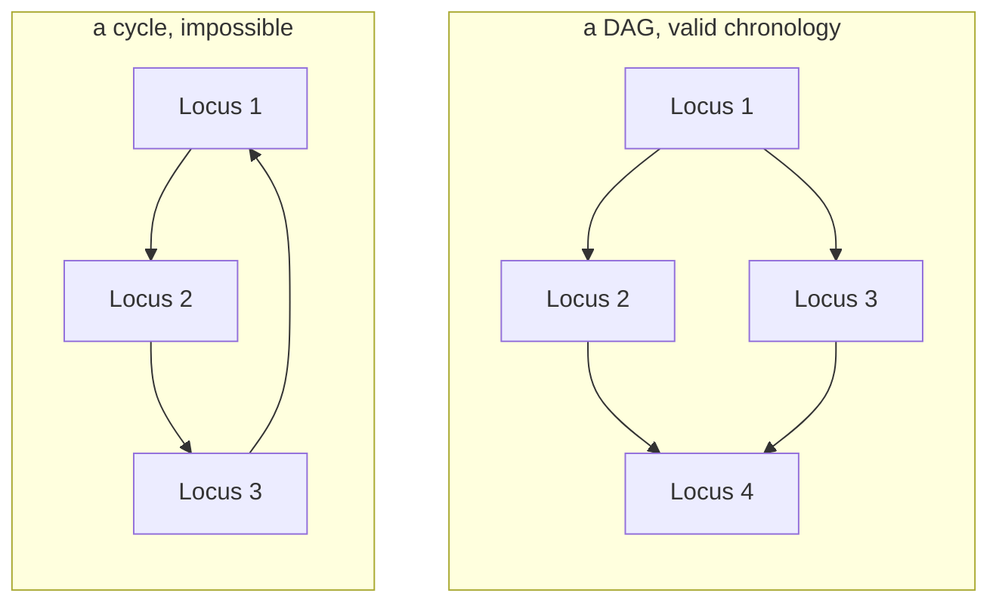

# Directed acyclic graphs

A directed graph with no cycles. The structure a valid chronology must have,
and the constraint that turns "these walls disagree" from a vague worry into a
detectable, reportable error.

## What it is

A **DAG** is a directed graph containing no path that returns to its starting
node. Three properties follow, and all three are used here.

**It defines a partial order.** `A → B` means A comes before B, and the relation
is transitive and antisymmetric. Some pairs are simply unrelated, which is
exactly what excavation evidence gives you.

**It can be [topologically sorted](topological-sorting.md).** A sequence exists
in which every node appears before all its successors. Acyclicity is not merely
sufficient, it is *necessary*: a cycle makes no such sequence possible.

**It has a unique [transitive reduction](transitive-reduction.md).** The minimal
edge set with the same reachability is unique for a DAG, which is what makes a
Harris Matrix diagram well defined rather than a matter of taste.

For archaeology the acyclicity requirement has a physical meaning: a cycle would
say a deposit is both younger and older than another. That cannot happen. A
cycle in the data is therefore always an error: a mis-recorded relationship, or
a correlation asserting that two units are the same when the stratigraphy says
otherwise.

## The picture



The cycle says Locus 1 is younger than Locus 2, which is younger than Locus 3,
which is younger than Locus 1. No sequence satisfies all three.

## Where this project uses it

### Validating a Harris Matrix

`poggio_webapp/pipeline/harris_matrix.py` treats acyclicity as the gate on
everything else:

```python
nodes, relation_ids_by_edge = _collapsed_graph(matrix, components)
edges = set(relation_ids_by_edge)
cycle = _find_cycle(nodes, edges)
if cycle is not None:
    errors.append(
        _issue(
            "cycle",
            f"Chronological cycle detected: {' -> '.join(cycle)}.",
            cycle,
            _cycle_relation_ids(cycle, relation_ids_by_edge),
        )
    )
    order = []
    display_edges = []
else:
    order = _topological_sort(nodes, edges)
    reduced_edges = _transitive_reduction_edges(edges)
    display_edges = sorted(reduced_edges)
```

The `else` is the point: order and display edges are computed **only** when the
graph is acyclic, because neither is defined otherwise. A cyclic matrix produces
an error and two empty lists rather than a partial answer.

The error names the offending relation IDs, not just the units, so a user can
go and fix the specific assertion.

Acyclicity is checked on every load and every save:

```python
def _validate_candidate(candidate) -> HarrisMatrix:
    try:
        matrix = HarrisMatrix.model_validate(candidate)
    except ValidationError as error:
        raise InvalidMatrixError("Matrix schema is invalid.") from error

    report = validate_matrix_graph(matrix)
    if not report["ok"]:
        ...
        raise InvalidMatrixError(...)
    return matrix
```

An invalid graph cannot be persisted. See
[validation at trust boundaries](validation-at-trust-boundaries.md).

The same check gates accepting a suggestion, in
`poggio_webapp/pipeline/harris_suggestions.py`:

```python
suggestion.status = "accepted"

report = validate_matrix_graph(reviewed)
if not report["ok"]:
    raise _acceptance_error(suggestion, report)
return reviewed
```

Apply the change to a **copy**, revalidate, and reject the whole operation if it
would introduce a cycle. That is a transaction, and it means no accepted
suggestion can corrupt the matrix. See
[immutability and defensive copying](immutability-and-defensive-copying.md).

### Ordering layers across several walls

`poggio_webapp/pipeline/merge_walls.py` builds a DAG of surface-order
constraints and refuses on a cycle:

```python
if len(order) < len(order_index):
    raise ValueError(_cycle_message(order, order_index, successors, faces_by_surface))
```

`_cycle_message` then does something careful. It isolates the surfaces actually
*on* the cycle rather than everything downstream of it:

```python
def _cycle_message(order, order_index, successors, faces_by_surface):
    """Name the surfaces actually on a cycle, not everything downstream of it.
    Repeatedly drop unsorted surfaces with no remaining predecessor or no
    remaining successor; what survives is on a cycle."""
```

and names which wall each is on:

```python
return (
    "the walls contradict each other: these surfaces form a "
    "stratigraphic cycle and cannot be ordered young to old -- "
    + listed
    + ". Check the layer order on those walls, or correlate the loci "
    "explicitly; no order is guessed."
)
```

The message tells the operator *what* contradicts, *where*, and *what to do*.
It states plainly that nothing was guessed.

## Why this and not something else

| Alternative | How it would handle a contradiction | Why it lost |
|---|---|---|
| **Allow cycles, break them arbitrarily** | Drop one edge and carry on | Silently discards an archaeologist's recorded observation and invents an order. The worst outcome: a confident model built on a contradiction nobody was told about. |
| **Allow cycles, warn** | Report and continue with a best-effort order | Better, and there is no defensible best effort: every choice of which edge to drop is a different chronology. |
| **Require a total order up front** | Make the user rank everything | Forces relationships the evidence does not support. |
| **Require acyclicity, refuse otherwise** *(chosen)* | Error naming the cycle and the relations on it | The contradiction is real and the person who recorded it is the one who can resolve it. |

The two modules answer identically, in different words. `merge_walls`: *"Guessing
an order there would invent stratigraphy, so it refuses."* `harris_matrix`:
error, empty order, empty display edges.

That consistency is a design position, not a coincidence. See
[fail-closed design](fail-closed-design.md) and
[codebase review](../architecture/code-review.md).

## What it costs

Checking acyclicity is one [depth-first search](depth-first-search.md), O(V + E).
It runs on every load, every save, and every suggestion acceptance. It is cheap
enough that it never needs to be skipped.

The costs are all borne by the user, and deliberately:

- A cyclic matrix cannot be saved. Work in progress that has become
  contradictory is rejected rather than stored. Harsh, and the alternative is a
  store that can hold invalid states.
- A cyclic merge cannot be built. The operator must fix the layer order or
  supply an explicit correlation.
- Detection does not say which edge is wrong. It names every relation on the
  cycle; deciding which one is the mistake requires the excavation record.

The last is inherent. Three mutually contradictory statements contain at least
one error, and nothing in the data says which.

## Where else you meet it

- Build systems. Make, Bazel, and every package manager reject dependency
  cycles for the same reason.
- Spreadsheets, where a circular reference is exactly this error.
- Git, whose commit history is a DAG: a cycle would mean a commit was its
  own ancestor.
- Task scheduling and project planning, where PERT and critical-path
  analysis run on a DAG.
- Blockchains, and DAG-based ledgers.
- Neural network computation graphs, where a cycle would make
  backpropagation undefined.

## Related pages

- [Graphs and terminology](graphs-and-terminology.md): the vocabulary.
- [Cycle detection](cycle-detection.md): how the check is performed.
- [Topological sorting](topological-sorting.md): what acyclicity enables.
- [Transitive reduction](transitive-reduction.md): the unique minimal edge set.
- [Harris Matrix](../archaeology/index.md): the archaeological structure.
