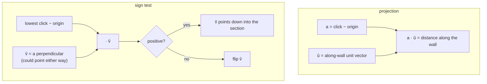

# Dot product

Multiply two vectors componentwise and add. One number that answers "how much
does this go that way?" — and, by its sign alone, "which side is this on?"

## What it is

```
a · b = aₓbₓ + a_yb_y  (+ a_zb_z)
```

Equivalently `a · b = ‖a‖‖b‖cos θ`, which is where the meaning comes from.

Two readings, both used in this repository:

**As a projection.** If `b` is a [unit vector](unit-vectors-and-normalisation.md),
then `a · b` is exactly how far `a` extends along `b`, in `a`'s own units. That
is the whole of coordinate conversion.

**As a sign test.** The cosine is positive for angles under 90°, negative above.
So the *sign* alone answers "is this point on the same side as that one?" — with
no trigonometry, no square roots, and no angle wrapping.

| `a · b` | Meaning |
|---|---|
| `> 0` | roughly the same direction |
| `= 0` | perpendicular |
| `< 0` | roughly opposite |

## The picture



## Where this project uses it

### Projection — converting a click into metres

`poggio_webapp/pipeline/manual_extraction.py`:

```python
def convert(self, point):
    px, py = float(point[0]), float(point[1])
    dx, dy = px - self.origin_x, py - self.origin_y
    x_m = (dx * self.ux + dy * self.uy) / self.px_per_m
    depth_m = (dx * self.vx + dy * self.vy) / self.px_per_m
    return round(x_m, 4), round(depth_m, 4)
```

`dx * self.ux + dy * self.uy` is a dot product written out. Because `û` is a
unit vector, it gives the distance along the wall in pixels; the division
converts to metres.

Two dot products against two perpendicular unit vectors give both coordinates —
that is a [change of basis](orthonormal-bases.md), and it is why a tilted
photograph needs no rotation of the image at all.

### Sign test — deciding which perpendicular is "down"

The same file, three lines earlier:

```python
ux, uy = dx / pixel_span, dy / pixel_span
# One of the two perpendiculars points toward the user's lowest click.
vx, vy = -uy, ux
toward_lowest = (lx - ox) * vx + (ly - oy) * vy
if toward_lowest < 0:
    vx, vy = -vx, -vy
```

Rotating `û` by 90° gives *a* perpendicular, but there are two and the code
cannot know which is downward — the drawing may be photographed either way up.
The user's third click resolves it, and one dot product's sign is the entire
mechanism.

`poggio_webapp/pipeline/detect_markers.py` does the identical thing:

```python
# Ensure that the selected lowest point is in the positive-depth direction.
lowest_dx = lowest_x - origin_x
lowest_dy = lowest_y - origin_y

if lowest_dx * downward_x + lowest_dy * downward_y < 0:
    downward_x = -downward_x
    downward_y = -downward_y
```

And so does the browser, in
`poggio_webapp/static/visualizer/coordinates.mjs`:

```javascript
if ((lowestX * v.x) + (lowestY * v.y) < 0) {
  v = { x: -v.x, y: -v.y };
}
```

Three implementations, one idea, kept in step by tests.

### Projection onto a wall's bearing

`poggio_webapp/pipeline/true_dip.py` needs an along-wall coordinate for points
that are already in site coordinates:

```python
angle = math.radians(bearings[face])
s = (x * math.sin(angle)) + (y * math.cos(angle))
```

That is a dot product of the site position with the wall's direction vector
`(sin θ, cos θ)`. The docstring is careful about what it is and is not:

> s is the projection of the site position onto the wall's own direction, which
> differs from `convert()`'s local x by a constant offset -- harmless, because
> only the slope against s is ever used.

Knowing that an unknown constant offset is harmless *because of what the value
feeds* is the kind of reasoning that prevents a later "fix" from breaking it.

## Why this and not something else

For the perpendicular-direction decision:

| Alternative | How it would work here | Why it lost |
|---|---|---|
| **Compare angles** | `atan2` both vectors, compare | Two inverse trig calls, plus wraparound handling at ±180°, to learn one bit. |
| **Compare y coordinates** | "Down is larger y in image space" | True only for an un-rotated image. The whole point of the calibration is to work on a tilted photograph. |
| **[Cross product](cross-product.md) sign** | The 2D cross gives left-versus-right | Answers a different question — which *side* of the line, not which *direction along* the perpendicular. Both are one multiply-add; each answers its own question. |
| **Ask the user which way is down** | An extra control | The third click already supplies it, and clicking the lowest point of the wall is a natural thing to do while calibrating. |
| **Dot-product sign** *(chosen)* | Two multiplies, one add, one comparison | No trigonometry, no wrapping, no special cases, and it works at any orientation. |

For the projection there is really no competitor — a dot product against an
orthonormal basis *is* the coordinate transform. The only alternative is to
write it as a matrix multiplication, which is the same arithmetic with more
machinery. See [affine transforms](affine-transforms.md).

## What it costs

Two multiplies and one add in 2D. Nothing.

The subtlety is that the **projection reading requires a unit vector.** If `b`
is not normalised, `a · b` is scaled by `‖b‖` and the result is wrong by that
factor — silently, and by a plausible-looking amount. Every projection in this
codebase is preceded by an explicit normalisation, which is why
[unit vectors](unit-vectors-and-normalisation.md) has its own page.

The **sign reading** needs no such care: only the sign is used, and scaling by a
positive length cannot change it.

## Where else you meet it

- **Lighting in 3D graphics.** Lambert's cosine law is `normal · light`, and it
  is computed billions of times a second.
- **Cosine similarity** in search and recommendation: normalise both vectors,
  and the dot product is the cosine of the angle between them.
- **Neural networks**, where every layer is a matrix of dot products.
- **Physics.** Work is `force · displacement` — the projection reading exactly.
- **Half-space tests** in collision detection and clipping, using the sign
  reading.
- **Signal processing**, where correlation is a sliding dot product.

## Related pages

- [Vector projection](vector-projection.md) — the projection reading in full.
- [Unit vectors and normalisation](unit-vectors-and-normalisation.md) — the
  precondition.
- [Cross product](cross-product.md) — the other vector product, and what it
  answers instead.
- [Orthonormal bases](orthonormal-bases.md) — two dot products as a change of
  basis.
- [Signed area and the orientation test](signed-area-and-orientation-test.md) —
  the 2D cross product, used for a different sign question.
