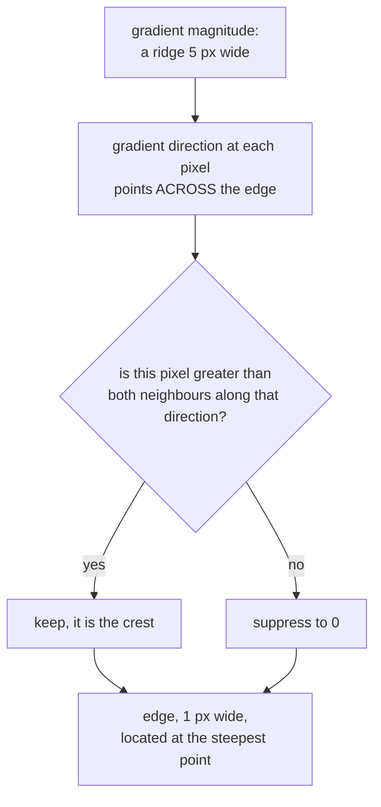

# Edge thinning (non-maximum suppression)

Reducing a fat ridge of gradient response to a single-pixel line, by keeping
only the pixels that are a local maximum in the direction the gradient points.
Stage three of [Canny](canny-edge-detection.md).

## What it is

A [Sobel](image-gradients-and-sobel.md) gradient does not produce a thin edge.
It produces a **ridge**: a band of high response several pixels wide, because
the brightness transition itself spans several pixels. Thresholding that ridge
gives a fat edge.

Non-maximum suppression fixes it with one rule:

> Keep this pixel only if its gradient magnitude is greater than the magnitudes
> of its two neighbours **along the gradient direction**.

The gradient points across the edge, so the two neighbours are on either side of
the edge. The pixel at the ridge's crest wins; its flanks are suppressed. What
survives is one pixel wide, positioned at the steepest point of the transition,
which is the best available estimate of where the edge actually is.

The direction is quantised to the eight compass neighbours (or interpolated
between them, in better implementations), because a pixel grid has only eight
neighbours to compare against.

## The picture

One row crossing a boundary stroke, showing gradient magnitude:

```
position       1    2    3    4    5    6    7
magnitude      3   42   96  125   94   38    2
                              ↑
                        the crest

after NMS      0    0    0  125    0    0    0
```



The comparison is **along the gradient**, not along the edge. Pixels
running *parallel* to the edge are all crests, so the line survives as a line.
Comparing in a fixed direction, or against all eight neighbours, would break it
into dots.

## Where this project uses it

Inside both `cv2.Canny` calls. It is not separately exposed, and the quality of
what comes after depends on it.

`poggio_webapp/pipeline/preprocess.py`:

```python
edges = cv2.Canny(gray, 50, 150)
lines = cv2.HoughLines(edges, 1, np.pi / 180, threshold=200)
```

The [Hough transform](hough-line-transform.md) is a voting scheme: every edge
pixel votes for every line passing through it. A three-pixel-wide edge casts
three times the votes and spreads them across three nearly-identical lines, so
the accumulator peak blurs and the estimated angle degrades. Thinning
concentrates the vote, which is what lets a `threshold=200` vote count mean
something consistent.

`poggio_webapp/pipeline/detect_features.py`:

```python
edges = cv2.Canny(gray, lower_threshold, upper_threshold)
...
contours, _ = cv2.findContours(edges, cv2.RETR_LIST, cv2.CHAIN_APPROX_SIMPLE)
...
perimeter = float(cv2.arcLength(contour, True))
circularity = 4.0 * math.pi * area / (perimeter * perimeter)
```

Here thinning matters even more directly. [Contour tracing](contour-tracing.md)
walks the *outside* of a foreground region, so a fat edge produces a contour
that traces around a thick band: its [perimeter](contour-area-and-perimeter.md)
roughly doubles and its enclosed [area](contour-area-and-perimeter.md) shrinks.
Since [circularity](circularity.md) is `4πA/P²`, doubling P divides circularity
by four. Every shape threshold in the filter would need retuning, and would
become dependent on edge thickness rather than on shape.

## Why this and not something else

| Alternative | How it would work here | Why it lost |
|---|---|---|
| **No thinning** | Threshold the gradient magnitude directly | Fat edges. Every shape descriptor becomes a function of edge thickness rather than of the object, and Hough peaks smear. |
| **[Morphological thinning](erosion.md) / skeletonisation** | Erode iteratively until one pixel wide, preserving connectivity | Produces a proper skeleton with guaranteed connectivity, genuinely better on that axis. It is iterative and slower, it is applied *after* binarisation so it inherits the threshold's errors, and it ignores the gradient direction, so the surviving line is the geometric middle of the fat edge rather than the point of steepest change. NMS is more accurately *located*. |
| **Zero-crossings of the Laplacian** | Second derivative, find sign changes | Naturally one pixel wide and naturally closed (attractive here), and far more noise-sensitive, producing spurious loops wherever the second derivative wanders near zero in a flat region. |
| **Sub-pixel edge localisation** | Fit a parabola to the three magnitudes and interpolate the peak | More precise than a whole pixel, and the consumers here work on integer pixel grids: Hough accumulators and contour tracing both quantise anyway, so the extra precision is discarded immediately. |
| **NMS along the gradient** *(what Canny does)* | One comparison per pixel against two neighbours | Cheap, single-pass, direction-aware, and it places the edge at the steepest point rather than at the middle of a band. |

Note the name collision worth keeping straight. This page's NMS operates on
**pixels along a gradient direction**. The
[non-maximum suppression](non-maximum-suppression.md) used in
`detect_markers.py` and `detect_features.py` operates on **whole candidate
objects** ranked by score. Same principle (keep the local winner, discard its
neighbours) applied at two completely different scales.

## What it costs

O(n), one pass, two comparisons per pixel. Trivial next to the blur and the
Sobel passes that precede it.

Its known limitation is quantisation: with directions snapped to eight
neighbours, an edge at 22.5° is compared against neighbours up to 22.5° off its
true perpendicular, which can suppress a pixel that should survive. That is one
source of the small gaps in Canny output, and it is part of why
[morphological closing](morphological-closing.md) follows in
`detect_features.py`.

## Where else you meet it

- Every Canny implementation, in every library.
- Corner and keypoint detection: SIFT, Harris, and FAST all keep only local
  maxima of their response functions.
- Peak-finding in signals, from spectroscopy to heart-rate monitors.
- Audio onset detection, thinning a broad energy rise to a single moment.
- Object detection, at the box level rather than the pixel level. See
  [non-maximum suppression](non-maximum-suppression.md).

## Related pages

- [Canny edge detection](canny-edge-detection.md): the algorithm this is stage
  three of.
- [Image gradients and Sobel](image-gradients-and-sobel.md): supplies the
  direction this compares along.
- [Hysteresis thresholding](hysteresis-thresholding.md): stages four and five.
- [Non-maximum suppression](non-maximum-suppression.md): the same principle on
  whole objects.
- [Contour tracing](contour-tracing.md): why edge thickness would corrupt every
  shape measure.
