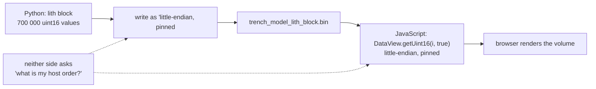

# Endianness

Which end of a multi-byte number goes first. Irrelevant inside one process, and
decisive the moment a number is written to a file that another program will
read.

## What it is

A 16-bit value needs two bytes, and there are two orders to write them in:

```
value 0x1234 (4660 decimal)

little-endian:  34 12      least significant byte first  — x86, ARM, RISC-V
big-endian:     12 34      most significant byte first   — network protocols
```

Within a running program this never matters: the CPU reads what it wrote. It
matters at every boundary where bytes leave one process and enter another — a
file, a socket, a shared buffer.

Get it wrong and the failure is spectacular but not obviously a byte-order
problem: `0x1234` read backwards is `0x3412`, or 13330. Every value is wrong, in
a way that looks like corrupt data.

The remedy is to **pin the order explicitly** at both the writer and the reader,
rather than letting either default to the host's.

## The picture



## Where this project uses it

### Writing, in Python

`poggio_webapp/pipeline/build_gempy.py`:

```python
# `<u2` is pinned rather than left as the platform's native uint16: the
# browser decodes this file with DataView.getUint16(i, true), so the file
# has to be little-endian on every machine that writes one.
encoded = np.asarray(values.reshape(shape, order="C"), dtype="<u2").ravel(order="C")
with open(output_path, "wb") as binary_file:
    binary_file.write(encoded.tobytes(order="C"))
```

`"<u2"` is NumPy's dtype string: `<` little-endian, `u` unsigned, `2` bytes. The
alternative `"=u2"` or plain `np.uint16` would use the host's order — correct on
every machine anyone is likely to use, and a latent bug rather than a
guarantee.

The manifest states the format explicitly so the reader is not guessing:

```python
manifest["volume"] = {
    "schema_version": 1,
    "format": "raw",
    "dtype": "uint16-le",
    "layout": "C",
    "axes": ["x", "y", "z"],
    "shape": [int(value) for value in resolution],
    "path": relative_path(volume_path),
    ...
}
```

Four properties that would otherwise be assumptions: byte order, memory layout,
axis meaning, and dimensions. See
[binary serialisation](binary-serialisation.md).

### Reading, in JavaScript

`poggio_webapp/static/visualizer/volume3d-core.mjs`:

```javascript
/**
 * Decode a raw little-endian uint16 payload without relying on host byte order.
 */
export function decodeUint16LE(arrayBuffer, expectedCount) {
    ...
    const view = new DataView(arrayBuffer);
    const values = new Uint16Array(expectedCount);
    for (let index = 0; index < expectedCount; index += 1) {
        values[index] = view.getUint16(index * 2, true);
    }
    return values;
}
```

The `true` is the whole point: `DataView.getUint16(offset, littleEndian)`.

The tempting one-liner would be `new Uint16Array(arrayBuffer)` — and a typed
array **uses the host's byte order**. On every mainstream device that is
little-endian and the shortcut works; on a big-endian host the volume would
render as noise. `DataView` is the only JavaScript API that lets byte order be
stated rather than inherited, which is why the docstring says "without relying
on host byte order."

The decoder also validates before decoding:

```javascript
if (arrayBuffer.byteLength % 2 !== 0) {
    throw new RangeError("volume payload byte length must be even");
}

const actualCount = arrayBuffer.byteLength / 2;
if (actualCount !== expectedCount) {
    throw new RangeError(
      `volume payload contains ${actualCount} elements; expected ${expectedCount}`,
    );
}
```

An odd byte length or a size mismatch means the file is truncated or the
manifest disagrees with it — caught as an error rather than rendered as garbage.

And the format fields are checked against the only values this reader supports:

```javascript
if (raw.dtype !== SUPPORTED_DTYPE) {
    throw new TypeError('volume.dtype must be "uint16-le"');
}
if (raw.layout !== SUPPORTED_LAYOUT) {
    throw new TypeError('volume.layout must be "C"');
}
```

If a future writer emits big-endian or Fortran-order data, the reader refuses
rather than misinterpreting. See
[schema versioning](schema-versioning.md).

## Why this and not something else

| Alternative | How it would transfer the volume | Why it lost |
|---|---|---|
| **Host-native order, undocumented** | `np.uint16` and `new Uint16Array(buf)` | Works on x86 and ARM, silently wrong elsewhere. It also makes correctness depend on a fact neither file states. |
| **Big-endian ("network order")** | `>u2` and `getUint16(i, false)` | Equally valid, and every consumer here is little-endian natively, so it would add a byte swap on both sides for tradition's sake. |
| **JSON array of numbers** | `[1, 1, 2, 2, …]` | Human-readable and endian-free — and 700 000 numbers as JSON text is several megabytes against 1.4 MB binary, plus a much slower parse. |
| **A self-describing format (HDF5, npy, Zarr)** | Header carries dtype and order | Genuinely the right answer for a larger system. Each needs a browser-side decoder library, and this project ships no build step and vendors nothing beyond Three.js. |
| **Compressed (PNG-style, zlib)** | Smaller on the wire | Needs a decoder and a scheme for how 3D data was flattened into it. Raw plus an explicit `shape` is six lines to decode. |
| **Raw little-endian, pinned and declared** *(chosen)* | `<u2` ↔ `getUint16(i, true)` | Compact, trivially decodable, and the contract is written in the manifest rather than assumed. |

The generalisable principle: **at a boundary, state the representation rather
than inheriting it.** The same discipline appears in `.encode("utf-8")` when
hashing and in `order="C"` on the array reshape — every place a byte-level
detail could differ between two runtimes.

## What it costs

The `DataView` loop is slower than a typed-array view — one function call per
element instead of a direct memory read. At 700 000 elements that is a few
milliseconds, once, at load.

That is the whole cost, and it buys a guarantee rather than a probability.

The other cost is the contract itself: `dtype`, `layout`, `axes`, and `shape`
must stay in step between writer and reader. Both sides assert them, so a
mismatch is an error rather than a rendering artefact.

## Where else you meet it

- **Network protocols.** TCP/IP defines "network byte order" as big-endian, and
  `htons`/`ntohs` exist entirely for this.
- **File formats** — PNG is big-endian, BMP little-endian, TIFF declares its
  order in the header with a magic value.
- **Unicode BOM**, which marks the byte order of UTF-16 text.
- **Emulators and reverse engineering**, where reading a foreign platform's data
  makes this a daily concern.
- **The name itself** comes from *Gulliver's Travels*, where a war is fought over
  which end of a boiled egg to crack.

## Related pages

- [Binary serialisation](binary-serialisation.md) — the wider file contract.
- [Bit depth and dynamic range](bit-depth-and-dynamic-range.md) — why `uint16`.
- [Schema versioning](schema-versioning.md) — how the reader refuses an
  unsupported format.
- [Validation at trust boundaries](validation-at-trust-boundaries.md) — the
  checks around the decode.
