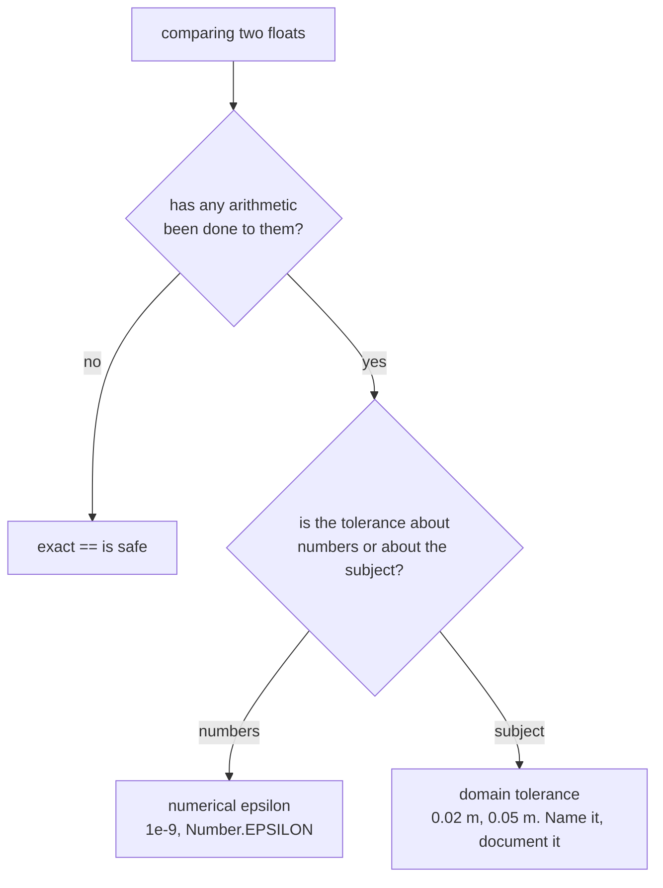

# Epsilon comparison

Treating two floating-point numbers as equal when they are close enough. The
harder question is *how close*, and this repository answers it four different
ways, each correct for its own numbers.

## What it is

After any arithmetic, exact equality between floats is unreliable. The standard
remedy is a tolerance:

```
equal  ⟺  |a − b| < ε
```

Choosing ε is the whole problem, and there are three families of answer:

**Machine epsilon.** `Number.EPSILON` ≈ 2.2×10⁻¹⁶, the smallest gap near 1.0.
Right when you expect exactness and are guarding only against a last-bit
difference.

**An absolute tolerance.** A fixed number like `1e-9`. Right when the values
have a known scale.

**A domain tolerance.** A number that means something in the subject: 2 cm, 5 mm,
0.05 m. This is not really a floating-point tolerance at all; it is a statement
about measurement accuracy that happens to be implemented as one.

Confusing the third with the first two is the common error. A domain tolerance
is a *scientific* parameter and should be named, documented, and configurable. A
numerical epsilon is an implementation detail.

## The picture



## Where this project uses it

### Exact comparison, justified

`poggio_webapp/pipeline/editor/geometry.py`:

```python
def _point_on_segment(point, start, end):
    return (
        _direction(start, end, point) == 0
        and min(start[0], end[0]) <= point[0] <= max(start[0], end[0])
        ...
    )
```

`== 0` with no tolerance, and it is correct. The
[orientation test](signed-area-and-orientation-test.md) is four multiplications
and three subtractions (**no division**), so on user-clicked coordinates the
result is exact. Introducing an epsilon here would add a parameter and buy
nothing.

### Numerical epsilon, justified

`poggio_webapp/static/visualizer/layer-fill.mjs`:

```javascript
const EPSILON = 1e-9;

function samePoint(a, b) {
  return (
    Math.abs(a.x - b.x) <= EPSILON
    && Math.abs(a.y - b.y) <= EPSILON
  );
}
```

The same file uses `EPSILON` twenty-six times, and it is the right call here for a
reason the *other* file's exactness makes clear: these coordinates have been
through [interpolation](linear-interpolation.md) during
[polyline clipping](polyline-clipping.md). Division has occurred, so exact zero
would rarely appear even where the geometry is genuinely collinear.

Two files, two policies, each justified by what has happened to the numbers.

`poggio_webapp/static/canvas/grid.mjs` uses the machine epsilon instead:

```javascript
if (Math.abs(crossProduct) > Number.EPSILON) {
    return false;
}
```

Its coordinates are snapped to an exact grid (see
[grid snapping](grid-snapping-and-quantisation.md)), so near-exactness is
expected and only a last-bit difference needs absorbing.

### Domain tolerances, named and documented

This is where the repository is most careful. `poggio_webapp/pipeline/validator.py`:

```python
DEFAULT_MONOTONIC_TOLERANCE_M = 0.02
DEFAULT_TOP_CONTINUITY_TOLERANCE_M = 0.10
DEFAULT_MAX_PLAUSIBLE_DEPTH_M = 5.0
```

Module-level constants, suffixed `_M` for metres, and **exposed as parameters**
so an operator can adjust them for a site:

```python
def validate(data, monotonic_tolerance_m=DEFAULT_MONOTONIC_TOLERANCE_M,
             top_continuity_tolerance_m=DEFAULT_TOP_CONTINUITY_TOLERANCE_M,
             max_plausible_depth_m=DEFAULT_MAX_PLAUSIBLE_DEPTH_M):
```

These are not floating-point tolerances. 2 cm is a statement that two hand-traced
boundaries agreeing to within 2 cm are not evidence of crossing layers. That is
archaeology, expressed as a number.

`poggio_webapp/pipeline/merge_walls.py` does the same for survey geometry:

```python
def check_trench_grid_config(grid, merged, tolerance_m=0.05):
```

5 cm is the distance within which two walls' corner coordinates count as the same
corner. Again a survey judgement, again named and adjustable.

And the fabrication detectors use tolerances that encode an *empirical*
observation:

```python
UNIFORM_SPACING_CV = 0.02  # coefficient of variation below this = suspicious
PARALLEL_OFFSET_TOLERANCE_M = 0.005
```

with the comment explaining where the numbers came from:

> Real traced boundaries have irregular vertex spacing (Trench 23 sits around
> cv 0.20); fabricated ones come out at cv 0.00.

A threshold with its calibration data recorded beside it.

## Why this and not something else

| Alternative | How it would work | Why it lost |
|---|---|---|
| **Exact `==` everywhere** | No tolerance | Correct only where no arithmetic has occurred. Used here exactly where that holds, and would silently break every clipping and interpolation comparison. |
| **One global epsilon** | A single `EPSILON` constant for the codebase | Tempting and wrong: it conflates a numerical detail with a scientific parameter. A single constant serving both "these floats are the same" and "these boundaries do not cross" cannot be tuned for either. |
| **Relative tolerance** (`math.isclose`) | Scale the tolerance to the magnitudes | The right general-purpose answer, and it is scale-relative when the domain tolerances here are deliberately absolute. Two boundaries 2 cm apart are 2 cm apart whether the wall is 1 m or 10 m long. |
| **Units library (pint) or a `Metres` type** | Make the units type-checked | Would prevent mixing a tolerance in metres with one in pixels. A dependency and a large refactor; the `_M` suffix convention achieves most of it by discipline. |
| **Per-context tolerances, named by kind** *(chosen)* | Numerical epsilons local to the file; domain tolerances as documented, adjustable constants | Each number is chosen for what it is guarding, and the domain ones are visible as scientific parameters rather than buried as magic. |

The distinction is the point. A reader of `validator.py` can see that
`DEFAULT_MONOTONIC_TOLERANCE_M = 0.02` is a decision about archaeological
recording accuracy and can argue with it. A reader of `layer-fill.mjs` can see
that `EPSILON = 1e-9` is an implementation detail and should not touch it.
Collapsing them into one constant would destroy that signal.

## What it costs

A comparison and a subtraction. Nothing.

The costs are conceptual, and real:

- Tolerant equality is not transitive. `a ≈ b` and `b ≈ c` does not give
  `a ≈ c`. Nothing here relies on chaining, but it is why tolerant comparison
  cannot be used as a sort key or a dictionary key.
- Every tolerance is a decision that can be wrong. A 2 cm monotonic
  tolerance will miss a genuine 1 cm crossing. That is why it is a parameter,
  and why the validator reports rather than silently corrects.
- A tolerance can mask a real error. `PARALLEL_OFFSET_TOLERANCE_M = 0.005`
  catches copy-pasted boundaries offset by a constant; a fabricator using a
  varying offset would slip past. The check is explicitly a hint, not a proof.
  The README says so: "Statistical signatures … are hints; overlap with actual
  ink pixels would be direct evidence."

## Where else you meet it

- Test assertions: `assertAlmostEqual`, `pytest.approx`, `toBeCloseTo`.
  Every framework has one.
- Numerical solvers, where convergence is "the change is below ε."
- Computational geometry libraries, where robustness predicates exist
  precisely to avoid needing an epsilon.
- Graphics, where depth-buffer comparisons use a bias to avoid z-fighting.
- Sensor fusion, where "the same reading" is defined by the instrument's
  accuracy: a domain tolerance, exactly like this project's 2 cm.

## Related pages

- [Floating-point representation](floating-point-representation.md): why exact
  equality fails.
- [Signed area and the orientation test](signed-area-and-orientation-test.md):
  the predicate that can be compared exactly.
- [Grid snapping and quantisation](grid-snapping-and-quantisation.md): avoiding
  the problem by choosing exact constants.
- [Coefficient of variation](coefficient-of-variation.md): a threshold with its
  calibration recorded.
- [Validation rules](../reference/validation-rules.md): every domain tolerance,
  in one table.
