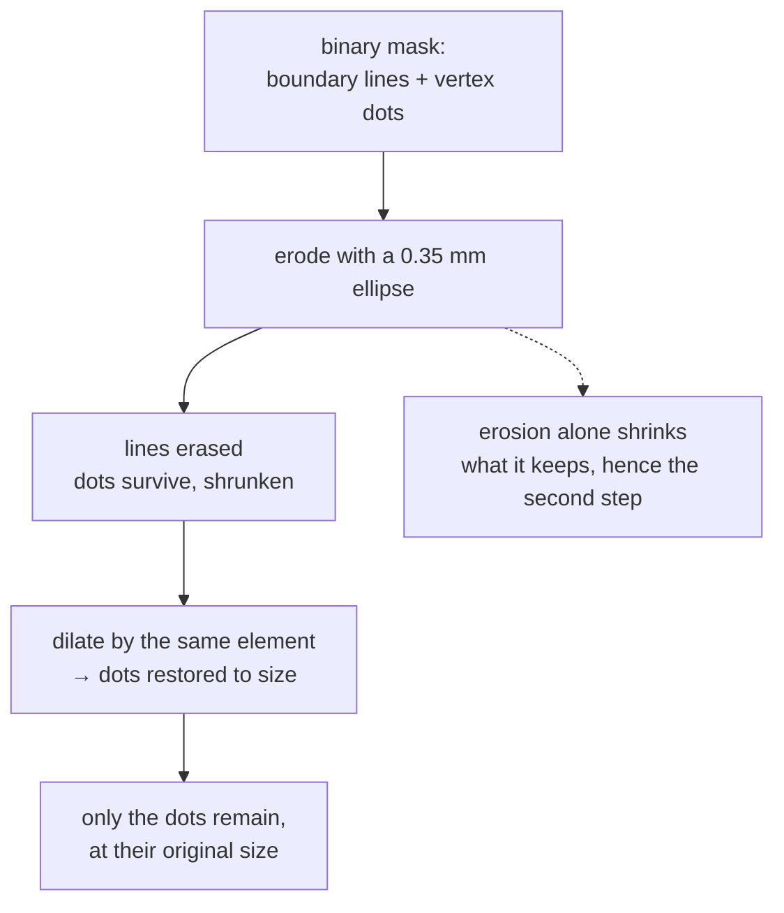

# Erosion

Shrinking the foreground of a binary image by removing anything the probe shape
cannot fit inside. The half of [opening](morphological-opening.md) that does the
deleting.

## What it is

Slide a [structuring element](structuring-elements.md) over the image. A pixel
stays foreground **only if the element, centred there, lies entirely within the
foreground.** Everything else becomes background.

The consequences follow directly:

- Objects shrink by roughly the element's radius on every side.
- Anything **thinner than the element** disappears completely.
- Small isolated specks vanish.
- Two objects joined by a thin bridge become separated.
- Holes grow.

That third and fourth property are why erosion is a *selection* operation, not
merely a shrinking one: it selects for objects thick enough to contain the
probe.

In grayscale, erosion is the local minimum over the element's footprint. The
binary case is that with only two values.

## The picture

A 3×3 elliptical element on a row containing a 2-pixel line and an 8-pixel dot:

```
before:   ....██......████████....
                ↑           ↑
             2px line    8px dot

after:    ............██████......
                          ↑
          the line is gone entirely;
          the dot survives, one pixel narrower on each side
```



That last box is why erosion is almost never used alone. It removes what you
want removed *and* shrinks what you want kept. Pairing it with
[dilation](dilation.md) restores the survivors' size, which is exactly
[opening](morphological-opening.md).

## Where this project uses it

As the first half of the opening in `poggio_webapp/pipeline/detect_markers.py`:

```python
k = max(3, int(line_kill_paper_mm * mm_px) | 1)

opened = cv2.morphologyEx(
    ink,
    cv2.MORPH_OPEN,
    cv2.getStructuringElement(cv2.MORPH_ELLIPSE, (k, k)),
)
```

`cv2.MORPH_OPEN` is erosion followed by dilation. The erosion is doing the
selection, and the parameter name says what it selects against:
`line_kill_paper_mm`, default **0.35 mm**: narrower than a recorder's vertex
dot, wider than a drawn boundary line.

The module docstring explains why this step exists at all:

> morphological **OPENING** before the circle hunt, so vertex dots that touch
> their boundary line survive as blobs instead of merging into one big
> non-circular contour and being lost

That is the failure being prevented. A dot sitting on the line it marks is, to
[contour tracing](contour-tracing.md), a single connected shape: a long line
with a bump. Its [circularity](circularity.md) is near zero, so the shape filter
rejects it, and a real recorded vertex is lost. Eroding away the line first
leaves the dot as its own component.

Erosion is never called on its own in this repository. It always appears inside
`MORPH_OPEN` or `MORPH_CLOSE`.

## Why this and not something else

The problem is "separate small round marks from the thin lines they touch."

| Alternative | How it would work here | Why it lost |
|---|---|---|
| **Erosion alone** | Erode and use the result directly | Removes the lines and leaves every dot k pixels smaller. Since the next stage filters on **diameter in paper millimetres**, a systematically shrunken dot fails its own size band. The dilation is not optional. |
| **[Opening](morphological-opening.md)** *(chosen)* | Erode, then dilate by the same element | Removes thin structure and restores the size of what survives. |
| **Filter by area after contouring** | Skip morphology; reject contours whose area is too large | Does not help. The dot and the line it touches form **one** contour, so there is nothing to filter: the dot never appears as a candidate at all. Morphology is what makes it a separate object. |
| **Thinning / skeletonisation** | Reduce everything to single-pixel skeletons, find junctions | A real approach to separating strokes, and it destroys exactly the property being measured: whether the mark is a *filled disk*. [Solidity](solidity.md) and [fill ratio](extent-and-fill-ratio.md) are meaningless on a skeleton. |
| **Hough circle transform** | Search parameter space for circles directly | Purpose-built for finding circles, and heavily parameterised (accumulator resolution, minimum distance, two Canny thresholds), sensitive to all of them, and it finds circles *including* the outlines of drawn stones. The shape filter here specifically wants **filled** disks, which is a solidity test, not a circle test. |
| **Distance transform + local maxima** | Peaks of the distance transform mark blob centres | Elegant and effective for touching round objects, and it is a full extra pipeline with its own thresholds, solving a problem a 3-pixel kernel already solves. |

The morphological answer wins because the discriminating property here is
purely **thickness**, and erosion is the operation that is exactly a thickness
test.

## What it costs

O(n·k²) for a k×k element; O(n·k) for a decomposable rectangular one. At
k ≈ 3–7 pixels on the images here, one fast pass.

The correctness cost is the shrinkage, which is why it never ships alone. There
is also a genuine information loss that no pairing recovers: a dot **thinner
than k** is deleted and cannot come back. That is why `line_kill_paper_mm` is
0.35 rather than, say, 1.0: the margin between "thinner than any dot" and
"thicker than any line" is real but not large, and the setting sits deliberately
at the cautious end.

This is also why the module keeps its rejects:

```python
# The route and review UI consume the rejected candidates too (red,
# toggleable dots), so a person can rescue a real vertex the filters
# wrongly dropped.
```

The morphology's mistakes are recoverable by a person, because the pipeline
declines to throw the evidence away. See
[human-in-the-loop review](human-in-the-loop-review.md).

## Where else you meet it

- Photoshop's "Minimum" filter, and contracting a selection by N pixels.
- Noise removal in scanned documents, stripping isolated speckles before
  OCR.
- Semiconductor inspection, measuring whether a trace is wide enough.
- Medical imaging, separating touching cells or vessels before counting.
- Font rendering: stem darkening and thinning are grayscale morphology.

## Related pages

- [Dilation](dilation.md): the dual operation.
- [Morphological opening](morphological-opening.md): erosion then dilation,
  which is what this project actually calls.
- [Morphological closing](morphological-closing.md): the other pairing.
- [Structuring elements](structuring-elements.md): the probe, and how its size
  is derived here.
- [Circularity](circularity.md) and [solidity](solidity.md): the measures that
  erosion makes computable.
