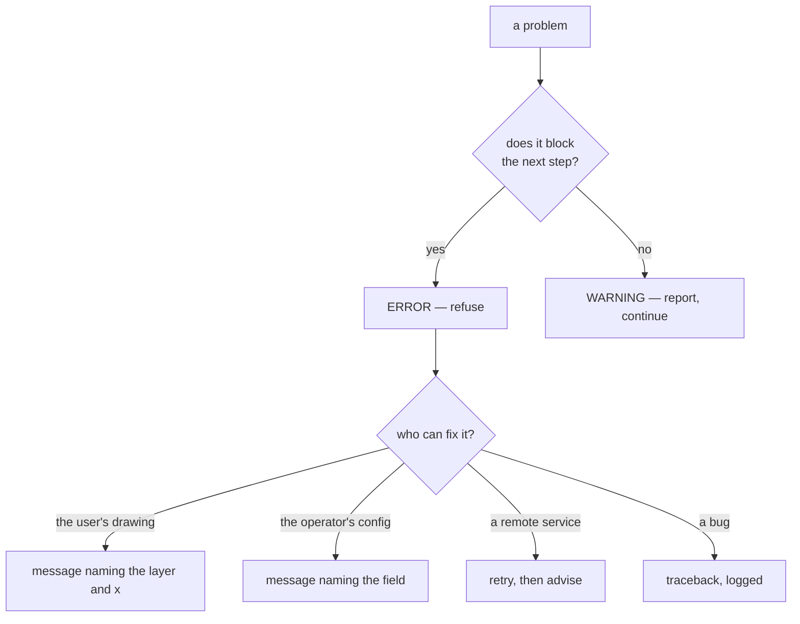

# Error taxonomies

Not every problem is the same kind of problem. Classifying them — by severity,
by who can fix them, by whether they block — is what turns a pile of failures
into something a user can act on.

## What it is

Software fails in categories, and the categories deserve different treatment:

| Axis | Distinction |
|---|---|
| **Severity** | blocks the next step, or merely warrants review |
| **Attribution** | the user's input, the operator's configuration, a remote service, a bug |
| **Recoverability** | retry may help, or it certainly will not |
| **Audience** | a message for a person, or a traceback for a developer |

A single `except Exception: print("error")` collapses all four. A taxonomy keeps
them separate so each can be handled and reported appropriately.

This repository draws all four distinctions, in different places, and each is
worth reading as a design decision rather than as plumbing.

## The picture



## Where this project uses it

### Errors block, warnings do not

`poggio_webapp/pipeline/validator.py`:

```python
@dataclass
class Report:
    errors: list = field(default_factory=list)
    warnings: list = field(default_factory=list)

    def err(self, where, msg):
        self.errors.append(f"[ERROR] {where}: {msg}")

    def warn(self, where, msg):
        self.warnings.append(f"[WARN]  {where}: {msg}")
```

The classification is a domain judgement made per check. Layers crossing is an
**error**:

```python
if above is not None and y < above - monotonic_tolerance_m:
    report.err(
        where,
        f"bottom at x={x} (depth {y:.2f}) is ABOVE "
        f"{prev_name}'s bottom (depth {above:.2f}) — layers cross",
    )
```

A gap between one layer's bottom and the next's top is a **warning**:

```python
if above is not None and abs(y - above) > top_continuity_tolerance_m:
    report.warn(
        where,
        f"top at x={x} (depth {y:.2f}) is far from "
        f"{prev_name} bottom (depth {above:.2f}) — "
        f"possible void/overlap",
    )
```

Layers crossing is physically impossible. A void is not — it can be real. **The
severity encodes the archaeology**, not the software's confidence.

Every message carries `where` and the actual numbers, so a user can find the
place on the drawing.

### One exception class per rule

`poggio_webapp/pipeline/editor/errors.py`:

```python
"""Structural problems in saved editor state.

One class per rule, so a caller can catch the family or a single case, and
so the message lives with the rule rather than at the raise site.
"""


class EditorStructuralValidationError(ValueError):
    """Base class for editor-only structural validation failures."""


class UnclosedPolygonError(EditorStructuralValidationError):
    """Raised when a drawn polygon is not closed."""


class SelfIntersectingPolygonError(EditorStructuralValidationError):
    """Raised when a polygon crosses itself."""


class IncompleteGridRegistrationError(EditorStructuralValidationError):
    """Raised when any editor face lacks a complete grid registration."""
```

Thirteen classes, one per rule, under a common base. The docstring gives both
reasons: a caller can catch the whole family or one specific case, and the
*meaning* of each failure lives with its class rather than being implied by a
string at the raise site.

Inheriting from `ValueError` means existing `except ValueError` handlers still
work — a taxonomy layered onto the standard hierarchy rather than replacing it.

### Attribution: a refusal versus a missing dependency

`poggio_webapp/backend/services/trench_builder.py`:

```python
class TrenchBuildError(Exception):
    """A refusal the operator can act on. The message is user-facing."""


class GempyUnavailableError(TrenchBuildError):
    """gempy is not installed. The route reports this as an {"error": ...}
    body rather than a refusal message, matching the previous behaviour."""
```

Two categories that would otherwise be one. A refusal ("your registration is
still placeholders") is the operator's to fix; a missing optional dependency is
an installation problem. The route treats them differently:

```python
except GempyUnavailableError as error:
    return jsonify({"error": str(error)}), 400
except TrenchBuildError as error:
    abort(400, description=str(error))
```

And the docstring notes *why* the exceptions exist at all:

> Refusals raise ``TrenchBuildError`` rather than calling ``abort``. The route
> maps that to a 400; keeping Flask out of here is what lets the rules be tested
> without an app.

The taxonomy serves [layering](layered-architecture.md) as well as reporting.

### Two audiences, two messages

`poggio_webapp/backend/tasks.py`:

```python
except Exception as e:
    TASKS[task_id]["error"] = _friendly_error(e)
    TASKS[task_id]["error_detail"] = f"{e}\n{traceback.format_exc()}"
    TASKS[task_id]["status"] = "error"
```

Two fields. `error` is for the person; `error_detail` keeps the traceback. The
translation lives in `poggio_webapp/backend/errors.py`:

```python
def _friendly_error(e):
    """Translate the errors users actually hit into what-to-do-next text.
    The raw exception + traceback still travels alongside as error_detail;
    this string is the one shown in the red banner."""
```

and it classifies by *recoverability*:

```python
if code == 429:
    return (
        "Gemini says your API key is out of quota (429). Retrying will "
        "not help until the quota resets. ..."
    )
if code in (400, 401, 403):
    return (
        f"Gemini rejected the request ({code}) — usually an invalid or "
        "restricted API key... Retrying "
        "with the same key will keep failing."
    )
```

"Retrying will not help" and "will keep failing" are the taxonomy's most useful
output: they tell the user which category they are in.

### Structured issues, not strings

`poggio_webapp/pipeline/harris_matrix.py` goes further and makes issues
machine-readable:

```python
def _issue(
    code: str,
    message: str,
    unit_ids=(),
    relation_ids=(),
) -> dict:
    return {
        "code": code,
        "message": message,
        "unit_ids": list(unit_ids),
        "relation_ids": list(relation_ids),
    }
```

A `code` (`"cycle"`, `"missing-unit"`, `"duplicate-relation"`,
`"generic-label"`) lets the interface react programmatically, and the ID lists
let it **highlight the offending nodes in the diagram**. A prose string could do
neither.

`harris_store` then reports codes rather than prose upward:

```python
error_codes = sorted({issue["code"] for issue in report["errors"]})
raise InvalidMatrixError(
    "Matrix graph is invalid: " + ", ".join(error_codes) + ".",
    error_codes=error_codes,
)
```

## Why this and not something else

| Alternative | How it would report | Why it lost |
|---|---|---|
| **One exception type, message strings** | `raise ValueError("...")` | Callers must match on message text to distinguish cases — brittle and untestable. |
| **Error codes only** | Numeric or string codes | Machine-readable, unreadable to a person. The Harris issues carry **both** a code and a message for exactly this reason. |
| **Errors only, no warnings** | Everything blocks | A void between layers can be real. Blocking on it would make the validator unusable on genuine data. |
| **Warnings only** | Nothing blocks | Crossing layers would reach the model, where they are physically impossible and would corrupt the interpolation. |
| **Log and continue** | Write to a log file | The user never sees it. The failure becomes a wrong result rather than a message. |
| **Severity + class + audience + code** *(chosen)* | Four distinctions, each where it matters | Each failure is reported to the right person in the right form, and callers can react programmatically. |

The recurring design point is that **severity is a domain judgement, not a
software one**. Nothing in the code can decide whether a void is an error; only
knowing that voids occur in real stratigraphy can.

## What it costs

Nothing at runtime.

The costs:

- **Thirteen exception classes** is a lot of file for a lot of one-line classes.
  The payoff is that each carries its rule's meaning and can be caught
  individually.
- **The severity split must be maintained.** Every new check needs a judgement,
  and a wrong one either blocks valid work or lets invalid data through.
- **Two-audience messages need writing.** `_friendly_error` is 40 lines of prose
  for four error codes — genuinely expensive to produce, and the difference
  between a usable tool and a stack trace.
- **Codes are a contract.** An interface highlighting `"cycle"` breaks if the
  code is renamed.

## Where else you meet it

- **Compilers**, which distinguish errors from warnings and give each a code —
  `rustc --explain E0382` is this taken to its conclusion.
- **HTTP status codes**, splitting client errors (4xx) from server errors (5xx)
  by attribution.
- **Linters**, with severity levels and per-rule identifiers.
- **Medical triage**, the original taxonomy of severity under limited attention.
- **Aviation**, which separates advisories, cautions, and warnings by required
  response time.

## Related pages

- [Fail-closed design](fail-closed-design.md) — what an error causes.
- [Validation at trust boundaries](validation-at-trust-boundaries.md) — where
  they are raised.
- [Structural versus schema validation](structural-vs-schema-validation.md) —
  ordering checks so the message is right.
- [Retry budgets](retry-budgets.md) — the recoverability axis.
- [Validation rules](../reference/validation-rules.md) — every code, in one
  table.
