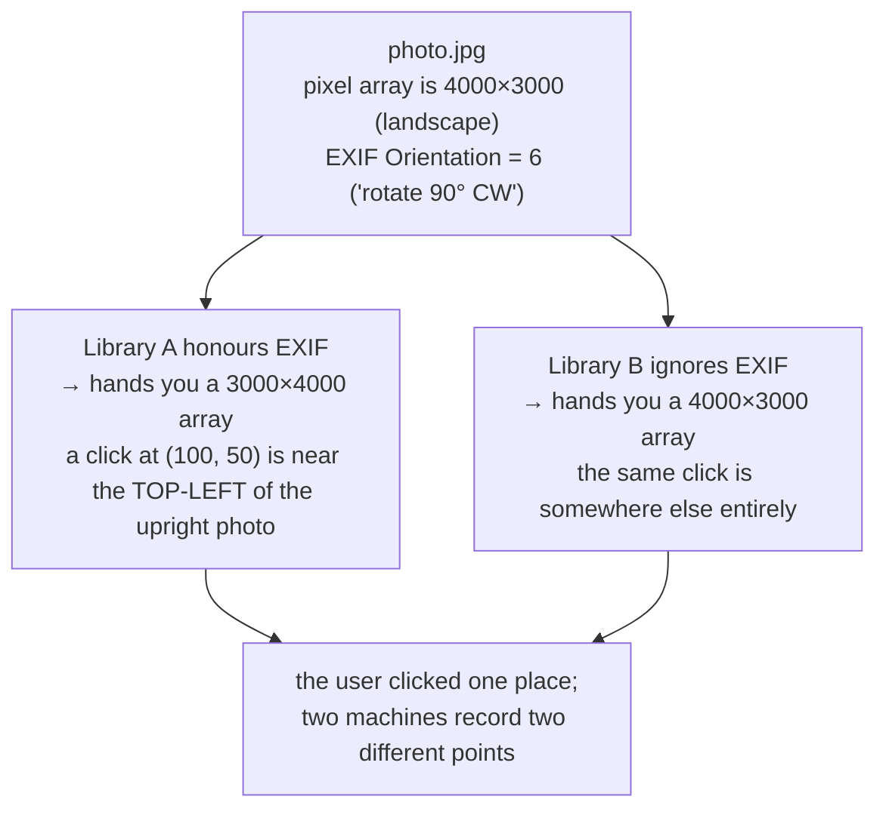

# EXIF orientation

A photograph can carry a note saying "actually, rotate me." Whether a program
obeys that note decides whether pixel coordinates mean the same thing on two
machines.

## What it is

When a phone or camera takes a picture sideways, it usually does **not** rotate
the pixels. Rotating a 20-megapixel array costs time and battery. Instead it
writes the sensor data as-is and adds an EXIF metadata tag (`Orientation`,
values 1 through 8) saying how a viewer should turn it before display.

The consequence is that "the image" is ambiguous. The same file is either

- a landscape array of pixels, if you read the raw data; or
- a portrait image, if you honour the tag.

Different libraries make different default choices, and some change the default
between versions.

## The picture



For an application whose whole purpose is turning clicks into measurements,
this is not a cosmetic difference. A calibration measured on one machine would
be meaningless on another.

## Where this project uses it

`poggio_webapp/pipeline/detect_markers.py` disables EXIF handling explicitly
and applies its own rotation instead:

```python
def load_rotated(image_path, rotate=0):
    """Read the photo with EXIF auto-rotation explicitly DISABLED (so
    `rotate` means the same thing on every machine) and apply the requested
    clockwise rotation."""
    img = cv2.imread(image_path, cv2.IMREAD_IGNORE_ORIENTATION | cv2.IMREAD_COLOR)
    if img is None:
        raise RuntimeError(f"could not read image: {image_path}")
    if rotate == 90:
        img = cv2.rotate(img, cv2.ROTATE_90_CLOCKWISE)
    elif rotate == 180:
        img = cv2.rotate(img, cv2.ROTATE_180)
    elif rotate == 270:
        img = cv2.rotate(img, cv2.ROTATE_90_COUNTERCLOCKWISE)
    elif rotate != 0:
        raise RuntimeError("rotate must be one of 0, 90, 180, 270")
    return img
```

`detect_features.py` uses the same flag for the same reason.

The decision propagates further than the loader. Because the *rotated* frame is
the one markers were measured in, the whole job has to keep serving that exact
frame. From `poggio_webapp/backend/routes/pages.py`:

```python
# marker_calib (origin_px + px_per_m) was computed against the ROTATED
# working copy written by markers/detect, not the raw scan or the
# (possibly differently-sized) preprocessed clean image. Serving any
# other image alongside it would silently misplace the overlay, so if
# calibration exists, that rotated copy (not clean/scan) is the image
# this job hands to the visualizer.
```

And when the rotated copy is missing, the route omits the calibration rather
than pairing it with an image it does not match:

```python
# calib exists but we can't trust it against whatever image we just
# served (rotated copy missing), so omit it rather than misalign.
```

That is [fail-closed design](fail-closed-design.md): the degraded outcome is "no overlay,"
not "an overlay in the wrong place."

## Why this and not something else

| Alternative | How it would work here | Why it lost |
|---|---|---|
| **Honour EXIF and let the library rotate** | Drop the flag; `cv2.imread` or PIL's `ImageOps.exif_transpose` handles it | Sounds like the friendly default, and it makes the pixel frame depend on the library version, the platform, and whether the file was ever re-saved by software that stripped the tag. A stored calibration would silently stop matching its image. |
| **Strip EXIF on upload and normalise once** | Rotate to upright at ingest, discard the tag | Genuinely clean, and it changes the bytes of the archival scan. This project keeps `01_scan/` as the untouched upload on purpose. See [files and artifacts](../architecture/files-and-artifacts.md). |
| **Detect orientation automatically** | Guess from the drawing's own content, e.g. text direction | Guessing, on an application whose selling point is not guessing. It would also be wrong on a section drawn in an unusual aspect. |
| **Ignore EXIF and ask the user** *(what this does)* | The user picks 0/90/180/270 and sees the result | The user is already looking at the drawing and can see whether it is upright. One explicit parameter beats an inferred one, and the parameter means the same thing everywhere. |

The general principle: when a stored measurement refers to a coordinate frame,
that frame must be **explicit and reproducible**. Anything that can silently
differ between two readings of the same file is unsuitable as a reference.

## What it costs

Ignoring the tag is free. Applying a 90° rotation is O(pixels) and allocates a
second image. `cv2.rotate` is a transpose plus a flip, memory-bandwidth bound,
a few tens of milliseconds on a phone photo.

The real cost is one extra artifact on disk: `marker_source_rotated.png`, the
frame everything else is measured against. That file is the contract.

## Where else you meet it

- Every photo upload form you have used that showed your picture sideways:
  that is a library disagreeing with the tag.
- Machine-learning training pipelines, where inconsistent EXIF handling
  between training and inference silently rotates a fraction of the data.
- Digital forensics, where the tag is evidence about the device.
- Web browsers, which honour EXIF for `` but historically did not for
  images drawn into a `<canvas>`, the same split as here.

## Related pages

- [Raster images and pixels](raster-images-and-pixels.md): what a pixel
  coordinate means.
- [Coordinate spaces](../concepts/coordinate-spaces.md): the frames a point
  can be correct in.
- [Similarity transforms](similarity-transforms.md): the calibration this
  protects.
- [Fail-closed design](fail-closed-design.md): omitting the overlay rather than misplacing
  it.
