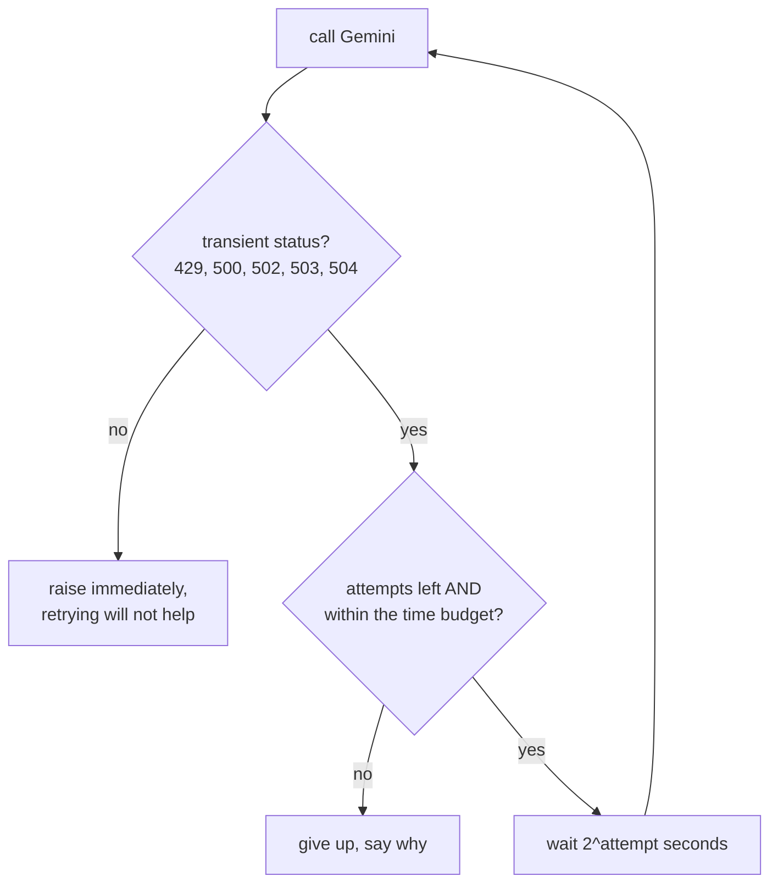

# Exponential backoff

Waiting longer after each failed attempt. The standard way to retry without
making an overloaded service worse.

## What it is

A transient failure (a timeout, a 503) will often succeed on a retry. Retrying
*immediately* is the wrong response: if the server is overloaded, an immediate
retry adds load at the worst moment, and many clients doing so simultaneously
turn a stumble into an outage.

Exponential backoff waits longer each time:

```
attempt 1 fails → wait 1s
attempt 2 fails → wait 2s
attempt 3 fails → wait 4s
attempt 4 fails → wait 8s
```

Two refinements matter:

**Jitter**: randomise the wait so that many clients failing at the same moment
do not retry in lockstep. Essential at scale; less so for a single-user
application.

**Which errors to retry.** A 503 is worth retrying. A 400 is not. The request
is malformed and will be malformed again. Retrying a permanent error wastes
time and, when the API is metered, money.

## The picture



## Where this project uses it

`poggio_webapp/pipeline/_extract_common.py`, wrapping every call to Gemini:

```python
# Status codes worth retrying. 504 DEADLINE_EXCEEDED matters most here: a
# big scan + a long structured-output generation routinely blows past
# Google's server-side deadline, and the error body literally says "Please
# try again." The original per-module helpers only retried 500/503/429, so
# the single most retryable error raised straight through on attempt one.
TRANSIENT_STATUS_CODES = (429, 500, 502, 503, 504)


def generate_with_retry(
    client, progress_cb=None, max_attempts=5, max_total_seconds=600, **kwargs
):
    """client.models.generate_content with exponential backoff on transient
    server errors. Shared by both extraction modules (was duplicated in
    each). kwargs pass through to generate_content unchanged.

    max_total_seconds caps the whole retry loop's wall clock. Every retry
    re-sends the full image as input tokens, so an outage at Google's end
    shouldn't be allowed to quietly spend the user's quota five times over.
    Past the budget we stop and tell them, rather than keep paying to fail."""
    t0 = time.time()
    for attempt in range(max_attempts):
        try:
            return client.models.generate_content(**kwargs)
        except errors.ServerError as e:
            code = getattr(e, "code", None)
            wait = 2**attempt
            elapsed = time.time() - t0
            out_of_budget = elapsed + wait > max_total_seconds
            if (
                code in TRANSIENT_STATUS_CODES
                and attempt < max_attempts - 1
                and not out_of_budget
            ):
                if progress_cb:
                    progress_cb(
                        f"Gemini returned {code}; retrying in {wait}s "
                        f"(attempt {attempt + 2}/{max_attempts}, "
                        f"{elapsed:.0f}s elapsed)..."
                    )
                time.sleep(wait)
            else:
                if progress_cb and code in TRANSIENT_STATUS_CODES:
                    progress_cb(
                        f"giving up after {attempt + 1} attempt(s) / "
                        f"{elapsed:.0f}s. Not retrying further to "
                        "avoid spending more quota on a failing "
                        "request."
                    )
                raise
```

Five decisions worth naming.

**The status list is documented, with a bug fix recorded.** 504 was missing from
the earlier per-module helpers, so "the single most retryable error raised
straight through on attempt one." That is the kind of detail a comment earns its
place by preserving.

**Three independent stop conditions**, all checked together: the code must be
transient, attempts must remain, and the *next wait must fit the budget*. See
[retry budgets](retry-budgets.md). That third condition is the unusual one.

**`elapsed + wait > max_total_seconds`** looks ahead rather than checking elapsed
time alone. Sleeping 8 seconds only to find the budget exhausted would waste the
user's time for nothing.

**Progress is reported both ways.** The retry message says which attempt and how
long; the give-up message says *why* it stopped: "Not retrying further to avoid
spending more quota on a failing request." A user watching the log learns
something either way.

**Non-transient errors re-raise immediately**, with no wait. A 400 or a 403 will
fail identically on retry.

The pairing with `backend/errors.py` completes the story. When the retries are
exhausted, the raw exception becomes advice:

```python
if code in (504, 503, 500, 502):
    return (
        f"Gemini's servers failed with a {code} on every retry attempt. "
        "This is a problem on Google's side, not with your scan or this "
        "app. What to do: (1) wait 15–30 minutes and try once more "
        "(don't hammer re-run: each attempt re-sends the whole image and "
        "uses your quota); ..."
    )
```

Retry automatically, then tell the human what *not* to do manually.

## Why this and not something else

| Alternative | How it would retry | Why it lost |
|---|---|---|
| **No retry** | Fail on the first error | A 504 on a large image is routine, and the whole extraction (a slow, expensive request) would be thrown away for a transient condition. |
| **Immediate retry** | Loop with no delay | Adds load exactly when the service is struggling, and burns the attempt budget in milliseconds. |
| **Fixed delay** | Wait 5s each time | Simple, and it does not adapt: too short for a real outage, too long for a momentary blip. |
| **Exponential with jitter** | Add randomness to the wait | The right answer for many concurrent clients. This is a single-user local application, so lockstep retries cannot occur. The jitter would only add unpredictability. |
| **Retry everything** | Ignore the status code | Wastes minutes on 400s and 403s that will never succeed, and each attempt re-sends the image and spends quota. |
| **Exponential, transient-only, dual-bounded** *(chosen)* | 1s, 2s, 4s, 8s; attempts and wall clock both capped | Adapts to the failure's severity, stops before spending unreasonable quota, and never retries what cannot succeed. |

The distinguishing feature against the textbook version is the **cost model**.
Most backoff discussions treat retries as free. Here every retry re-uploads a
multi-megabyte image and consumes metered API quota, so the design optimises for
*not spending the user's money* as much as for eventual success. That is why the
wall-clock budget exists alongside the attempt cap, and why the give-up message
explains the reasoning.

## What it costs

Total worst-case wait is 1 + 2 + 4 + 8 = 15 seconds across five attempts,
bounded further by `max_total_seconds=600`.

The costs:

- Latency on failure. A doomed request takes 15 seconds longer to fail. The
  progress callback keeps the user informed rather than staring at a hung
  interface.
- Quota. Each attempt re-sends the image. Bounded deliberately, and named in
  the docstring.
- `time.sleep` blocks the thread. Acceptable: this already runs on a
  [background thread](threads-and-the-gil.md), so the web server stays
  responsive.
- Only `ServerError` is caught. A network-level failure raising a different
  exception type is not retried. Narrow by design: catching everything would
  retry programming errors too.

## Where else you meet it

- Ethernet's collision backoff, where the algorithm originated.
- TCP retransmission, which doubles its timeout on loss.
- Every cloud SDK: AWS, Google, and Azure clients all ship with it built in.
- Kubernetes `CrashLoopBackOff`, restarting a failing pod with growing
  delays.
- OAuth and rate-limited APIs, where `Retry-After` is the server telling the
  client what backoff to use.

## Related pages

- [Retry budgets](retry-budgets.md): the wall-clock bound and why it exists.
- [Error taxonomies](error-taxonomies.md): transient versus permanent.
- [Threads and the GIL](threads-and-the-gil.md): why blocking here is fine.
- [Fail-closed design](fail-closed-design.md): what happens after giving up.
- [Troubleshooting](../reference/troubleshooting.md): the user-facing messages.
