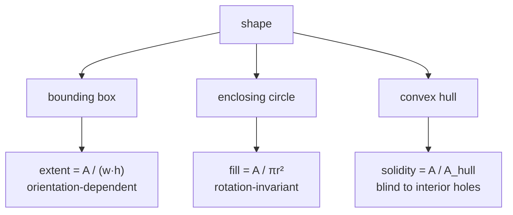

# Extent and fill ratio

Two measures of how much of a reference region a shape actually occupies. Both
answer "is this solid or is this hollow?", against two different references, in
the two detectors.

## What it is

Both compare a shape's [area](contour-area-and-perimeter.md) to the area of a
simple region containing it:

```
extent = area / (bounding-box width × height)      reference: the axis-aligned box
fill   = area / (π · r²)                            reference: the enclosing circle
```

Both land in `(0, 1]`. Both are dimensionless and scale-free.

They differ in what they are blind to:

- **Extent** uses the [bounding box](bounding-boxes.md), which is
  **orientation-dependent**. A diagonal line has a huge box and a tiny extent; a
  horizontal line of the same shape has a thin box and a large one.
- **Fill** uses the [minimum enclosing circle](minimum-enclosing-circle.md),
  which is **rotation-invariant**. It measures spread from a centre.

Neither duplicates [solidity](solidity.md), which compares against the
[convex hull](convex-hull.md) and is therefore blind to interior holes that do
not reach the boundary. A hollow ring with a closed outline has solidity 1.0 by
that measure, and a fill ratio near 0.1, which is what catches it.

## The picture



Four shapes against the three references:

| Shape | extent | fill | solidity |
|---|---|---|---|
| filled disk | 0.79 | **0.95** | 0.98 |
| drawn ring (outline only) | 0.20 | **0.10** | 0.98 ← misses it |
| horizontal line | 0.90 ← misses it | 0.05 | 0.95 |
| diagonal line | 0.02 | 0.05 | 0.95 |

No single row is caught by all three. The ring defeats solidity; the horizontal
line defeats extent. Requiring all of them in conjunction is what makes the
filter work.

## Where this project uses it

### Fill, as a hard gate: marker detection

`poggio_webapp/pipeline/detect_markers.py`:

```python
fill = (
    area / (math.pi * radius * radius)
    if radius > 0
    else 0
)

if (
    min_d <= diameter <= max_d
    and circularity >= min_circularity
    and solidity >= min_solidity
    and fill >= 0.5
):
```

The module docstring states the target precisely:

> dots are small **FILLED** disks; stone outlines and nested contour duplicates
> are not

That is the ring problem, and fill is the measure that solves it. A drawn stone
outline is round, so its [circularity](circularity.md) may pass; it is convex in
hull terms, so its [solidity](solidity.md) passes. Only the ratio of enclosed
area to circle area exposes that its middle is empty.

`fill >= 0.5` is well below the ≈0.95 a real disk scores, leaving room for
[thresholding](adaptive-thresholding.md) noise and for a stray pixel inflating
the enclosing radius.

### Extent, as a reject *and* a scoring term: feature detection

`poggio_webapp/pipeline/detect_features.py`:

```python
extent = area / float(width * height)
...
# Layer boundaries and grid lines generally have low extent or
# solidity. Small text loops are mostly removed by size limits.
if solidity < 0.34 or extent < 0.09:
    continue

score = 0.45 * compactness + 0.35 * min(1.0, solidity) + 0.20 * min(1.0, extent)
```

The comment names the target: **layer boundaries and grid lines**. Those are
long and thin, and on a sheet whose lines run at arbitrary angles their bounding
boxes are mostly empty. Extent's orientation-dependence, a weakness in general,
is here an asset: a diagonal ruling scores 0.02 and is gone.

Weighted lowest of the three score terms (0.20), because that same
orientation-dependence makes it the least trustworthy: a horizontal ruling would
score high on extent alone.

The `min(1.0, ...)` clamps guard against the discretisation quirks that let a
small contour's measured area slightly exceed its reference region.

## Why this and not something else

| Alternative | What it measures | Why it lost, or won |
|---|---|---|
| **[Solidity](solidity.md) alone** | `A / hull area` | Also used, and blind to interior holes reached by a closed outline. The ring case defeats it entirely. |
| **[Circularity](circularity.md) alone** | `4πA/P²` | Also used. A thin ring has low circularity too, but so does a squiggle, so circularity cannot say *why*. Fill says specifically "hollow." |
| **Extent** *(chosen for features)* | `A / box area` | Cheap, and its orientation-dependence is exactly what kills diagonal ruled lines. |
| **Fill** *(chosen for markers)* | `A / circle area` | Rotation-invariant, and the reference circle is already computed for the diameter test, so it is free. |
| **Rotated-box extent** | `A / minAreaRect area` | Orientation-invariant, and it *destroys* the property that makes extent useful here: a diagonal line's rotated box is tight, so its extent jumps to ≈0.9 and it stops being rejected. |
| **Euler number** | Counts holes topologically | Directly answers "does this have a hole?" Genuinely the most principled ring test. It is discrete and brittle: one noisy pixel bridging the ring changes the answer from 1 to 0. Fill degrades gracefully. |

The through-line: **each descriptor is blind to something.** The marker filter
requires four in conjunction (size, circularity, solidity, fill) because a
mark has to pass every one, and each covers a different neighbour's failure.

## What it costs

Both are one division. Extent needs the [bounding box](bounding-boxes.md), which
is O(n) and already computed; fill needs the
[minimum enclosing circle](minimum-enclosing-circle.md), also already computed
for the diameter test. Neither adds a measurable cost.

Their limitations are the mirror image of each other. Extent is
orientation-dependent: useful here, misleading in general. Fill assumes the
shape is roughly round, so for a genuinely elongated object it reports a low
value that means "not round" rather than "hollow." `detect_markers.py` gets away
with it because roundness has already been established by
[circularity](circularity.md) before fill is consulted.

## Where else you meet it

- OCR, where extent helps separate characters from rules and borders.
- Document layout analysis, distinguishing text blocks from table lines.
- Cell biology, where fill-type ratios distinguish solid nuclei from
  vesicles.
- Object detection, where box-fill ratios flag detections whose box is
  mostly background.
- Packing and logistics, where "extent" is literally how much of a container
  a shape wastes.

## Related pages

- [Bounding boxes](bounding-boxes.md): extent's reference region.
- [Minimum enclosing circle](minimum-enclosing-circle.md): fill's reference
  region.
- [Solidity](solidity.md): the third reference, and what it misses.
- [Circularity](circularity.md): the shape measure applied first.
- [Contour area and perimeter](contour-area-and-perimeter.md): the shared
  numerator.
