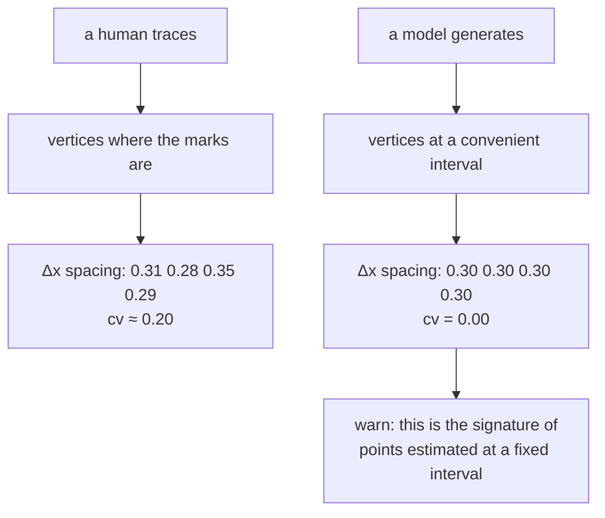

# Fabrication detection

Checking whether data that looks like a measurement actually is one. Written
because a language model was asked not to invent geometry, and invented it
anyway, twice.

## What it is

Fabricated data is data that was **generated rather than observed**, while
occupying the same fields and passing the same type checks as the real thing.

It is not detectable by validation in the ordinary sense. A fabricated boundary
has plausible coordinates, sensible depths, and correct ordering. Every
structural check passes.

What it does carry is **statistical signatures**. Human measurement is
irregular; generation is regular in ways nobody would choose to be:

- vertices at a perfectly constant interval
- one boundary an exact copy of another, offset by a constant
- suspiciously smooth curves, implausibly round numbers

These are **hints, not proof**. A genuinely regular boundary is possible. The
right response is a warning that names the pattern and says what to do, not a
refusal.

## The picture



## Where this project uses it

### The record of what happened

`poggio_webapp/pipeline/validator.py`, where the comment is the most important part
of the mechanism:

```python
# fabrication detection
# The T104 field-wall extraction produced geometrically fabricated boundaries
# twice: every point on a fixed x interval, and each locus's boundary an exact
# copy of the one above offset by a constant depth. The extraction prompt
# already warns against this and it happened anyway, so check for it here
# instead of trusting the model to police itself. Real traced boundaries have
# irregular vertex spacing (Trench 23 sits around cv 0.20); fabricated ones
# come out at cv 0.00.

UNIFORM_SPACING_CV = 0.02  # coefficient of variation below this = suspicious
PARALLEL_OFFSET_TOLERANCE_M = 0.005
```

Four things recorded: **what happened**, **how often**, **why the obvious fix was
insufficient**, and **the observed values that calibrate the thresholds**.

"The extraction prompt already warns against this and it happened anyway" is the
sentence that justifies the whole approach. Instructing a model not to fabricate
is not a control.

### Check one: uniform spacing

```python
def check_uniform_spacing(points, where, report):
    """Warn when boundary vertices sit on a perfectly regular x interval."""
    pts = _pairs(points)
    if len(pts) < 5:
        return
    xs = [x for x, _ in pts]
    dx = [b - a for a, b in zip(xs, xs[1:])]
    mean = sum(dx) / len(dx)
    if mean <= 0:
        return
    var = sum((d - mean) ** 2 for d in dx) / len(dx)
    cv = (var**0.5) / mean
    if cv < UNIFORM_SPACING_CV:
        report.warn(
            where,
            f"boundary vertices are evenly spaced every {mean:.3g} m "
            f"({len(pts)} points, spacing variation {cv:.3f}). This is "
            "the signature of points estimated at a fixed interval "
            "rather than read off the recorder's marked vertices. "
            "Re-extract, or detect the markers computationally.",
        )
```

The [coefficient of variation](coefficient-of-variation.md) is scale-free, so one
threshold works across drawings of any size. The message **names the signature
and gives the remedy**, including pointing at the CV path.

### Check two: copied boundaries

```python
def check_parallel_layers(layers, where, report):
    """Warn when two layers' boundaries are the same shape shifted by a
    constant depth, a copy-paste artifact rather than real stratigraphy."""
    ...
    if any(abs(a[0] - b[0]) > 1e-9 for a, b in zip(pa, pb)):
        continue  # different x stations, not comparable
    diffs = [b[1] - a[1] for a, b in zip(pa, pb)]
    spread = max(diffs) - min(diffs)
    if spread <= PARALLEL_OFFSET_TOLERANCE_M:
        report.warn(where, ...)
```

Two boundaries at identical x stations whose depth differences barely vary is
one boundary copied down.

### Skipped for the path where the signature is legitimate

```python
if source != "manual_editor":
    check_parallel_layers(layers, fname, report)
...
if source != "manual_editor":
    check_uniform_spacing(layer.get("bottomBoundary"), f"{where} bottom", report)
```

A human tracing on graph paper clicks along the grid, producing regular spacing
honestly. Running the check there would flood the *supported* path with false
positives, and a check that cries wolf gets ignored.

That exemption is the difference between a rule someone thought about and one
that was copied.

### The structural remedy

Detection is the fallback. The primary answer was to make fabrication
**impossible**, by taking geometry away from the model entirely.

`poggio_webapp/pipeline/detect_markers.py`:

```python
"""...
Finds the recorder's circle-marked vertex points on a field-wall photo with
computer vision instead of asking an LLM to trace boundaries. CV cannot
fabricate a marker that isn't on the paper, which is exactly the failure
mode Gemini tracing runs on T104-style sheets kept exhibiting (perfectly
even spacing, layers copy-pasted with a constant offset).
"""
```

"CV cannot fabricate a marker that isn't on the paper" is a **structural**
guarantee, not a statistical one.

And `assign_markers` keeps the model's remaining role harmless:

> if it misassigns one, the point is on the wrong boundary but still a real
> point from the paper, and the validator's spacing checks stay meaningful

Even the failure mode is designed so the detector still works.

## Why this and not something else

| Alternative | How it would catch a fabricated boundary | Why it lost |
|---|---|---|
| **Instruct the model not to fabricate** | Prompt engineering | Tried. Documented as having failed twice on the same data. |
| **Reject regular spacing outright** | Error rather than warning | Regular spacing is possible honestly, and is *normal* for grid tracing, which is why the check is skipped there. An error would block valid work. |
| **Statistical signatures** *(chosen)* | Coefficient of variation, constant-offset comparison | Cheap, scale-free, and it detects the failure that actually occurred. Explicitly a hint. |
| **Compare against the source image's ink** | Check whether the boundary lies on drawn ink | **Direct evidence rather than a hint**, and unimplemented. The README says so: "Statistical signatures … are hints; overlap with actual ink pixels would be direct evidence, and automating that check is on the roadmap." |
| **Structural prevention** *(chosen, primary)* | Give the model no coordinate field | The strongest answer, and it requires a CV path that can supply the geometry, which is why `detect_markers` exists. |
| **Human review** *(chosen, primary)* | A person compares the extraction to the drawing | The only complete check, and the one the supported workflow rests on. |

Three layers, in order of strength: **prevent structurally**, **review by
human**, **detect statistically**. The statistical layer is the weakest and the
only one that works on data produced by a path that bypassed the other two.

## What it costs

O(n) per boundary and O(L²) across layers. Negligible.

The costs are the limits of any statistical signature:

- False negatives. A fabricator using irregular invented spacing passes
  cleanly. The checks detect a specific lazy pattern, not fabrication in general.
- False positives are possible, hence warning rather than error, and hence
  the manual-path exemption.
- The thresholds are empirical. 0.02 comes from observing cv ≈ 0.20 on real
  traces and 0.00 on fabricated ones: a wide margin, and a calibration against
  two datasets rather than a derived bound. The comment records the observations
  so a maintainer can recalibrate rather than guess.
- Warnings can be ignored. Nothing blocks a build on a fabricated
  extraction, which is why prevention and review matter more.

## Where else you meet it

- Scientific misconduct detection: Benford's law on reported figures,
  duplicated Western blot images, implausibly clean statistics.
- Fraud analytics, where invented transaction amounts cluster at round
  numbers.
- GPS spoofing detection, where synthesised tracks are too smooth.
- Deepfake detection, which looks for generation artefacts rather than
  content.
- Survey data quality, where straight-lining respondents are found by
  variance being too low.

## Related pages

- [Coefficient of variation](coefficient-of-variation.md): the statistic.
- [Human-in-the-loop review](human-in-the-loop-review.md): the stronger layer.
- [Separation of concerns](separation-of-concerns.md): the structural
  prevention.
- [Interpolation versus measurement](interpolation-vs-measurement.md): the
  distinction being defended.
- [Accuracy and provenance](../concepts/accuracy-and-provenance.md): the
  concept page.
- [Roadmap](../project/roadmap.md): where the ink-overlap check sits.
