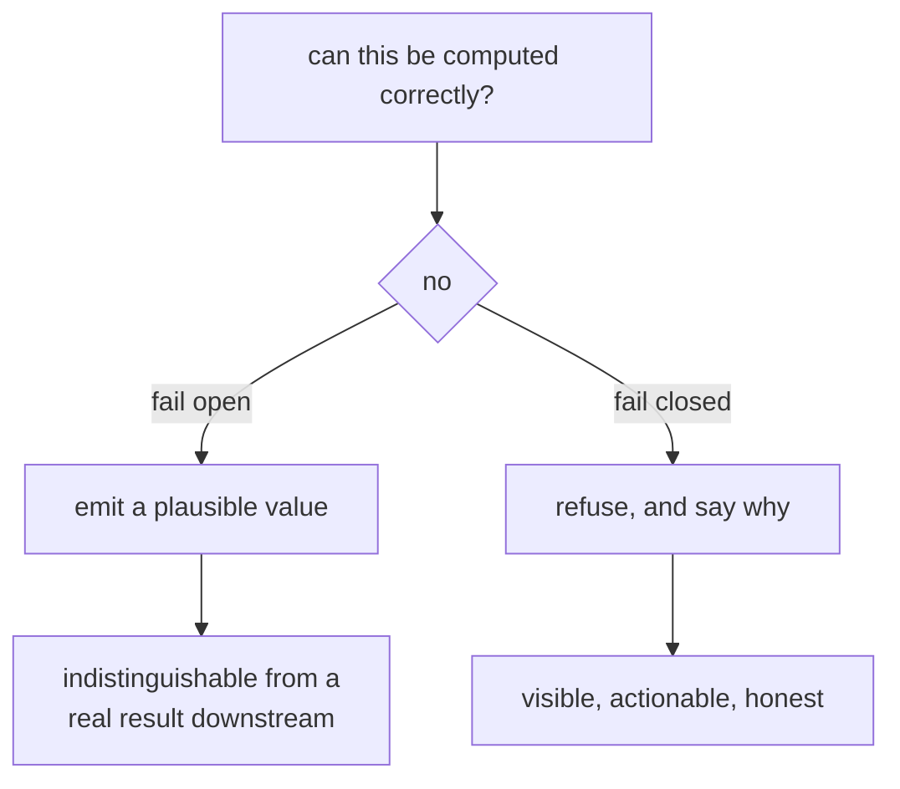

# Fail-closed design

When the system cannot do the right thing, do nothing rather than something
plausible. The single most consistent principle in this repository.

## What it is

Every operation that can fail has a choice of default:

**Fail open**: carry on with a guess, a partial result, or a default value.
Convenient, and the output looks the same as a correct one.

**Fail closed**: refuse, and say why. Inconvenient, and the failure is visible.

For a system that produces **evidence**, the choice is not balanced. A model
built from guessed inputs renders exactly as confidently as one built from
measurements. Nobody downstream can tell them apart, so the guess is worse than
an error: it is an error wearing the costume of a result.

The variants used here:

| Response | When |
|---|---|
| **Raise** | proceeding would produce a wrong artifact |
| **Return `None`** | the caller can render less rather than wrong |
| **Emit nothing plus a note** | this part cannot be computed; the rest stands |
| **Warn and continue** | the operator's judgement, not the software's |

## The picture



## Where this project uses it

### Refusing an orientation it cannot justify

`poggio_webapp/pipeline/true_dip.py`, the clearest statement in the codebase:

```python
Where a solve is not available -- a surface drawn on one wall, or two walls too
nearly parallel to condition it -- nothing is emitted and a note says so. A
plausible-looking invented orientation would be worse than the apparent dips
already in the CSV, because it would look like an improvement.
```

```python
pair = _best_pair(faces, bearings, threshold)
if pair is None:
    notes.append(
        f"surface {surface!r} appears only on walls that are within "
        f"{min_separation_deg} degrees of parallel "
        f"({', '.join(repr(face) for face in faces)}); a true dip "
        "cannot be solved from them, so the existing apparent dips "
        "stand"
    )
    continue
```

Note it does not fall back to an average or to one wall's value. It leaves the
existing data alone and explains.

### Refusing to guess stratigraphy

`poggio_webapp/pipeline/merge_walls.py`:

```python
Raises ValueError if the walls contradict each other (a cycle). Guessing an
order there would invent stratigraphy, so it refuses.
```

and the message names what to fix:

```python
return (
    "the walls contradict each other: these surfaces form a "
    "stratigraphic cycle and cannot be ordered young to old -- "
    + listed
    + ". Check the layer order on those walls, or correlate the loci "
    "explicitly; no order is guessed."
)
```

"No order is guessed" is stated *to the user*, not just in a comment.

### Refusing placeholder registration

`poggio_webapp/backend/services/trench_builder.py`:

```python
The build deliberately refuses two things rather than guessing: it will not
build without a grid config, and it will not build on the starter placeholder
registration. Merged models amplify mis-registration -- placeholder values put
the walls in a row 10 m apart instead of around a pit, which produces a
confident-looking model of nothing.
```

"A confident-looking model of nothing" is the failure mode the whole principle
exists to prevent.

### Degrading rather than misleading

Not every refusal is an exception. `poggio_webapp/static/visualizer/layer-fill.mjs`
returns `null`:

```javascript
if (
  polygon.length < 3
  || polygonArea(polygon) <= EPSILON
  || selfIntersects(polygon)
) {
  return null;
}
```

The layer is drawn as two boundary lines with no shading, visibly different
from a wrong fill, and less than a correct one. See
[polyline clipping](polyline-clipping.md).

`poggio_webapp/backend/routes/pages.py` does the same with a calibration it
cannot trust:

```python
# calib exists but we can't trust it against whatever image we just
# served (rotated copy missing), so omit it rather than misalign.
```

No overlay beats an overlay in the wrong place.

`poggio_webapp/backend/services/viewer_files.py` states the rule for a whole
module:

```python
Everything the visualizer can auto-load for a job, checked before it is
offered: a manifest that is malformed, points outside the job directory, or
names artifacts that are not there must degrade to a smaller payload rather
than hand the browser a broken reference.
```

### Returning zero rather than a guess

`poggio_webapp/pipeline/preprocess.py`:

```python
lines = cv2.HoughLines(edges, 1, np.pi / 180, threshold=200)
if lines is None:
    return gray, 0.0
...
if not angles:
    return gray, 0.0
```

No evidence of skew → no rotation. Rotating by an angle derived from one
ambiguous line would be worse than leaving the image alone.

### And where it deliberately does *not* refuse

`poggio_webapp/pipeline/merge_walls.py`:

```python
Bad geometry is never fatal -- it is the operator's to judge, and this
repo's convention is to report rather than guess. Two things ARE fatal
(ValueError), both because convert() cannot proceed on them: a face missing
from the config, which convert() would silently drop, and a face whose
surfaceZ is absent, which is every depth on that wall measured from
nothing.
```

Two categories, one rule. **What convert() cannot proceed on is fatal;
questionable geometry is a warning**, because an archaeologist may have a reason
for a wall that does not join: an unexcavated side, a survey the software
cannot know about.

Fail-closed does not mean refuse everything. It means refuse where the software
cannot know, and report where the human can.

## Why this and not something else

| Alternative | How it would handle an unsolvable dip | Why it lost |
|---|---|---|
| **Use a default** | Emit dip 0, azimuth 0 | A horizontal orientation is a *claim*, and GemPy would honour it, pulling the surface flat. Worse than the apparent dips already present. |
| **Interpolate or average** | Average the two walls' apparent dips | Sounds reasonable, and both apparent dips are systematically too shallow, so their average is too shallow with a spurious air of consensus. |
| **Best effort with a confidence score** | Emit a value and a caveat | Better than a bare guess, and downstream consumes numbers, not caveats. GemPy has no confidence input. |
| **Fail closed with a note** *(chosen)* | Emit nothing, explain why | The existing data stands, the gap is documented, and nothing invented enters the model. |

The deciding argument is **what the consumer can do with a caveat.** GemPy takes
a CSV of numbers. A confidence column would be dropped on the floor. The only
way to prevent a guess from influencing the model is not to write it.

The same logic governs the README's own framing: *"The model interpolates between
your recorded points. It is a hypothesis shaped by evidence, not a
measurement."*

## What it costs

Nothing to run. The cost is entirely in friction:

- Refusals interrupt work. An operator who wanted a model gets an error.
  Mitigated by messages that name what to fix: "Check the layer order on those
  walls, or correlate the loci explicitly."
- Sometimes the guess would have been fine. Two walls 9° apart are refused
  though the solve might have been adequate. The threshold is a named parameter,
  so it is arguable rather than hidden.
- It requires knowing what "correct" means. Every refusal here rests on a
  domain fact: apparent dips are too shallow, layers cannot cross, placeholders
  lay walls in a row. Without that knowledge the principle cannot be applied.
- Degraded output can look broken. A layer with no fill may read as a bug
  rather than as a deliberate abstention. Better than a wrong fill, and worth an
  interface note.

## Where else you meet it

- Security, where fail-closed is the default posture: deny on error, never
  grant.
- Aviation and medical devices, where a sensor disagreement raises an alarm
  rather than averaging.
- Type systems and compilers, which refuse to build rather than emit code
  they cannot verify.
- Database constraints, which reject a write rather than store an
  inconsistent row.
- `set -e` in shell scripts, stopping at the first failure instead of
  continuing on corrupt state.

## Related pages

- [Error taxonomies](error-taxonomies.md): the errors-versus-warnings split.
- [Interpolation versus measurement](interpolation-vs-measurement.md): the
  epistemic distinction underneath.
- [Validation at trust boundaries](validation-at-trust-boundaries.md): refusing
  bad input early.
- [Fabrication detection](fabrication-detection.md): catching a guess that got
  in anyway.
- [Codebase review](../architecture/code-review.md): where this principle is
  assessed.
